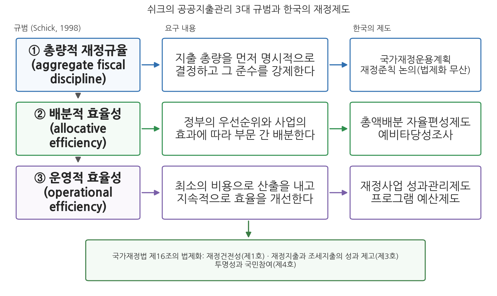
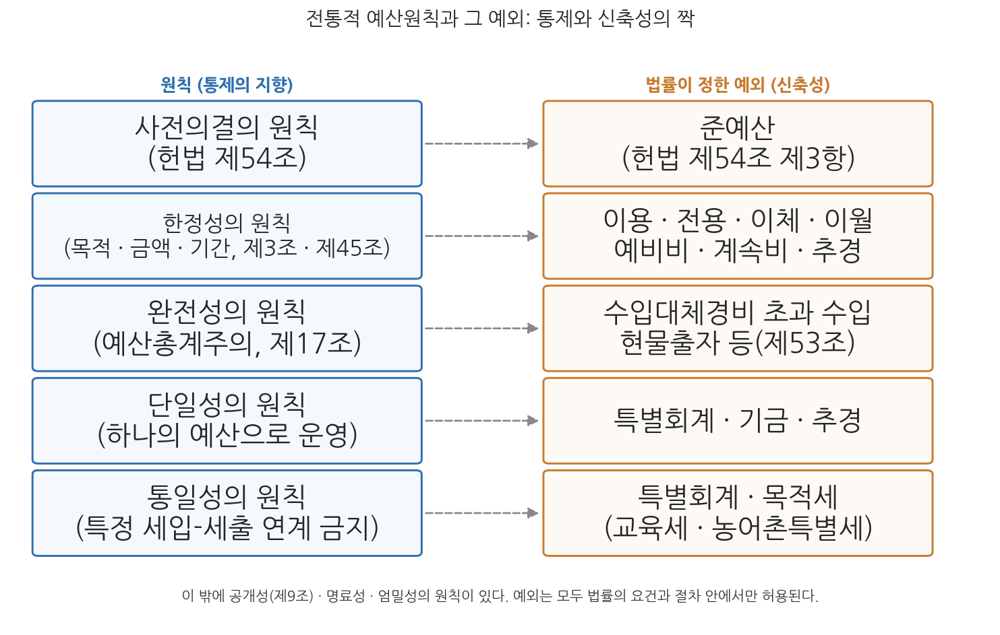

# 2주차 2차시. 재정운영의 규범과 예산의 원칙

> 예산 총량은 명시적으로 내려지고 집행이 강제되는 결정의 결과여야 하며, 지출 수요를 그대로 수용한 결과여서는 안 된다.
> (앨런 쉬크, 「공공지출관리의 현대적 접근」, 1998)

## 이 장에서 배우는 것

2025년 12월 2일 밤, 국회 본회의는 2026년도 예산을 총지출 727조 9,000억 원으로 의결했다. 예산안이 헌법상 법정기한 안에 여야 합의로 처리된 것은 2021년 이후 5년 만이었다. 꼭 1년 전의 풍경은 정반대였다. 2025년도 예산은 2024년 12월 10일, 여야 합의 없이 야당 주도로 정부안에서 4조 1,000억 원을 감액한 수정안이 통과되는 헌정 사상 첫 사례를 남겼고, 처리가 늦어지는 동안 준예산이라는 낯선 단어가 언론에 오르내렸다. 그런데 여기서 물어볼 것이 있다. 애초에 12월 2일은 왜 기한인가. 답은 헌법에 있다. 헌법 제54조는 국회가 회계연도 개시 30일 전까지 예산안을 의결하도록 정해 놓았고, 2026년 회계연도가 1월 1일에 시작하므로 그 30일 전이 12월 2일인 것이다. 예산이 집행되기 전에 국민의 대표기관이 미리 심의하고 의결해야 한다는 것, 이것이 이번 차시에서 배울 예산원칙 가운데 하나인 사전의결의 원칙이다.

1차시에서 우리는 재정이 무엇을 하는가(기능)를 배웠다. 이번 차시의 질문은 그다음이다. 그 일들을 어떻게 해야 잘하는 것인가. 바람직한 예산 편성, 바람직한 재정운영이란 무엇인가라는 질문에는 평가기준이 필요하다. 이 장은 그 기준을 세 층위로 살핀다. 먼저 재정운영을 보는 관점 자체가 어떻게 변해 왔는지(패러다임의 전환)를 개관하고, 현대 공공지출관리의 표준 규범이 된 쉬크(Allen Schick)의 3대 규범을 배운 뒤, 예산운영의 오랜 문법인 전통적 예산원칙과 그 예외들을 정리하고, 마지막으로 이 규범들이 한국의 현행법에 어떻게 담겨 있는지를 국가재정법 제16조를 통해 확인한다. 구체적으로 다음을 배운다.

- 재정운영 패러다임의 다섯 가지 전환과 이를 뒷받침하는 한국의 제도
- 쉬크(1998)의 공공지출관리 3대 규범: 총량적 재정규율, 배분적 효율성, 운영적 효율성
- 전통적 예산원칙(공개성, 명료성, 사전의결, 한정성, 완전성, 단일성, 통일성, 엄밀성)과 각 원칙의 법적 근거 및 예외
- 국가재정법 제16조가 정한 예산의 원칙과 그 현대적 성격

<strong>이 장의 로드맵</strong> 
이 장은 하나의 질문을 따라 전개된다. <em>"바람직한 재정운영이란 무엇이며, 그것을 판단하는 규범과 원칙은 무엇인가?"</em>  
<strong>2.1</strong> 재정운영 패러다임의 다섯 가지 전환을 개관한다 →
<strong>2.2</strong> 쉬크의 3대 규범(총량 규율 · 배분 효율 · 운영 효율)과 한국 제도의 대응을 본다 →
<strong>2.3</strong> 전통적 예산원칙과 그 예외들을 법조문과 함께 정리한다 →
<strong>2.4</strong> 국가재정법 제16조의 예산 원칙을 읽고, 전통과 현대의 규범이 어떻게 종합되는지 확인한다.

## 2.1 재정운영 패러다임의 전환

재정운영을 바라보는 관점은 지난 수십 년 사이 크게 이동해 왔다. 방향은 하나로 요약된다. 돈을 얼마나 썼는가를 통제하는 데서, 돈으로 무엇을 이루었는가를 관리하는 쪽으로다. 표 2-2가 다섯 가지 전환과 이를 뒷받침하는 한국의 제도를 정리한 것이다.

**표 2-2. 재정운영 패러다임의 전환과 관련 제도**

| 패러다임의 전환 | 관련 제도 |
|------|------|
| 투입 중심 → 성과 중심 | 재정사업 성과관리제도 |
| 유량 중심 → 유량·저량 중심 | 복식부기·발생주의 회계제도 |
| 아날로그 정보 시스템 → 디지털 통합정보 시스템 | 디브레인(dBrain+), e-호조 |
| 관리자 중심 → 납세자 주권 | 국민참여예산제도, 주민소송제 |
| 몰성인지적 관점 → 성인지적 관점 | 성인지 예산제도 |

첫째, 투입에서 성과로다. 전통적 재정운영의 관심은 배정된 예산을 규정대로 썼는가라는 투입 통제에 있었다. 오늘의 관심은 그 지출이 약속한 성과를 냈는가로 옮겨 왔고, 한국은 2021년 12월 국가재정법 개정으로 성과목표관리와 성과평가를 축으로 하는 재정사업 성과관리 체계를 법제화했다(제85조의2 이하). 이 성과관리 사무는 2026년 정부조직 개편 이후 기획예산처가 관장한다. 둘째, 유량에서 유량과 저량으로다. 한 해 동안 얼마가 들어오고 나갔는가(유량)만 보던 현금주의 단식부기에서, 정부가 가진 자산과 갚아야 할 부채(저량)까지 함께 보는 발생주의 복식부기로의 전환이다. 이 회계로 작성된 국가 재무제표 덕분에 우리는 2025회계연도 결산 기준 국가자산 3,593조 원, 국가부채 2,772조 원이라는 저량 정보를 알 수 있다. 셋째, 아날로그에서 디지털 통합정보 시스템으로다. 중앙정부의 디지털예산회계시스템 디브레인(dBrain+)과 지방정부의 e-호조가 예산 편성부터 집행, 결산까지를 하나의 전산 체계로 묶고 있으며, 디브레인과 재정정보 공개 시스템 열린재정을 운영하는 한국재정정보원의 주무기관은 재정경제부다. 넷째, 관리자 중심에서 납세자 주권으로다. 예산과정을 관료의 전유물이 아니라 납세자가 참여하고 감시하는 과정으로 여는 전환으로, 국민이 제안한 사업을 예산에 반영하는 국민참여예산제도와 지방재정의 위법한 지출에 대해 주민이 소송을 제기할 수 있는 주민소송제가 그 장치다. 다섯째, 몰성인지에서 성인지로다. 예산이 성별에 중립적이라는 가정을 버리고 예산이 여성과 남성에게 미치는 효과를 따져 편성에 반영하는 전환으로, 성인지 예산제도가 이를 담당한다(6주차 2차시에서 상세히 다룬다).

이 다섯 전환은 방향은 제각각으로 보이지만 배후의 질문은 같다. 무엇이 좋은 재정운영인가, 그것을 어떤 기준으로 평가할 것인가다. 이 질문에 대한 현대의 표준적 대답이 다음 절의 3대 규범이다.

## 2.2 쉬크(Schick, 1998)의 공공지출관리 3대 규범

### 좋은 재정운영의 세 가지 기준

쉬크는 세계은행에서 펴낸 『공공지출관리의 현대적 접근(A Contemporary Approach to Public Expenditure Management)』(Schick, 1998)에서 공공지출관리(public expenditure management)가 충족해야 할 세 가지 규범을 제시했다. 총량적 재정규율, 배분적 효율성, 운영적 효율성이 그것이며, 이 세 규범은 이후 각국 정부와 국제기구가 한 나라의 예산운영 능력을 평가하는 틀로 자리 잡았다.

<strong>정의 · 공공지출관리의 3대 규범 (Schick, 1998)</strong> 
<strong>총량적 재정규율</strong>(aggregate fiscal discipline)은 예산 총량이 개별 지출 요구를 그대로 수용한 결과가 아니라 명시적으로 결정되고 그 준수가 강제되어야 한다는 규범이다. <strong>배분적 효율성</strong>(allocative efficiency)은 지출이 정부의 우선순위와 사업의 효과에 근거하여 배분되어야 한다는 규범이다. <strong>운영적 효율성</strong>(operational efficiency)은 정부기관이 재화와 서비스를 최소의 비용으로 생산하고 지속적인 효율 개선을 이루어야 한다는 규범이다.

세 규범 사이에는 순서가 있다. 총량적 재정규율은 나라 살림 전체의 크기에 관한 규범이고, 배분적 효율성은 그 총량 안에서 부문과 사업 사이에 돈을 나누는 일에 관한 규범이며, 운영적 효율성은 배분된 돈으로 일을 해내는 방식에 관한 규범이다. 1주차 2차시의 언어로 옮기면 총량 규율은 거시적 배분, 배분 효율은 미시적 배분의 규범이다. 그리고 쉬크의 핵심 주장은 총량이 먼저라는 것이다. 총량을 정해 놓지 않고 개별 요구를 쌓아 올리는 방식(상향식)으로는 재정규율이 설 수 없으며, 총량을 먼저 결정하고 그 안에서 우선순위 배분이 이루어지는 방식(하향식)이어야 한다는 것이다. 이 장 첫머리의 인용구가 바로 그 주장이다.

그림 2-2를 읽는 법은 이렇다. 왼쪽 열의 세 상자가 쉬크의 3대 규범이고, 위에서 아래로 총량, 배분, 운영의 순서로 내려온다. 가운데 열은 각 규범의 요구 내용이며, 오른쪽 열은 그 규범을 구현하기 위해 한국이 운영하는 제도들이다. 맨 아래 상자는 이 규범들이 국가재정법 제16조의 예산 원칙으로 법제화되어 있음을 보여 준다(2.4절). 이 그림에서 알 수 있는 것은 두 가지다. 첫째, 3대 규범은 추상적 이념이 아니라 국가재정운용계획, 총액배분 자율편성, 예비타당성조사(예타), 성과관리 같은 구체적 제도로 번역되어 있다. 둘째, 규범에는 위계가 있어 총량 규율이 무너지면 아래의 배분·운영 효율도 설 자리를 잃는다.

한국의 제도 대응을 규범별로 짚어 보자. 총량적 재정규율을 위한 대표 제도는 5회계연도 이상을 내다보며 재정 총량의 경로를 설정하는 국가재정운용계획(국가재정법 제7조, 기획예산처장관 수립)이다. 배분적 효율성을 위해서는 부처별 지출한도를 먼저 정하고 그 안에서 자율 편성하게 하는 총액배분 자율편성제도(10주차)와 대규모 신규 사업의 타당성을 사전에 검증하는 예타(14주차)가 운영된다. 운영적 효율성을 위해서는 재정사업 성과관리제도(14주차 2차시)와 프로그램 예산제도(5주차)가 투입이 아닌 산출과 성과에 관리의 초점을 맞춘다.

쉬크만이 아니다. 세계은행은 건전 재정운영의 원칙으로 포괄성과 규율, 정당성, 신축성, 예측가능성, 경쟁 가능성, 정직성, 정보, 투명성 및 책임성을 제시했고, 샤피로(Shapiro, 2001)는 건전 예산 체제의 요소로 기관의 역할과 책임을 규정한 법체계, 포괄적 예산 편성, 정확하고 적절하며 적시성 있는 정보와 예측, 투명성과 참여를 제시했다. 목록은 저마다 다르지만 총량의 규율, 우선순위에 따른 배분, 투명성과 책임성이라는 뼈대는 공통적이다.

### 한국의 실제: 총량적 재정규율은 서 있는가

3대 규범 가운데 한국에서 가장 뜨거운 논쟁거리는 총량적 재정규율이다. 규율을 법으로 묶으려는 시도와 확장적 재정운용의 현실이 최근 몇 년째 맞서 왔기 때문이다.

<strong>사례 읽기 · 재정준칙 법제화 논쟁과 확장재정 (2022-2026년)</strong> 
관리재정수지 적자를 국내총생산(GDP) 대비 3% 이내로 관리하는 재정준칙을 국가재정법에 명문화하려는 개정안이 2022년부터 추진되었으나 국회를 통과하지 못했고, 2026년 8월 현재까지 재정준칙의 법제화는 이루어지지 않았다. 2025년 출범한 이재명 정부는 확장재정으로 기조를 전환하여, 2025-2029년 국가재정운용계획에서 그간의 "관리재정수지 적자 3% 이내 관리" 목표를 4%대로 완화했다. 국회가 확정한 2026년 본예산은 총지출 727조 9,000억 원으로 전년 본예산 대비 8.1% 늘어난 역대 최대 규모였고, 이 기준 관리재정수지 적자는 GDP 대비 3.9%, 국가채무(D1)는 연말 1,415조 2,000억 원(GDP 대비 51.6%)으로 전망되었다. 같은 국가재정운용계획은 국가채무가 2029년 1,788조 9,000억 원, GDP 대비 58.0%에 이를 것으로 내다보았다. (출처: 뉴시스, 2024-09-26; 대한민국 정책브리핑, 2025-12-02; 한국일보, 2025-08-28)

이 사례가 보여 주는 것은 총량적 재정규율이라는 규범의 두 얼굴이다. 준칙 법제화를 지지하는 쪽은 총량을 묶는 명시적 규칙 없이는 지출 요구가 총량을 밀어 올리는 것을 막을 수 없다고 본다. 쉬크가 경계한 "지출 수요를 그대로 수용한 총량"이 현실이 된다는 것이다. 반대쪽은 경기 침체기에 총량을 경직적으로 묶으면 1차시에서 배운 경제안정화 기능이 마비되며, 규율은 준칙이라는 형식이 아니라 중기계획과 예산과정의 실질로 확보해야 한다고 본다. 총량적 재정규율과 안정화 기능 사이의 이 긴장은 정답이 정해진 문제가 아니라 각국이 제도 설계로 씨름하는 문제이며, 재정준칙의 유형과 각국의 운용은 9주차 1차시에서 본격적으로 다룬다.

## 2.3 전통적 예산원칙

### 통제의 문법: 입법부 우위의 원칙들

쉬크의 규범이 1990년대에 정식화된 관리의 규범이라면, 그보다 훨씬 오래된 통제의 규범이 있다. 전통적 예산원칙이다. 전통적 예산원칙은 예산의 편성, 심의, 집행, 회계검사 등 예산과정 전반에 적용되는 규범으로, 행정부의 재정 활동을 입법부가 통제하는 데 초점을 둔 입법부 우위의 통제 중심 원칙이다. 근대 예산제도 자체가 군주와 행정부의 자의적 재정 운용을 의회가 통제하는 장치로 태어났음을 떠올리면, 예산원칙이 통제의 문법으로 출발한 것은 자연스럽다. 아래에서 여덟 가지 원칙을 각 원칙의 법적 근거, 그리고 그 예외와 함께 정리한다. 미리 말해 두면, 전통적 예산원칙의 현대적 운용을 이해하는 열쇠는 원칙 자체보다 예외에 있다. 모든 원칙에는 법률이 정한 예외가 있고, 그 예외들이 현대 행정이 요구하는 신축성을 공급한다.

먼저 공개성의 원칙이다. 예산의 내용이 국민에게 공개되어야 한다는 원칙으로, 국가재정법 제9조는 예산, 기금, 결산, 국채, 통합재정수지 등 재정에 관한 중요 사항을 매년 1회 이상 정보통신매체와 인쇄물 등으로 알기 쉽고 투명하게 공표하도록 명시하고 있다. 다음으로 명료성의 원칙은 수입과 지출의 추계가 명료해야 하며 그 내용이 합리적으로 구분되고 적절하게 세분화되어 있어야 한다는 원칙이다. 공개가 형식에 그치지 않으려면 공개된 내용이 읽고 이해할 수 있는 것이어야 하기 때문이다.

### 사전의결의 원칙: 예산 민주주의의 출발점

사전의결의 원칙은 예산이 집행되기 전에 입법부의 의결을 거쳐야 한다는 원칙이다. 이 장 도입에서 본 12월 2일이라는 기한이 바로 이 원칙의 헌법적 표현이다.

<strong>법조문 읽기 · 헌법 제54조</strong> 
"① 국회는 국가의 예산안을 심의·확정한다. 
② 정부는 회계연도마다 예산안을 편성하여 회계연도 개시 90일 전까지 국회에 제출하고, 국회는 회계연도 개시 30일 전까지 이를 의결하여야 한다. 
③ 새로운 회계연도가 개시될 때까지 예산안이 의결되지 못한 때에는 정부는 국회에서 예산안이 의결될 때까지 다음의 목적을 위한 경비는 전년도 예산에 준하여 집행할 수 있다. 
1. 헌법이나 법률에 의하여 설치된 기관 또는 시설의 유지·운영 
2. 법률상 지출의무의 이행 
3. 이미 예산으로 승인된 사업의 계속"

무슨 뜻인가. 제1항은 예산안의 심의·확정 권한이 국회에 있음을 선언한다. 정부가 아무리 정교하게 예산안을 짜도 국회의 의결 없이는 한 푼도 쓸 수 없다는 것, 이것이 사전의결 원칙의 핵심이자 예산 민주주의의 출발점이다. 제2항은 그 사전의결이 실제로 가능하도록 일정을 못박는다. 정부는 회계연도 개시 90일 전까지 예산안을 제출하고 국회는 30일 전까지 의결해야 한다. 현행 국가재정법 제33조는 심의 기간을 더 확보하기 위해 정부의 제출 기한을 회계연도 개시 120일 전까지로 앞당겨 놓았다. 제3항은 예외를 정한다. 회계연도가 시작될 때까지 예산이 성립하지 못하면, 정부는 국회의 사전 의결 없이도 기관·시설의 유지 운영, 법률상 지출의무의 이행, 승인된 계속 사업이라는 세 가지 목적의 경비를 전년도 예산에 준하여 집행할 수 있다. 이것이 준예산 제도로, 사전의결 원칙의 헌법이 스스로 정한 예외다.

준예산은 국정 마비를 막기 위한 안전판이지만, 한국에서 준예산이 실제로 편성·집행된 사례는 지금까지 없다. 예산안 처리가 아무리 늦어져도 회계연도 개시 전에는 어떻게든 의결이 이루어져 왔기 때문이다. 예산 불성립에 대비하는 제도는 나라마다 달라서, 한국의 제1공화국은 일정 기간의 예산만 미리 의결받는 가예산 제도를 채택해 실제로 사용한 바 있고, 영국 등은 잠정예산 제도를 운영한다. 준예산, 가예산, 잠정예산의 비교와 최근 준예산 논란은 6주차 1차시에서 상세히 다룬다.

### 한정성의 원칙: 정해진 목적, 정해진 금액, 정해진 기간

한정성의 원칙은 예산이 정한 사용의 한계, 곧 목적(질적 한정성), 금액(양적 한정성), 기간(시간적 한정성)을 지켜야 한다는 원칙이다. 셋으로 나누어 보자. 첫째, 목적 외 사용의 금지다. 국가재정법 제45조는 각 중앙관서의 장은 세출예산이 정한 목적 외에 경비를 사용할 수 없다고 규정한다. 국회가 도로 건설에 쓰라고 의결한 돈을 행정부가 마음대로 청사 신축에 쓸 수 있다면 심의는 무의미해지기 때문이다. 다만 같은 법 제46조부터 제48조는 전용(세항·목 사이의 융통), 이용(장·관·항 사이의 융통), 이체(정부조직 개편에 따른 이관), 이월(다음 연도로 넘겨 사용) 등 법정 요건을 갖춘 융통을 허용한다. 둘째, 초과지출의 금지다. 의결된 금액을 넘겨 지출할 수 없으며, 초과지출의 필요가 생기면 예측할 수 없는 지출에 대비해 미리 계상해 둔 예비비를 쓰거나 추가경정예산(추경)안을 편성해 국회의 의결을 다시 받아야 한다. 셋째, 회계연도 독립의 원칙이다. 국가재정법 제3조는 각 회계연도의 경비는 그 연도의 세입 또는 수입으로 충당하여야 한다고 규정한다. 다만 연도를 넘겨 쓸 수 있게 하는 이월, 여러 해에 걸친 공사를 위한 계속비, 과년도 수입·지출 등의 예외가 있다. 이 신축성 확보 수단들(이용, 전용, 이체, 이월, 예비비, 계속비)은 예산 집행을 다루는 10주차 2차시의 주인공이다.

### 완전성의 원칙: 모든 세입과 세출을 예산에

완전성(포괄성)의 원칙은 모든 세입과 세출이 빠짐없이 예산에 계상되어야 한다는 원칙으로, 예산총계주의라고도 한다.

<strong>법조문 읽기 · 국가재정법 제17조(예산총계주의)</strong> 
"① 한 회계연도의 모든 수입을 세입으로 하고, 모든 지출을 세출로 한다. 
② 제53조에 규정된 사항을 제외하고는 세입과 세출은 모두 예산에 계상하여야 한다."

무슨 뜻인가. 정부의 수입과 지출 가운데 일부라도 예산 바깥에 있으면 그만큼 국회의 심의와 국민의 감시가 미치지 않는 사각지대가 생긴다. 완전성의 원칙은 그런 예산 외 재정을 원천적으로 금지하여 재정 전체를 통제의 그물 안에 넣으려는 원칙이다. 제2항이 스스로 밝히고 있듯 예외는 제53조(예산총계주의 원칙의 예외)에 열거되어 있는데, 용역 제공으로 발생하는 수입을 관련 경비에 직접 쓸 수 있게 하는 수입대체경비의 초과 수입, 현물출자 등이 그것이다. 예외조차 법률에 근거를 두어야 한다는 점에 주목하자. 완전성 원칙은 4주차 1차시에서 배울 예산총계·순계 개념의 출발점이기도 하다.

### 단일성과 통일성의 원칙: 하나의 지갑, 섞이는 돈

단일성의 원칙은 이해와 통제의 용이성을 위해 예산이 하나로, 곧 본예산의 일반회계 중심으로 운영되어야 한다는 원칙이다. 나라의 지갑이 여러 개로 쪼개져 있으면 재정의 전모를 파악하기 어렵고 통제도 그만큼 어려워지기 때문이다. 그러나 현실의 한국 재정은 일반회계 하나가 아니라 다수의 특별회계와 기금, 그리고 연도 중의 추경으로 이루어져 있다. 모두 단일성 원칙의 예외다.

통일성의 원칙은 특정한 세입을 특정한 세출에 직접 연계해서는 안 된다는 원칙이다. 모든 수입은 일단 국고라는 하나의 주머니에 들어갔다가 지출 우선순위에 따라 나와야 하며, "이 세금은 이 용도에만"이라는 꼬리표를 달아서는 안 된다는 뜻이다. 꼬리표가 붙는 순간 그 돈은 우선순위 경쟁에서 면제되어, 앞 절에서 배운 배분적 효율성이 훼손되기 때문이다. 여기에도 예외가 있다. 특정 세입으로 특정 세출을 충당하는 특별회계, 그리고 교육세와 농어촌특별세처럼 용도가 지정된 목적세가 그것이다. 마지막으로 엄밀성의 원칙은 예산과 결산이 일치해야 한다는 원칙으로, 예산이 집행 단계에서 흐트러지지 않고 편성·의결된 대로 이행되어야 한다는 요구다.

그림 2-3을 읽는 법은 이렇다. 왼쪽 열이 통제를 지향하는 전통적 예산원칙들이고, 오른쪽 열이 각 원칙에 대해 법률이 열어 놓은 예외, 곧 신축성 장치들이다. 화살표는 어느 원칙에 어느 예외가 대응하는지를 보여 준다. 이 그림에서 알 수 있는 것은 두 가지다. 첫째, 원칙과 예외는 일대일로 짝을 이루고 있어, 예외를 알면 원칙이 무엇을 지키려는 것인지가 거꾸로 선명해진다. 둘째, 오른쪽 열의 예외들(준예산, 추경, 특별회계, 기금, 이월, 예비비 등)은 이 과목의 뒤 주차들에서 하나씩 본격적으로 등장할 제도들이다. 특히 특별회계와 기금은 바로 다음 주(3주차)의 주제다.

<strong>유의 · 예외의 존재가 원칙의 실패는 아니다</strong> 
전통적 예산원칙을 배우고 나면 "예외가 이렇게 많은데 원칙이 무슨 소용인가"라는 의문이 들 수 있다. 그러나 두 가지를 구분해야 한다. 첫째, 모든 예외는 <strong>법률이 정한 요건과 절차 안에서만</strong> 허용된다. 특별회계는 법률로써만 설치할 수 있고, 예비비 지출은 국회의 사후 승인을 받아야 하며, 준예산의 용도는 헌법이 세 가지로 한정한다. 예외는 원칙의 포기가 아니라 원칙이 관리하는 신축성이다. 둘째, 예외의 <strong>양</strong>은 별개의 문제다. 특별회계와 기금이 지나치게 늘어나 재정의 전모 파악이 어려워지면 단일성·통일성 원칙의 훼손이 실질적 문제가 되며, 이것이 3주차에서 다룰 특별회계·기금 정비 논쟁의 핵심이다. 원칙의 존재 이유와 원칙의 침식 정도를 나누어 판단하는 것이 분석의 출발점이다.

## 2.4 국가재정법의 예산 원칙

### 제16조: 전통과 현대의 종합

전통적 예산원칙이 개별 조문들(제3조, 제9조, 제17조, 제45조 등)에 흩어져 구현되어 있다면, 현대적 규범을 하나의 조문에 모아 선언한 것이 국가재정법 제16조다. 국가재정법은 종전의 예산회계법과 기금관리기본법을 대체하여 2006년 제정되고 2007회계연도부터 시행된 한국 재정운영의 기본법인데, 제16조는 정부가 예산의 편성과 집행에서 준수해야 할 원칙을 다음과 같이 정하고 있다.

<strong>법조문 읽기 · 국가재정법 제16조(예산의 원칙)</strong> 
"정부는 예산을 편성하거나 집행할 때 다음 각 호의 원칙을 준수하여야 한다. &lt;개정 2010. 5. 17., 2013. 1. 1., 2020. 6. 9., 2021. 6. 15., 2021. 9. 24., 2021. 12. 21.&gt; 
1. 정부는 재정건전성의 확보를 위하여 최선을 다하여야 한다. 
2. 정부는 국민부담의 최소화를 위하여 최선을 다하여야 한다. 
3. 정부는 재정을 운용할 때 재정지출 및 「조세특례제한법」 제142조의2제1항에 따른 조세지출의 성과를 제고하여야 한다. 
4. 정부는 예산과정의 투명성과 예산과정에의 국민참여를 제고하기 위하여 노력하여야 한다. 
5. 정부는 「성별영향평가법」 제2조제1호에 따른 성별영향평가의 결과를 포함하여 예산이 여성과 남성에게 미치는 효과를 평가하고, 그 결과를 정부의 예산편성에 반영하기 위하여 노력하여야 한다. 
6. 정부는 예산이 「기후위기 대응을 위한 탄소중립ㆍ녹색성장 기본법」 제2조제5호에 따른 온실가스(이하 "온실가스"라 한다) 감축에 미치는 효과를 평가하고, 그 결과를 정부의 예산편성에 반영하기 위하여 노력하여야 한다."

무슨 뜻인가, 호별로 읽어 보자. 제1호의 재정건전성 확보는 쉬크의 총량적 재정규율을 법의 언어로 옮긴 것이다. 2.2절의 사례에서 보았듯 이 원칙을 구속력 있는 준칙으로 구체화할 것인가가 현재진행형의 논쟁이다. 제2호의 국민부담 최소화는 같은 일을 더 적은 세금과 부담금으로 해내라는 요구로, 재정의 크기가 곧 국민 부담의 크기라는 사실을 상기시킨다. 제3호는 재정지출만이 아니라 조세지출의 성과까지 제고하라고 요구한다. 조세지출이란 비과세와 감면처럼 세금을 걷지 않는 방식으로 이루어지는 지원, 곧 세금 쪽에 숨어 있는 지출이다. 2026년 국세감면액은 80조 5,000억 원으로 사상 처음 80조 원을 넘었고 국세감면율은 16.1%로 법정한도(16.5%)를 4년 만에 지킬 전망인데, 이 규모를 예산서에 담아 국회에 보고하는 조세지출예산서 제도(작성 기반인 세제 사무는 재정경제부 소관)는 6주차 2차시에서 다룬다. 제4호의 투명성과 국민참여는 2.1절에서 본 납세자 주권 패러다임의 법제화로, 제9조의 재정정보 공표와 국민참여예산제도가 그 실행 장치다.

제5호와 제6호는 이 조문의 가장 현대적인 부분이다. 제5호는 예산이 여성과 남성에게 미치는 효과를 평가해 편성에 반영하라는 성인지 원칙으로, 성인지 예산서·결산서 제도(제26조, 제57조)와 짝을 이룬다. 제6호는 예산이 온실가스 감축에 미치는 효과를 평가해 반영하라는 온실가스감축인지 원칙으로, 2021년 6월 국가재정법 개정으로 도입되어 2023년도 예산안부터 적용되었다. 첫 적용된 2023년도 온실가스감축인지 예산서는 13개 부처 288개 사업, 11조 8,828억 원 규모였다. 두 제도의 상세는 6주차 2차시에서 다룬다.

### 통제에서 관리로, 그리고 그 너머로

제16조를 전통적 예산원칙과 나란히 놓으면 예산 규범의 역사적 이동이 한눈에 들어온다. 전통적 원칙이 행정부를 향한 입법부의 통제(사전에 의결받고, 정한 대로 쓰고, 빠짐없이 계상하라)의 문법이라면, 제16조는 정부 스스로에게 부과된 관리와 성과의 규범(건전하게, 부담을 줄이며, 성과 있게, 투명하게)이며, 나아가 제5호와 제6호는 예산을 성평등과 기후위기 대응이라는 사회적 가치의 렌즈로 다시 보라는 인지적(gender-perspective, climate-perspective) 규범으로까지 나아간다. 규범의 진화는 곧 예산관의 진화다. 예산은 통제의 대상에서 관리의 도구로, 다시 사회적 가치 실현의 수단으로 그 의미가 확장되어 왔다.

다만 제16조의 성격에 대해서는 유의할 점이 있다. 각 호의 문장이 "최선을 다하여야 한다", "노력하여야 한다"로 되어 있는 데서 드러나듯, 이 원칙들은 위반하면 예산이 무효가 되는 효력 규정이라기보다 정부의 재정운영이 지향해야 할 방향을 선언한 규범이다. 그래서 원칙의 실효성은 조문 자체가 아니라 그것을 구현하는 개별 제도들(국가재정운용계획, 성과관리, 참여예산, 성인지·온실가스감축인지 예산서)과 정치과정의 감시에 달려 있다. 재정건전성 원칙(제1호)이 엄연히 법에 있는데도 확장재정 기조 아래 관리재정수지 적자 목표가 4%대로 완화된 2025-2026년의 현실은, 원칙 조항과 재정운영의 실제 사이의 거리를 보여 주는 살아 있는 예다. 그 거리를 좁히는 제도적 장치가 무엇인지, 예산과정의 각 단계는 어떻게 설계되어 있는지가 이 과목 후반부(9-10주차)의 질문이 된다.

다음 주에는 이 장에서 예외로만 언급한 존재들을 정면으로 다룬다. 단일성 원칙의 예외인 특별회계는 왜, 어떤 요건으로 설치되며, 한국 재정에서 얼마나 큰 자리를 차지하고 있는가. 3주차 1차시에서 일반회계와 특별회계로 시작한다.

## 요약

바람직한 재정운영의 기준을 묻는 이 장은 규범의 세 층위를 살폈다. 먼저 재정운영 패러다임은 투입에서 성과로(재정사업 성과관리제도), 유량에서 유량·저량으로(발생주의 복식부기), 아날로그에서 디지털 통합시스템으로(디브레인, e-호조), 관리자 중심에서 납세자 주권으로(국민참여예산, 주민소송), 몰성인지에서 성인지로(성인지 예산제도) 전환되어 왔다. 쉬크(1998)의 공공지출관리 3대 규범은 예산 총량이 명시적으로 결정되고 준수되어야 한다는 총량적 재정규율, 정부의 우선순위와 사업 효과에 따라 배분되어야 한다는 배분적 효율성, 최소 비용으로 산출을 내야 한다는 운영적 효율성으로 구성되며, 총량 규율이 우선한다는 위계를 갖는다. 한국에서는 국가재정운용계획, 총액배분 자율편성과 예비타당성조사, 재정사업 성과관리가 각 규범에 대응하며, 재정준칙 법제화 무산과 확장재정 전환(2026년 본예산 총지출 727조 9,000억 원, 전년 대비 8.1% 증가, 관리재정수지 적자 GDP 대비 3.9%)은 총량적 재정규율을 둘러싼 현재진행형 논쟁이다. 전통적 예산원칙은 입법부 우위의 통제 중심 규범으로, 공개성(국가재정법 제9조), 명료성, 사전의결(헌법 제54조, 예외는 준예산), 한정성(목적 외 사용 금지의 제45조, 초과지출 금지, 회계연도 독립의 제3조, 예외는 이용·전용·이체·이월·예비비·계속비·추경), 완전성(제17조 예산총계주의, 예외는 제53조의 수입대체경비 등), 단일성(예외는 특별회계·기금·추경), 통일성(예외는 특별회계·목적세), 엄밀성의 원칙으로 구성되며, 모든 예외가 법률의 요건과 절차 안에서만 허용된다는 점에서 예외는 원칙이 관리하는 신축성이다. 국가재정법 제16조는 재정건전성, 국민부담 최소화, 재정지출·조세지출의 성과, 투명성과 국민참여, 성인지, 온실가스감축인지(2021년 도입)의 여섯 원칙을 선언하여 전통적 통제 규범을 현대적 관리·성과 규범과 사회적 가치의 인지 규범으로 확장했으며, 그 실효성은 선언 자체가 아니라 이를 구현하는 개별 제도와 정치과정의 감시에 달려 있다.

## 토론·복습 문제

**2-5. (서술형 연습)** 쉬크의 공공지출관리 3대 규범을 각각 정의하고 세 규범 사이의 위계를 설명하시오. 이어서 각 규범에 대응하는 한국의 재정제도를 하나씩 제시하고, 국가재정법 제16조의 여섯 개 호 가운데 각 규범과 연결되는 호를 지적하시오.

**2-6. (조문 적용형)** 다음 각 상황이 전통적 예산원칙 중 어느 원칙의 예외(또는 위반)에 해당하는지 판정하고 근거 조문을 제시하시오. (1) 정부가 교통시설 관련 특정 세입을 특정 사업에만 쓰는 특별회계를 법률로 설치하였다. (2) 회계연도 개시 전까지 예산안이 의결되지 못하여 정부가 공무원 보수를 전년도 예산에 준하여 집행하였다. (3) 어느 부처가 예상하지 못한 재해 대응을 위해 예비비를 지출하였다. (4) 어느 부처가 세출예산이 정한 목적과 다른 용도에 경비를 사용하였다.

**2-7. (찬반 토론)** "관리재정수지 적자를 GDP 대비 일정 비율 이내로 묶는 재정준칙을 국가재정법에 명문화해야 한다"는 주장에 대해, 총량적 재정규율(쉬크, 국가재정법 제16조 제1호)과 경제안정화 기능(1차시)의 관점에서 찬성과 반대 논거를 각각 제시하고 자신의 입장을 정하시오.

**2-8.** 전통적 예산원칙이 통제 중심의 규범인 데 비해 국가재정법 제16조는 관리·성과·참여 중심의 규범이라는 평가가 있다. 두 규범 체계의 성격 차이를 시대적 배경과 함께 설명하고, "최선을 다하여야 한다"는 문언으로 된 제16조의 원칙들이 실효성을 가지려면 어떤 제도적 장치가 필요한지 성인지 예산서와 온실가스감축인지 예산서를 예로 들어 논하시오.
