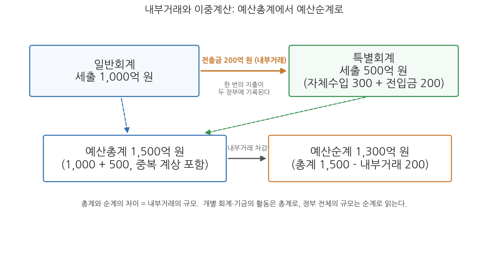
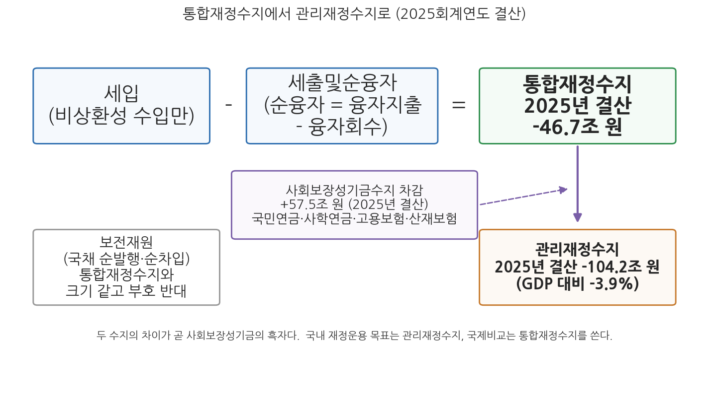

# 4주차 1차시. 예산의 총계·순계와 통합재정

> 정부는 예산, 기금, 결산, 국채, 차입금, 국유재산의 현재액 및 통합재정수지 그 밖에 ... 재정에 관한 중요한 사항을 매년 1회 이상 정보통신매체·인쇄물 등 적당한 방법으로 알기 쉽고 투명하게 공표하여야 한다.
> (국가재정법 제9조 제1항에서 발췌)

## 이 장에서 배우는 것

2026년 4월 6일, 재정경제부는 2025회계연도 국가결산보고서가 국무회의에서 심의·의결되었다고 발표했다. 2026년 1월 정부조직 개편으로 결산 사무를 넘겨받은 재정경제부의 첫 국가결산 발표였다. 그런데 이날 결산을 전한 보도의 숫자는 하나가 아니었다. 어떤 기사는 지난해 나라살림 적자가 46.7조 원이라 썼고, 다른 기사는 104.2조 원이라 썼다. 같은 정부가 같은 날 발표한 같은 해의 결산인데, 적자 규모가 두 배 넘게 벌어진다. 어느 쪽이 맞는가. 답은 "둘 다 맞다"이다. 46.7조 원은 통합재정수지 적자이고, 104.2조 원은 통합재정수지에서 사회보장성기금의 흑자를 걷어낸 관리재정수지 적자다. 나라살림의 성적표는 하나의 숫자가 아니라, 무엇을 더하고 무엇을 빼는가에 따라 달라지는 여러 개의 숫자로 발표된다.

이 장은 그 "더하고 빼는 규칙"을 배우는 시간이다. 3주차에서 우리는 한국의 정부재정이 일반회계 1개, 여러 개의 특별회계, 수십 개의 기금이라는 칸막이 구조로 짜여 있음을 보았다. 칸막이는 재정 운영의 자율성과 전문성을 위한 장치지만, 그 대가로 "그래서 정부는 한 해에 돈을 얼마나 쓰는가"라는 단순한 질문에 답하기 어렵게 만든다. 칸막이 사이로 돈이 오가기 때문에 단순 합산은 실제보다 부풀려진 숫자를 낳고, 국채를 찍어 마련한 돈까지 수입으로 세면 살림의 건전성이 가려진다. 예산의 총계와 순계, 그리고 통합재정은 이 문제를 풀기 위해 고안된 합산의 렌즈다. 구체적으로 다음을 배운다.

- 내부거래가 만드는 이중계산 문제와 예산총계·예산순계의 구분
- 통합재정의 의의, 포괄범위, 그리고 IMF 재정통계 기준과의 관계
- 세입, 세출및순융자, 보전재원의 구분과 통합재정수지의 산출 논리
- 관리재정수지의 개념과 사회보장성기금수지를 제외하는 이유
- 2025회계연도 결산 수치로 두 재정수지를 읽는 법

<strong>이 장의 로드맵</strong> 
이 장은 하나의 질문을 따라 전개된다. <em>"쪼개진 나라살림을 어떻게 하나의 숫자로 합산하고, 그 숫자에서 재정의 건전성을 어떻게 읽는가?"</em>  
<strong>1.1</strong> 내부거래와 이중계산 문제에서 출발해 예산총계와 예산순계를 구분한다 →
<strong>1.2</strong> 회계와 기금을 하나로 합치는 통합재정의 의의와 포괄범위를 본다 →
<strong>1.3</strong> 세입 · 세출및순융자 · 보전재원의 구분으로 통합재정수지를 산출하고 해석한다 →
<strong>1.4</strong> 통합재정수지에서 사회보장성기금수지를 뺀 관리재정수지의 논리와 쟁점을 다룬다.

## 1.1 예산총계와 예산순계

### 칸막이 사이로 돈이 오간다: 내부거래

정부의 회계와 기금은 서로 고립된 섬이 아니다. 일반회계와 특별회계 사이, 특별회계와 특별회계 사이, 회계 안의 계정 사이, 그리고 회계와 기금 사이, 기금과 기금 사이에는 끊임없이 자금이 오간다. 일반회계가 특정 특별회계의 사업 재원을 지원하려고 돈을 옮기면 보내는 쪽에서는 전출금, 받는 쪽에서는 전입금이 되고, 한 회계나 기금이 여유자금을 다른 회계·기금에 맡기면 맡기는 쪽에서는 예탁금, 받는 쪽에서는 예수금이 된다. 이 밖에 출연금 등 다양한 형태의 자금 이전이 있다. 이처럼 정부라는 하나의 살림 안에서 주머니와 주머니 사이를 오가는 거래를 내부거래(internal transaction)라 한다.

문제는 이 내부거래가 양쪽 장부에 모두 기록된다는 점이다. 일반회계가 어느 특별회계에 200억 원을 전출하면, 이 200억 원은 일반회계의 세출로 한 번, 특별회계의 세입과 그 재원으로 집행되는 세출로 또 한 번 잡힌다. 정부 전체로 보면 실제로 나간 돈은 한 번인데 장부 위에서는 두 번 세어지는 것이다. 회계와 기금의 수가 많고 칸막이 사이의 거래가 활발할수록 이 이중계산의 규모는 커진다.

<strong>정의 · 예산총계와 예산순계</strong> 
<strong>예산총계</strong>(gross budget)는 일반회계, 특별회계 등 각 회계의 규모를 이중계산을 제거하지 않고 그대로 합산한 예산 규모다. <strong>예산순계</strong>(net budget)는 예산총계에서 회계 간, 회계 내 계정 간, 회계와 기금 간 내부거래로 중복 계상된 부분을 차감한 규모다. 정부 재정의 전체 규모를 파악하는 데는 순계 기준이 유용하고, 개별 회계나 기금의 독립된 활동 규모를 파악하는 데는 총계 기준이 유용하다.

숫자로 확인해 보자. 일반회계의 세출이 1,000억 원이고 그중 200억 원이 특별회계로의 전출금이며, 특별회계의 세출이 500억 원(재원은 자체수입 300억 원과 일반회계 전입금 200억 원)인 단순한 정부를 생각하자. 두 회계의 세출을 그대로 더한 총계는 1,500억 원이다. 그러나 특별회계가 쓴 500억 원 가운데 200억 원은 일반회계 세출에서 이미 한 번 세어진 돈이므로, 정부가 실제로 바깥에 지출한 돈은 1,500억 원에서 중복분 200억 원을 뺀 1,300억 원이다. 이것이 순계다. 그림 4-1이 이 관계를 보여 준다.

그림 4-1을 읽는 법은 이렇다. 위의 두 상자는 일반회계와 특별회계의 세출 장부이고, 두 상자를 잇는 화살표가 내부거래(전출금 200억 원)다. 아래의 두 상자는 이 장부를 합산하는 두 가지 방식, 곧 총계와 순계다. 이 그림에서 알 수 있는 것은 총계와 순계의 차이가 정확히 내부거래의 규모와 같다는 점이다. 어느 기준이 옳은가의 문제가 아니라 용도가 다른 것이다. 특별회계 하나의 사업 활동이 얼마나 되는지 보려면 총계가 맞고, 정부 전체의 살림 규모를 보려면 순계가 맞다.

지방재정에서는 이 구분이 한층 더 중요하다. 지방자치단체 안의 회계 간 이전거래에 더해, 광역자치단체와 기초자치단체 사이에 보조금, 교부금, 융자금 같은 이전거래가 대규모로 존재하기 때문이다. 서울특별시가 자치구에 내려보낸 교부금은 서울특별시의 세출이자 자치구의 세입·세출로 다시 잡히므로, 지방재정 전체의 규모는 이런 단체 간 이전거래까지 제외한 순계 기준으로 계산한다. 중앙정부가 지방자치단체에 내려보내는 지방교부세와 국고보조금도 마찬가지 논리로, 국가재정과 지방재정을 합산할 때는 반드시 제거되어야 할 이전거래다.

### 예산총계주의와 예산총계: 닮은 말, 다른 층위

여기서 용어 하나를 짚고 가야 한다. 2주차 2차시에서 본 예산원칙 중에 완전성의 원칙, 곧 예산총계주의가 있었다. 국가재정법은 이를 명문으로 선언한다.

<strong>법조문 읽기 · 국가재정법 제17조(예산총계주의)</strong> 
"① 한 회계연도의 모든 수입을 세입으로 하고, 모든 지출을 세출로 한다. 
② 제53조에 규정된 사항을 제외하고는 세입과 세출은 모두 예산에 계상하여야 한다."

무슨 뜻인가. 정부의 모든 수입과 지출은 서로 상계하거나 누락하지 말고 전액 그대로 예산서에 담아야 한다는 원칙이다. 세금을 걷는 데 든 비용을 빼고 남은 순수입만 계상하는 식의 처리를 허용하면 국회와 국민이 재정의 전모를 볼 수 없게 되기 때문에, 예산서 자체는 총액 기준으로 작성하도록 법이 강제하는 것이다. 이 원칙 덕분에 개별 회계·기금의 장부는 빠짐없이 기록되지만, 바로 그 때문에 장부들을 단순 합산하면 내부거래가 이중으로 세어지는 문제가 생긴다. 순계는 이 원칙을 훼손하는 것이 아니라, 총계로 작성된 장부를 분석 목적에 맞게 통계적으로 재가공한 값이다.

<strong>유의 · "예산총계주의"의 총계와 "예산총계"의 총계는 다른 말이다</strong> 
예산총계주의(완전성의 원칙)는 수입과 지출을 상계하지 말고 <em>전액 계상</em>하라는 예산 편성의 규범이고, 예산총계는 회계·기금의 규모를 중복 제거 없이 <em>단순 합산</em>한 통계 개념이다. 앞의 것은 "예산서를 어떻게 쓸 것인가"의 문제이고, 뒤의 것은 "재정 규모를 어떻게 셀 것인가"의 문제다. 시험에서도 실무에서도 자주 혼동되는 용어이므로 층위를 구분해 기억해 두자.

## 1.2 통합재정의 의의와 포괄범위

### 조각을 하나로 합치는 렌즈

순계 개념으로 이중계산을 제거했다면, 다음 과제는 합산의 범위다. 3주차에서 본 것처럼 정부의 재정활동은 예산(일반회계·특별회계)만이 아니라 기금을 통해서도 이루어진다. 예산만 보고 기금을 빼놓으면 국민연금기금이나 주택도시기금이 수행하는 대규모 재정활동이 시야에서 사라진다. 통합재정(consolidated fiscal accounts)은 일반회계, 특별회계, 기금을 모두 포함하는 정부의 재정활동을 체계적으로 분류해 하나의 표로 보여 줌으로써, 재정이 국민경제에 미치는 효과를 파악하고자 하는 재정통계의 틀이다. 3주차가 나라살림의 조각들을 하나씩 뜯어본 시간이었다면, 통합재정은 그 조각들을 다시 하나로 합쳐 전체를 보는 렌즈다.

<strong>정의 · 통합재정</strong> 
<strong>통합재정</strong>은 일반회계, 특별회계, 기금과 세입세출 외 자금을 포괄하여 정부의 재정활동을 순계 기준으로 파악하는 재정통계 체계다. 회계·기금 간 <strong>내부거래</strong>와 국채 발행·상환 같은 <strong>보전거래</strong>를 제외하여 재정활동의 실질 규모를 보여 주고, 세입과 세출을 경상거래와 자본거래로 나누는 경제적 분류를 사용하며, 그 수지(통합재정수지)로 재정 건전성을 판단한다. 한국은 IMF(국제통화기금)의 권고에 따라 1979년부터 정부재정통계편람(GFS) 기준의 통합재정수지를 작성해 왔다.

통합재정의 포괄범위는 넓다. 중앙정부 차원에서는 일반회계와 특별회계, 기금에 더해 세입세출 외 자금까지 포함한다. 세입세출 외 자금이란 세계잉여금(한 해 살림을 결산하고 남은 돈)이나 전대차관(정부가 외국에서 빌려 국내 실수요자에게 다시 빌려주는 차관)처럼 세입세출예산 바깥에서 관리되는 자금을 말한다. 나아가 통합재정의 규모는 중앙재정만이 아니라 지방재정과 지방교육재정까지 포함해 정부 부문 전체를 아우른다. 다만 기금 가운데 보증이나 보험 같은 금융활동을 수행하는 금융성기금은 재정활동이 아닌 금융활동으로 보아 통합재정의 범위에서 제외한다. 요컨대 통합재정은 "정부라는 하나의 경제주체가 국민경제에서 얼마를 걷고 얼마를 쓰는가"를 최대한 실질에 가깝게 재려는 통계다.

통합재정이 국제 기준의 산물이라는 점도 기억할 필요가 있다. 통합재정의 분류 체계는 IMF가 정한 정부재정통계편람(Government Finance Statistics Manual, GFSM)을 따른다. 한국이 1979년 통합재정수지를 도입할 당시의 기준은 현금주의에 기초한 GFSM 1986 체계였고, IMF는 2001년과 2014년의 개정판에서 발생주의와 제도단위 기준으로 틀을 바꾸었다. 오늘날 재정당국은 현금주의 기반의 통합재정수지와 함께 국제 기준에 따른 일반정부·공공부문 재정통계도 작성하는데, 이 확장된 범위의 이야기는 다음 차시(4주차 2차시)에서 다룬다. 통합재정이 경상거래와 자본거래를 구분하고 정부소비·정부투자 같은 국민소득계정의 항목과 연계되도록 설계된 것도, 재정통계를 거시경제 분석의 재료로 쓰기 위해서다.

이 장 첫머리에 인용한 국가재정법 제9조는 통합재정수지를 정부가 매년 국민에게 공표해야 할 재정정보의 하나로 명시하고 있다. 재정의 전체 모습을 알기 쉽고 투명하게 알리는 것이 법적 의무라는 뜻이며, 오늘날 이 의무는 재정정보 공개 시스템인 열린재정(openfiscaldata.go.kr)의 통계 공개로 구현되고 있다.

## 1.3 통합재정수지의 산출과 해석

### 세입, 세출및순융자, 보전재원: 세 개의 서랍

통합재정의 핵심 기술은 정부의 모든 거래를 성격에 따라 세입, 세출및순융자, 보전재원이라는 세 개의 서랍에 나누어 담는 것이다. 이 분류의 기준은 "갚아야 하는 돈인가"이다.

먼저 세입에는 정부로 유입되는 수입 가운데 비상환성 수입만 기록한다. 조세수입과 수수료 같은 세외수입이 경상수입으로, 정부 보유 자산의 매각 수입이 자본수입으로 여기에 담긴다. 반면 국채 발행이나 차입으로 들어온 돈은 언젠가 갚아야 하는 상환성 수입이므로 세입이 아니라 보전재원 수입으로 분류한다. 정부 장부에 들어온 돈이라고 모두 벌이가 아니라는 것, 이것이 통합재정의 첫 번째 규율이다.

다음으로 세출및순융자에는 정부의 모든 비상환성 지출과 함께 순융자를 담는다. 순융자란 정부가 정책 목적으로 빌려준 돈(융자지출)에서 회수한 돈(융자회수)을 뺀 차액이다. 융자는 형식상 되돌려받는 거래지만 유동성 운용이 아니라 정책 수단이므로, 순액 기준으로 지출 쪽에 계상한다. 마지막으로 보전재원은 세입과 세출및순융자의 차이를 메우는 재원, 곧 국채 발행과 차입(에서 상환을 뺀 순액)이다. 재정이 적자면 보전재원이 플러스(빚으로 메움)가 되고, 흑자면 마이너스(빚을 갚음)가 된다.

<strong>왜 국채 발행 수입은 세입이 아닌가?</strong> 
가계에 비유하면 분명해진다. 한 달 생활비가 모자라 마이너스통장에서 100만 원을 꺼내 썼다고 하자. 통장에 들어온 100만 원을 "이달의 소득"으로 계산하면 가계부는 균형처럼 보이지만, 실제로는 다음 달의 소득을 미리 당겨 쓴 것이다. 국채 발행도 같다. 발행 수입을 세입으로 세면 재정적자가 장부에서 사라지고, 재정이 얼마나 빚에 기대고 있는지 보이지 않게 된다. 통합재정이 상환성 수입을 세입에서 떼어내 보전재원이라는 별도 서랍에 담는 것은, <em>적자를 감추지 못하게 만드는</em> 장치다. 거꾸로 말하면 보전재원의 크기 자체가 재정적자의 크기다.

### 수지의 산출: 하나의 예제

이 세 서랍의 분류가 재정수지를 어떻게 바꾸는지, 단순화한 예제로 확인하자. 어느 해 정부의 장부가 조세수입 100, 세외수입 20, 융자회수 30, 국채발행 50의 수입과 일반행정비 80, 고정자산 취득 60, 융자지출 50, 국채상환 10의 지출로 이루어져 있다고 하자(단위는 조 원이라 생각해도 좋다). 전통적인 세입·세출 장부에서는 수입 합계도 200, 지출 합계도 200으로 재정은 정확히 균형처럼 보인다. 그러나 통합재정으로 재분류하면 그림이 달라진다. 표 4-1이 그 변환이다.

**표 4-1. 정부재정회계를 통합재정으로 바꾸면 (가상 예제)**

| 구분 | 전통적 세입·세출 장부 (총계) | 통합재정 기준 |
|------|------|------|
| 수입 쪽 | 조세수입 100 + 세외수입 20 + 융자회수 30 + 국채발행 50 = 200 | 세입 = 조세수입 100 + 세외수입 20 = 120 |
| 지출 쪽 | 일반행정비 80 + 고정자산 60 + 융자지출 50 + 국채상환 10 = 200 | 세출및순융자 = 80 + 60 + 순융자(50 - 30) = 160 |
| 재정수지 | 200 - 200 = 0 (균형처럼 보임) | 120 - 160 = **-40 (적자)** |
| 보전재원 | 별도로 드러나지 않음 | 국채 순발행(50 - 10) = **+40** |

전통 장부의 균형은 착시였다. 국채를 찍어 들어온 50을 수입으로 세고 갚은 10을 지출로 세었기 때문에 장부가 맞아떨어졌을 뿐, 갚지 않아도 되는 돈으로 벌어들인 세입 120에 비해 정부가 실제로 쓴 세출및순융자는 160이어서 이 해의 재정은 40의 적자다. 그리고 그 적자 40은 정확히 국채 순발행 40으로 메워졌다. 여기서 통합재정수지의 산식이 나온다.

통합재정수지 = 세입 - (세출 + 순융자) = (세입 + 융자회수) - (세출 + 융자지출) = -(보전재원)

통합재정수지와 보전재원은 크기가 같고 부호만 반대다. 적자만큼 빚을 내고, 흑자만큼 빚을 갚기 때문이다. 통합재정수지가 재정활동의 건전성을 보여 주는 지표가 되는 이유가 여기에 있다. 오늘날 재정당국이 발표하는 통합재정수지는 실무적으로 총수입에서 총지출을 뺀 값으로 산출되는데, 총수입·총지출이라는 지표 자체는 다음 차시의 주제이므로 여기서는 위의 산식과 같은 논리라는 점만 확인해 두자.

### 해석: 2025회계연도의 통합재정수지

산식을 실제 수치에 적용해 보자. 2026년 4월 발표된 2025회계연도 결산에서 통합재정수지는 46.7조 원 적자였다. 계획(추가경정예산 기준 60.9조 원 적자)보다 14.2조 원 개선된 결과인데, 이는 세입이 예상보다 더 걷혔거나 지출이 계획에 못 미쳤다는 뜻이다. 통합재정수지 적자는 그 해 정부가 국민경제에서 걷은 것보다 더 많이 풀었다는 것, 그리고 그 차액만큼 국채 발행 등 보전재원에 기댔다는 것을 의미한다. 적자가 항상 나쁜 것은 아니다. 경기가 침체할 때 정부가 일부러 적자를 내어 수요를 떠받치는 것은 2주차에서 본 재정의 경제안정화 기능의 정상적인 작동이다. 문제는 적자의 크기와 지속성, 그리고 그것이 쌓여 만드는 국가채무인데, 이 이야기는 다음 차시에서 이어진다.

## 1.4 관리재정수지

### 통합재정수지의 착시: 연금 흑자

그런데 한국의 통합재정수지에는 고유한 착시 요인이 하나 있다. 국민연금을 비롯한 사회보장성기금이다. 국민연금기금은 아직 보험료를 내는 사람이 연금을 받는 사람보다 많은 제도 성숙 이전 단계에 있어, 해마다 수십조 원의 흑자를 낸다. 이 흑자는 통합재정의 세입·세출에 그대로 합산되므로 통합재정수지를 큰 폭으로 끌어올린다. 그러나 이 돈은 미래의 연금 지급을 위해 쌓아 두는 적립금이지, 정부가 지금 도로를 놓거나 복지사업에 쓸 수 있는 재정 여력이 아니다. 통합재정수지만 보면 나라살림이 실제보다 건전해 보이는 착시가 생기는 것이다.

이 착시를 걷어내기 위해 만든 지표가 관리재정수지다. 처음에는 관리대상수지라는 이름으로 쓰이다가 2012년부터 지금의 이름으로 바뀌었다.

<strong>정의 · 관리재정수지</strong> 
<strong>관리재정수지</strong>는 통합재정수지에서 <strong>사회보장성기금수지</strong>를 제외한 재정수지다. 사회보장성기금은 국민연금기금, 사립학교교직원연금기금, 고용보험기금, 산업재해보상보험및예방기금의 4개를 말한다. 연금·보험의 구조적 흑자를 걷어내어 정부의 실질적인 재정 상태를 보여 주려는 취지의 지표로, 국제 기준에는 없는 한국 고유의 보조지표다. 정부의 재정운용 목표는 통상 이 관리재정수지를 기준으로 설정된다.

그림 4-2를 읽는 법은 이렇다. 왼쪽 위 흐름은 1.3절의 산식, 곧 세입에서 세출및순융자를 빼 통합재정수지를 얻는 과정이고, 오른쪽 아래 흐름은 거기서 사회보장성기금수지를 한 번 더 빼 관리재정수지를 얻는 과정이다. 상자 안의 수치는 2025회계연도 결산 실적이다. 이 그림에서 알 수 있는 것은 두 가지다. 첫째, 두 수지의 차이는 정확히 사회보장성기금수지의 크기다. 2025년 결산에서 통합재정수지 적자 46.7조 원과 관리재정수지 적자 104.2조 원의 차이인 57.5조 원이 그 해 사회보장성기금의 흑자였다. 둘째, 어느 수지를 보는가에 따라 나라살림의 인상이 크게 달라진다. GDP 대비로 관리재정수지 적자는 3.9%에 달해, 통합재정수지가 주는 인상보다 훨씬 팍팍한 살림이 드러난다.

<strong>왜 하필 사회보장성기금만 빼는가?</strong> 
정부 기금이 수십 개인데 왜 4개 기금의 수지만 따로 걷어내는가. 첫째, <strong>규모</strong> 때문이다. 국민연금기금을 필두로 한 사회보장성기금의 흑자는 수십조 원 단위로, 재정수지의 부호와 크기를 좌우할 만큼 크다. 둘째, <strong>돈의 성격</strong> 때문이다. 이 흑자는 가입자에게 장차 연금과 보험금으로 돌려주어야 할 부채 성격의 적립금이어서, 당장 흑자로 잡히더라도 정부가 재량껏 쓸 수 있는 돈이 아니다. 셋째, <strong>시간의 문제</strong> 때문이다. 연금제도가 성숙해 수급자가 늘어나면 이 흑자는 줄어들다가 적자로 돌아서게 되어 있다. 지금의 흑자는 미래의 지출 약속을 잠시 맡아 둔 것에 가깝다. 공무원연금과 군인연금이 사회보장성기금에 들어가지 않는 것도 같은 논리의 연장이다. 두 연금은 이미 수지가 적자여서 일반회계가 부족분을 메워 주고 있으므로, 걷어낼 구조적 흑자 자체가 없다.

### 두 수지 읽기: 2025회계연도 결산

<strong>사례 읽기 · 2025회계연도 국가결산: 부처 분리 후 첫 결산 발표 (2026)</strong> 
2026년 4월 6일 국무회의는 2025회계연도 국가결산보고서를 심의·의결했다. 2026년 1월 출범한 재정경제부가 국가재정법상 결산 사무(제58-61조)의 주관 부처로서 내놓은 첫 결산이다. 통합재정수지는 46.7조 원 적자로 계획(60.9조 원 적자)보다 14.2조 원 개선되었고, 관리재정수지는 104.2조 원 적자(GDP 대비 3.9%)로 추경 기준 계획(111.6조 원 적자)보다 7.4조 원 개선되었다. 한 해 나라살림의 성적표가 통합재정수지와 관리재정수지라는 두 개의 숫자로 발표되고, 각 수지가 "계획 대비 개선"이라는 틀로 평가되는 전형적인 모습을 보여 준다. (출처: 대한민국 정책브리핑, 2026년 4월 6일)

이 사례가 보여 주는 것은 두 가지다. 첫째, 재정수지는 결산 때 확정되는 사후의 숫자이면서, 동시에 예산 편성 때 세운 계획과 비교되는 관리의 숫자라는 점이다. "계획보다 7.4조 원 개선"이라는 평가는 수지를 재정운용의 목표치로 쓰고 있음을 전제한다. 둘째, 발표 주체의 변화다. 2008-2026년에는 기획재정부가 예산 편성과 결산을 함께 담당했지만, 2026년 개편 이후에는 예산 편성은 기획예산처가, 결산은 재정경제부가 맡는 분리 구조가 되었다. 1주차에서 본 재정당국 재편이 재정통계의 발표 창구까지 바꾼 것이다.

### 쟁점: 어느 수지가 나라살림의 "진짜" 성적표인가

두 수지의 관계를 둘러싼 논쟁은 한국 재정건전성 논의의 단골 쟁점이다. 정부의 재정운용 목표는 관리재정수지를 기준으로 설정되는 것이 관행이고, 국가재정법에 재정준칙을 명문화하려던 역대 정부의 시도 역시 관리재정수지 적자를 GDP 대비 3% 이내로 묶는 방안이 골자였다. 그러나 이 법제화는 2026년 8월 현재까지 이루어지지 않았고, 이재명 정부는 확장재정으로 기조를 전환하면서 2025-2029년 국가재정운용계획에서 관리재정수지 적자의 관리 목표를 종전의 3% 이내에서 4%대로 완화했다. 관리재정수지를 기준으로 삼는 쪽은 사회보장성기금의 착시를 걷어낸 실질 지표라는 점을 강조하고, 통합재정수지를 중시하는 쪽은 그것이 국제 기준(GFS)에 따른 지표여서 국가 간 비교가 가능하고 정부 부문 전체의 거시경제 효과를 보여 준다는 점을 강조한다. 재정준칙 설계를 둘러싼 논쟁은 9주차에서 본격적으로 다룬다.

<strong>유의 · "나라살림 적자"라는 기사를 읽을 때</strong> 
언론 보도의 "나라살림 적자"는 대부분 관리재정수지를 가리키지만, 항상 그런 것은 아니다. 두 수지는 2025회계연도 결산에서 57.5조 원이나 차이가 났다. 재정 기사를 읽을 때는 반드시 <em>어느 수지인지, 어느 연도의 어느 기준(본예산 · 추경 · 결산)인지</em>를 확인해야 한다. 같은 이유로, 연도가 다르거나 기준이 다른 수지 숫자를 이어 붙여 추세를 논하는 것은 위험하다. 이 습관은 다음 차시에서 국가채무 통계를 읽을 때 한 번 더 필요해진다.

정리하면, 이 장에서 우리는 쪼개진 나라살림을 합산하는 세 단계의 렌즈를 얻었다. 내부거래를 걷어내는 순계, 회계와 기금을 아울러 보전거래까지 걷어내는 통합재정, 그리고 사회보장성기금의 착시까지 걷어내는 관리재정수지다. 다음 차시에는 이 합산의 렌즈로 나라살림의 크기 그 자체를 잰다. 정부 지출의 대표 지표인 총지출, 나라 간 비교의 기준인 일반정부, 그리고 살림의 그림자인 국가채무가 그 주인공이다.

## 요약

정부재정은 일반회계, 특별회계, 기금의 칸막이 구조로 되어 있고 칸막이 사이에 전출금·전입금, 예탁금·예수금 같은 내부거래가 오가므로, 각 회계·기금을 단순 합산한 예산총계에는 같은 돈이 두 번 세어지는 이중계산이 포함된다. 예산순계는 총계에서 내부거래를 차감한 규모로, 정부 전체의 재정 규모 파악에는 순계가, 개별 회계·기금의 활동 파악에는 총계가 유용하다. 국가재정법 제17조의 예산총계주의는 수입·지출의 전액 계상을 요구하는 편성 원칙으로, 통계 개념인 예산총계와는 층위가 다르다. 통합재정은 일반회계·특별회계·기금과 세입세출 외 자금을 포괄해 내부거래와 보전거래를 제외한 순계 기준으로 정부의 재정활동을 파악하는 통계 체계로, 한국은 IMF 권고에 따라 1979년부터 작성해 왔다. 통합재정은 거래를 세입(비상환성 수입), 세출및순융자, 보전재원(국채·차입의 순증감)으로 구분하며, 통합재정수지는 세입에서 세출및순융자를 뺀 값으로 보전재원과 크기가 같고 부호만 반대다. 관리재정수지는 통합재정수지에서 국민연금기금 등 4개 사회보장성기금의 수지를 제외한 한국 고유의 보조지표로, 연금의 구조적 흑자가 만드는 건전성 착시를 걷어낸다. 2025회계연도 결산에서 통합재정수지는 46.7조 원 적자, 관리재정수지는 104.2조 원 적자(GDP 대비 3.9%)였고 그 차이 57.5조 원이 사회보장성기금 흑자였다. 재정준칙 법제화가 무산된 가운데 2025-2029년 국가재정운용계획은 관리재정수지 적자 관리 목표를 4%대로 완화했다.

## 토론·복습 문제

**4-1. (서술형 연습)** 예산총계, 예산순계, 통합재정 규모의 개념을 각각 정의하고, 어떤 질문에 답할 때 어느 개념이 적합한지 예를 들어 설명하시오. 이때 예산총계주의(국가재정법 제17조)와 예산총계의 차이도 함께 서술하시오.

**4-2. (계산형)** 어느 해 정부의 재정 거래가 다음과 같다(단위: 조 원). 조세수입 300, 세외수입 40, 자본수입 10, 경상·자본 지출 320, 융자지출 60, 융자회수 20, 국채발행 45, 국채상환 35, 사회보장성기금수지 +45. (1) 통합재정 기준의 세입과 세출및순융자를 구하시오. (2) 통합재정수지와 보전재원을 구하고 둘의 관계를 확인하시오. (3) 관리재정수지를 구하고, 통합재정수지와의 차이가 무엇을 뜻하는지 한 문장으로 설명하시오.

**4-3. (해석형)** 2025회계연도 결산에서 통합재정수지 적자는 46.7조 원, 관리재정수지 적자는 104.2조 원이었다. 두 숫자가 모두 "맞는" 이유를 산출 구조의 차이로 설명하고, 국제비교를 할 때와 국내 재정운용 목표를 세울 때 각각 어느 지표가 더 적합한지 논거와 함께 서술하시오.

**4-4. (찬반 토론)** "국민연금 흑자는 어차피 미래에 지급할 돈이므로, 재정건전성 판단에서 사회보장성기금수지를 제외하는 관리재정수지 방식이 옳다"는 주장에 대해, 찬성 논거와 반대 논거(예: 국제 기준과의 비교 가능성, 기금 흑자의 국공채 매입을 통한 재정 기여 등)를 각각 제시하고 자신의 입장을 정하시오.
