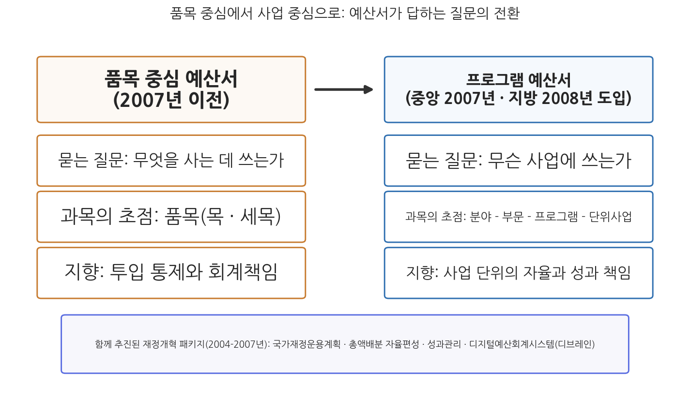
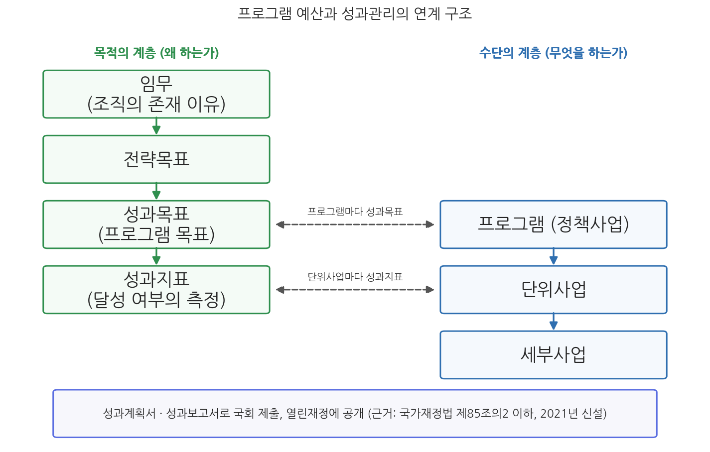

# 5주차 2차시. 프로그램 예산제도

> 모든 예산체계는, 그것이 아무리 초보적인 것일지라도 계획과 관리와 통제의 과정을 함께 담고 있다.
> (앨런 쉬크, 「PPB로 가는 길: 예산개혁의 단계」, 1966)

## 이 장에서 배우는 것

1차시에서 우리는 세출예산 과목체계의 허리에 프로그램과 단위사업이 있다는 것을 보았다. 그런데 이 허리는 처음부터 있던 것이 아니다. 2007년도 예산 이전의 한국 예산서는 품목 중심의 문서였다. 예산서를 펼치면 어느 부처가 인건비로 얼마, 물건비로 얼마, 보조금으로 얼마를 쓰는지는 보였지만, 정작 그 돈으로 무슨 사업을 해서 무엇을 이루려는지는 과목체계의 전면에 드러나지 않았다. 노인복지에 얼마가 가는지 알려면 여러 과목에 흩어진 숫자를 손으로 모아야 했다. 2007년, 예산서의 문법이 바뀌었다. 정부의 일을 사업(프로그램)의 묶음으로 재편하고 예산을 그 사업 구조 위에 얹은 프로그램 예산제도가 중앙정부에 도입된 것이다. 지방자치단체도 2008년부터 사업예산제도라는 이름으로 같은 길을 따랐다.

이 전환은 단순한 서식 개정이 아니라, 예산이라는 문서가 답하는 질문을 "무엇을 사는가"에서 "무슨 일을 하는가"로 바꾼 사건이다. 쉬크의 언어로 말하면 통제 지향의 예산서를 관리와 계획 지향의 예산서로 재설계한 것이고, 그 위에서 비로소 사업 단위의 성과를 묻는 일이 가능해졌다. 이번 차시는 이 제도의 논리와 구조, 그리고 실제 예산서 속의 모습을 배우는 시간이다. 구체적으로 다음을 배운다.

- 프로그램(정책사업)의 개념과 프로그램 예산제도의 의의
- 2007년 도입의 배경: 품목 중심 예산의 한계와 2000년대 중반의 재정개혁 패키지
- 프로그램 예산의 구조: 기능 분류, 프로그램 구조, 품목 분류의 연계와 조직과의 정합
- 실제 지방자치단체 사업예산서에 나타난 정책사업-단위사업-세부사업 구조
- 프로그램 구조와 성과지표가 연계되는 방식, 그리고 그 연계의 한계

<strong>이 장의 로드맵</strong> 
이 장은 하나의 질문을 따라 전개된다. <em>"예산을 품목이 아니라 사업으로 묶으면 무엇이 달라지는가?"</em>  
<strong>2.1</strong> 프로그램 예산제도의 개념과 의의를 정리한다 →
<strong>2.2</strong> 2007년 도입의 배경과 제도의 구조를 본다 →
<strong>2.3</strong> 실제 예산서 속의 사업예산구조를 읽는다 →
<strong>2.4</strong> 프로그램 구조가 성과지표와 연계되는 방식과 그 한계를 확인하고, 다음 주(예산의 종류)를 예고한다.

## 2.1 프로그램 예산제도의 의의

### 사업을 예산의 기본 단위로

프로그램 예산제도는 프로그램(정책사업)을 중심으로 예산을 편성하고 운용하는 제도다. 여기서 프로그램이란 동일한 정책목표를 수행하는 단위사업(project)들의 묶음을 말한다. 예산의 기본 구조는 기능-프로그램(정책사업)-단위사업-세부사업으로 짜이며, 예산의 편성, 심의, 집행, 결산, 성과평가가 모두 이 사업 구조를 공통의 단위로 삼는다. 1차시에서 본 과목체계의 언어로 말하면, 기능별 분류(분야·부문)와 품목별 분류(목·세목) 사이에 사업별 분류라는 허리를 세우고 그 허리를 예산 운용의 중심으로 삼는 제도다.

<strong>정의 · 프로그램과 프로그램 예산제도</strong> 
<strong>프로그램</strong>(program, 정책사업)은 동일한 정책목표를 달성하기 위한 단위사업들의 묶음이다. <strong>프로그램 예산제도</strong>는 이 프로그램을 예산 편성·운용의 기본 단위로 삼는 제도로, 한국의 중앙정부는 2007년, 지방자치단체는 2008년부터 공식 도입했다(양자를 구분하기 위해 지방정부의 제도는 <strong>사업예산제도</strong>라고 불린다). 프로그램 중심의 구조는 사업 단위의 성과 지향적 예산 편성과 운용을 가능하게 한다.

### 품목 중심 예산의 한계에서 출발한다

프로그램 예산제도의 논리를 이해하려면 그 이전 체제의 한계에서 출발해야 한다. 품목 중심의 예산은 지출 통제에는 강한 제도다. 정해진 품목에 정해진 금액만 쓰도록 묶어 두므로 유용과 낭비를 막는 데 유리하고, 회계책임의 추적도 쉽다. 하지만 그 대가로 두 가지를 잃는다. 첫째, 정책 정보가 실종된다. 인건비와 물건비의 합계는 정부가 국민을 위해 무슨 일을 하는지에 대해 아무것도 말해 주지 않는다. 둘째, 관리의 단위가 없다. 하나의 정책 활동에 들어가는 돈이 여러 품목에 흩어져 있으면, 그 활동에 총 얼마가 들었고 무엇을 산출했는지를 묻는 것 자체가 어렵다. 투입의 적법성은 따질 수 있지만 활동의 성과는 따질 수 없는 구조인 것이다. 그림 5-2가 이 전환의 논리를 보여 준다.

그림 5-2를 읽는 법은 이렇다. 왼쪽이 2007년 이전의 품목 중심 예산서, 오른쪽이 프로그램 예산서이며, 각 상자는 두 체제가 앞세우는 질문, 과목의 짜임, 제도의 지향을 대비한다. 아래의 상자는 이 전환이 단독 개혁이 아니라 2000년대 중반 재정개혁 패키지의 한 축이었음을 보여 준다(2.2절). 이 그림에서 알 수 있는 것은 전환의 본질이 과목 명칭의 교체가 아니라 예산 정보의 초점 이동이라는 점이다. 품목별 통제 정보는 사라진 것이 아니라 사업 구조의 아래층(목·세목)으로 내려갔고, 그 위에 사업과 성과의 정보가 얹혔다.

<strong>왜 하필 "사업"이 예산의 기본 단위가 되어야 하는가?</strong> 
품목도 기능도 아닌 사업이 중심 단위로 선택된 데에는 이유가 있다. 첫째, <strong>사업은 자원배분 결정의 실제 단위다.</strong> 정부와 국회가 예산을 놓고 다투는 단위는 "인건비를 늘릴까"가 아니라 "이 사업을 할까 말까, 얼마나 할까"다. 결정의 단위와 예산서의 단위가 일치해야 예산서가 결정을 돕는 문서가 된다. 둘째, <strong>사업은 책임의 단위다.</strong> 하나의 사업에는 담당 조직과 책임자가 있어, 돈과 성과를 잇는 책임의 고리를 걸 수 있다. 셋째, <strong>사업은 원가 계산의 단위다.</strong> 어떤 활동에 들어간 총비용을 사업 단위로 모아야 "이 성과를 내는 데 얼마가 들었는가"라는 성과 관리의 질문이 성립한다. 요컨대 프로그램 구조는 결정, 책임, 원가의 단위를 하나로 정렬하는 장치다.

## 2.2 도입 배경과 구조

### 2000년대 중반의 재정개혁 패키지

프로그램 예산제도는 단독으로 도입된 것이 아니다. 2000년대 중반 노무현 정부는 재정운용의 틀을 한꺼번에 재설계하는 개혁 패키지를 추진했다. 5년 이상의 시계로 재정운용의 방향을 세우는 국가재정운용계획이 2004년부터 수립되기 시작했고, 부처별 지출한도를 먼저 정하고 그 안에서 부처가 자율 편성하는 총액배분 자율편성제도가 2005년도 예산 편성부터 적용되었으며, 재정사업의 성과를 측정하고 관리하는 성과관리제도가 함께 구축되었다. 프로그램 예산제도는 이 개혁들의 기반 구조에 해당한다. 중기계획은 분야·부문별 재원배분 계획이므로 사업 구조 위에서만 구체화되고, 총액배분 이후의 부처 자율 편성은 사업 단위의 우선순위 조정으로 이루어지며, 성과관리는 성과를 귀속시킬 사업 단위를 필요로 하기 때문이다. 이 재정개혁을 뒷받침하는 법적 틀로 2006년 국가재정법이 제정되어 2007년부터 시행되었고, 예산 전 과정을 전산으로 처리하는 디지털예산회계시스템 디브레인도 프로그램 예산제도와 같은 2007년에 개통되었다(1차시 참조). 당시 이 개혁을 추진한 중앙예산기관은 기획예산처(1999-2008)였다. 1주차에서 본 것처럼 기획예산처는 2008년 재정경제부와 통합되어 기획재정부(2008-2026)가 되었다가 2026년 다시 분리되었으므로, 프로그램 예산제도는 옛 기획예산처가 만들고 현재의 기획예산처가 관장하는 제도인 셈이다.

### 제도의 구조: 세 분류의 연계와 조직과의 정합

프로그램 예산제도에서 예산과목 체계는 기능별 분류인 분야-부문, 프로그램 구조인 프로그램(정책사업)-단위사업-세부사업, 품목별 분류인 목·세목(지방은 편성목-통계목)이 연계된 구조다. 옛 과목 명칭과 대응시키면 장·관·항·세항·세세항·목·세목이 각각 분야·부문·프로그램(정책사업)·단위사업·세부사업·목(편성목)·세목(통계목)에 해당한다. 1차시 그림 5-1에서 본 계층 구조가 바로 이것이다.

이 구조의 특징은 조직 및 정책 체계와의 정합이다. 프로그램은 어느 부처의 어느 실·국이 수행하는 동일 목표의 사업 묶음으로 설계되므로, 사업 구조가 조직 구조와 대체로 포개진다. 기초 지방자치단체에서는 정책사업이 실·과에, 단위사업이 팀에 대응하는 방식으로 사실상 운영된다. 이 정합 덕분에 예산의 단위가 곧 일하는 조직의 단위, 성과 책임의 단위가 된다. 지방자치단체의 사업예산 구조는 법률에 명문화되어 있다.

<strong>법조문 읽기 · 지방재정법 제41조(예산의 과목 구분)</strong> 
"② 지방자치단체의 세출예산은 그 내용의 기능별·사업별 또는 성질별로 주요항목 및 세부항목으로 구분한다. 이 경우 주요항목은 분야·부문·정책사업으로 구분하고, 세부항목은 단위사업·세부사업·목으로 구분한다. 
③ 제1항 및 제2항에 따른 각 과목의 구분과 설정 등 지방자치단체의 예산 과목 운용에 필요한 사항은 대통령령으로 정한다."

무슨 뜻인가. 중앙정부의 세출과목이 국가재정법 제21조에서 장·관·항이라는 옛 명칭으로 남아 있는 것과 달리, 지방재정법은 사업예산제도의 용어인 분야·부문·정책사업·단위사업·세부사업을 법률 조문에 직접 새겨 넣었다. 사업 중심 구조가 지방에서는 법률 수준에서 과목의 공식 명칭이 된 것이다. 세부 운용은 대통령령(지방재정법 시행령 제47조)을 거쳐 행정안전부장관이 정하는 지방자치단체 예산편성 운영기준에 위임되어 있는데, 이 기준은 분야·부문을 기능별로 통일적으로 분류하고 정책사업 이하는 지자체가 자율 설정하도록 하면서, 지자체 전체 재정을 정책사업, 행정운영경비, 재무활동의 셋으로 구분하고 하나의 정책사업은 통상 4-5개의 단위사업으로 구성하되 10개를 넘지 않도록 운용의 가이드라인을 두고 있다. 인건비 같은 조직 운영 경비와 채무 상환 같은 재무활동을 정책사업 밖으로 빼내는 것은, 정책사업의 원가를 순수하게 보여 주기 위한 설계다.

## 2.3 사업예산구조의 실제

### 예산서 속의 프로그램 구조

이제 실제 예산서에서 이 구조가 어떻게 나타나는지 보자. 중앙정부의 예산서에서 하나의 지출을 따라가면, 예컨대 보건복지부 소관 일반회계의 사회복지 분야, 노인 부문 아래에 노인의 생활 안정을 목표로 하는 프로그램이 놓이고, 그 아래에 기초연금 지급과 같은 단위사업이, 다시 그 아래에 세부사업이 놓이는 식으로 이어진다. 국회가 2026년 예산에서 AI 관련 사업 738개를 세어 낼 수 있었던 것(1차시 사례)도, 정부 예산 전체가 이렇게 사업 단위로 편성되어 있기 때문이다. 프로그램 구조의 결은 지방자치단체의 사업예산서에서 더 생생하게 볼 수 있다. 실제 사례를 읽자.

<strong>사례 읽기 · 서울특별시 관악구의 복지 분야 사업예산 구조 (2023년)</strong> 
관악구의 2023년도 사업예산서에서 주민복지 담당 부서의 예산은 "주민과 함께 만들어가는 복지공동체 구현"이라는 정책사업 아래 네 개의 단위사업으로 짜여 있다. 복지기반 조성, 지역사회 복지서비스 지원, 맞춤형 복지서비스 제공, 보훈대상자 예우 및 지원이 그것이다. 각 단위사업 아래에는 세부사업이 놓인다. 복지기반 조성에는 동 복지기능 강화, 찾아가는 복지플래너 운영, 지역사회보장계획 수립 등이, 지역사회 복지서비스 지원에는 지역사회보장협의체 운영, 관악 푸드뱅크마켓 운영지원, 사회복지관 운영 지원 등이, 맞춤형 복지서비스 제공에는 통합사례관리사업, 긴급복지, 서울형 긴급복지 지원사업, 우리동네 돌봄단 등이 속한다. 정책사업과 별도로 인력운영비와 기본경비는 행정운영경비로, 국·시비 보조금 집행잔액의 반환은 재무활동(보전지출)으로 분리되어 있다. (출처: 서울특별시 관악구 세출예산서(사업예산 구조), 2023년도)

이 사례가 보여 주는 것은 세 가지다. 첫째, 운영기준의 설계가 실제로 지켜지고 있다. 하나의 정책사업 아래 단위사업이 4개로, "통상 4-5개" 기준에 부합하고, 행정운영경비와 재무활동은 정책사업 밖으로 분리되어 있다. 둘째, 사업 명칭 자체가 정보다. "찾아가는 복지플래너 운영", "우리동네 돌봄단" 같은 세부사업명은 그 돈으로 무슨 활동을 하는지를 품목 명세와는 비교할 수 없는 해상도로 보여 준다. 주민이 예산서를 읽고 자기 동네의 복지 활동을 확인할 수 있는 것은 이 구조 덕분이다. 셋째, 구조가 조직과 포개진다. 정책사업 하나가 주민복지 부서 하나에, 단위사업들이 그 아래 팀들에 대응하는 모습은 2.2절에서 본 조직 정합의 실물이다.

### 쟁점: 사업 구획의 자의성

사업예산구조의 실제에는 그늘도 있다. 프로그램과 단위사업의 구획에는 정답이 없으므로, 구조의 품질이 설계자의 역량과 유인에 좌우된다. 몇 가지 쟁점이 반복적으로 지적된다. 첫째, 사업의 쪼개기와 묶기의 자의성이다. 비슷한 활동이 부처나 부서에 따라 하나의 단위사업으로 묶이기도 하고 여러 세부사업으로 흩어지기도 하며, 세부사업이 지나치게 잘게 쪼개지면 사업 수가 불어나 관리 부담과 정보 과부하를 낳는다. 둘째, 유사·중복 사업의 문제다. 조직별로 사업 구조를 세우다 보면 여러 부처가 비슷한 목표의 사업을 각자 운영하는 일이 생기고, 이는 예산 낭비 논쟁의 단골 소재가 된다. 셋째, 구조 개편과 시계열의 긴장이다. 조직 개편이나 정책 변화로 사업 구조를 바꾸면 사업 단위의 연도별 비교가 끊어진다. 1차시에서 본 분류 개편의 비용이 사업 구조에서도 그대로 나타나는 것이다. 프로그램 예산제도는 좋은 구조를 강제하는 제도가 아니라 좋은 구조를 담을 수 있는 그릇이라는 점을 기억할 필요가 있다.

## 2.4 성과지표와의 연계

### 목적의 계층과 수단의 계층

프로그램 예산제도의 마지막 퍼즐은 성과와의 연계다. 프로그램 구조는 그 자체가 목적-수단의 사다리로 설계되어 있다. 각 조직은 자신의 임무(mission)에 근거하여 전략목표를 세우고, 전략목표를 달성하기 위한 성과목표를 세운다. 임무, 전략목표, 성과목표가 목적의 계층이라면, 프로그램(정책사업), 단위사업, 세부사업은 이를 실현하는 수단의 계층이다. 성과목표는 대체로 프로그램 수준에 대응하고, 성과목표의 달성 여부를 재는 성과지표는 사업 단위에 부착된다. 이 연계 구조가 있어야 "이 사업에 이만큼 썼다"는 예산 정보와 "이만큼 이루었다"는 성과 정보가 같은 단위에서 만난다. 그림 5-3이 이 구조를 보여 준다.

그림 5-3을 읽는 법은 이렇다. 왼쪽 기둥이 목적의 계층(임무, 전략목표, 성과목표, 성과지표)이고 오른쪽 기둥이 수단의 계층(프로그램, 단위사업, 세부사업)이며, 가로 점선은 성과목표가 프로그램에, 성과지표가 단위사업에 대응함을 나타낸다. 아래의 상자는 이 연계가 성과계획서와 성과보고서라는 문서로 국회에 제출되고 공개된다는 것을 보여 준다. 이 그림에서 알 수 있는 것은 프로그램 구조가 없으면 성과관리가 걸릴 자리 자체가 없다는 점이다. 품목 중심 예산에서 "인건비의 성과"를 물을 수 없듯이, 성과는 언제나 사업의 성과로만 정의될 수 있기 때문이다.

이 연계는 법률로 뒷받침되어 있다. 재정사업의 성과관리는 2021년 12월 국가재정법 개정(법률 제18585호)으로 체계화되어, 성과목표관리와 성과평가로 구성되는 성과관리의 틀, 재정사업 성과관리 기본계획의 수립, 성과계획서·성과보고서의 작성 근거가 국가재정법 제85조의2 이하에 신설되었다. 별도의 법률이 제정된 것이 아니라 국가재정법 안에 성과관리의 장이 마련된 것이다. 2026년 정부조직 개편 이후 예산·기금의 성과관리는 기획예산처의 관장 사무이며, 핵심 재정사업의 성과관리 정보는 열린재정을 통해 공개되고 있다. 성과관리제도의 전체 체계(성과목표관리, 재정사업자율평가, 심층평가)는 14주차 2차시에서 자세히 다룬다.

### 지표의 실제와 형식화의 함정

성과지표의 실제 모습은 어떨까. 앞서 본 관악구류의 복지 사업예산에는 통합서비스제공률, 신규수급자 발굴실적, 긴급지원 발굴실적, 통합사례관리 실적 같은 지표들이 단위사업에 붙어 있다. 이 지표들은 사업의 활동량을 재는 데는 유용하지만, 대부분 산출(output) 지표이지 성과(outcome) 지표가 아니라는 점에 주목할 필요가 있다. 발굴 실적이 늘었다는 것과 위기가구의 삶이 나아졌다는 것은 다른 이야기이기 때문이다. 측정하기 쉬운 것이 측정되고, 측정되는 것이 목표가 되는 경향은 성과관리의 오래된 함정이다.

<strong>유의 · 프로그램 구조가 곧 성과 개선을 보장하지 않는다</strong> 
프로그램 예산제도는 성과를 물을 수 있는 <strong>구조</strong>를 제공할 뿐, 성과 자체를 만들어 주지 않는다. 지표가 산출 실적에 치우치면 사업 구조는 정교해도 성과 정보는 공허해지고, 목표치를 달성 가능한 수준으로 낮춰 잡으면 성과보고서는 매년 "달성"으로 채워진다. 또한 성과가 나쁜 사업의 예산을 줄이는 환류가 작동하지 않으면 성과 정보는 편성과 분리된 서류 작업으로 형식화된다. 제도의 그릇과 운용의 내용을 구분해서 평가하는 눈이 필요하다.

### 허브로서의 프로그램 예산

마지막으로 시야를 넓혀 보자. 프로그램 예산은 성과관리만이 아니라 재정운용의 여러 제도가 만나는 허브다. 국가재정운용계획의 분야·부문별 재원배분은 프로그램 구조 위에서 연도별 예산으로 구체화되고, 총액배분 자율편성에서 부처의 자율 편성은 프로그램 단위의 우선순위 조정으로 실행되며, 발생주의 회계는 사업 단위의 원가 정보를 제공하고, 예산의 심의와 집행과 결산이 모두 같은 사업 구조 위에서 이루어진다. 예산운영의 규범 측면에서 보면 프로그램 예산은 자율성(사업 안에서의 운용 재량), 책임성(사업 단위의 성과 책임), 투명성(사업 단위의 정보 공개), 성과 지향성을 실현하는 중심 장치이기도 하다. 2주차에서 본 쉬크의 공공지출관리 3대 규범, 곧 총량 재정규율, 배분적 효율성, 운영 효율성의 언어로 옮기면, 총량은 국가재정운용계획과 총액배분이, 배분과 운영의 효율은 프로그램 구조와 성과관리가 떠받치는 분업 구조인 셈이다.

이로써 우리는 예산서의 안쪽 구조를 모두 들여다보았다. 회계와 기금(3주차), 거시 총량(4주차), 과목체계와 프로그램 구조(5주차)를 알았으니, 다음 주는 예산이라는 문서가 상황에 따라 갈아입는 법적 형태들을 다룬다. 본예산과 수정예산, 추가경정예산, 그리고 예산이 성립하지 못했을 때의 준예산이 6주차의 주제다.

## 요약

프로그램 예산제도는 동일한 정책목표를 수행하는 단위사업의 묶음인 프로그램(정책사업)을 중심으로 예산을 편성·운용하는 제도로, 중앙정부는 2007년, 지방자치단체는 2008년(사업예산제도)부터 공식 도입했다. 품목 중심 예산이 지출 통제에는 강하지만 정책 정보와 관리 단위를 결여한다는 한계에서 출발한 이 제도는, 예산서가 답하는 질문을 "무엇을 사는가"에서 "무슨 일을 하는가"로 바꾸었으며, 결정·책임·원가의 단위를 사업으로 정렬했다. 도입은 국가재정운용계획(2004년 최초 수립), 총액배분 자율편성(2005년도 예산부터 적용), 성과관리, 디지털예산회계시스템(2007년 개통)과 함께 추진된 2000년대 중반 재정개혁 패키지의 기반 구조였고, 당시 기획예산처(1999-2008)가 주도했으며 2006년 제정된 국가재정법이 법적 틀을 제공했다. 과목체계는 기능별 분류(분야-부문), 프로그램 구조(프로그램-단위사업-세부사업), 품목별 분류(목·세목, 지방은 편성목-통계목)가 연계된 구조이며 조직 체계와 정합하도록 설계되었다. 지방재정법 제41조는 분야·부문·정책사업과 단위사업·세부사업·목의 구분을 법률에 명문화했고, 행정안전부의 예산편성 운영기준은 전체 재정을 정책사업·행정운영경비·재무활동으로 구분하며 정책사업당 단위사업을 통상 4-5개로 운용하도록 한다. 관악구의 2023년 사업예산 구조는 이 설계가 실제로 작동함을 보여 주지만, 사업 구획의 자의성, 유사·중복 사업, 구조 개편에 따른 시계열 단절이라는 쟁점도 있다. 프로그램 구조는 임무-전략목표-성과목표의 목적 계층과 프로그램-단위사업-세부사업의 수단 계층을 대응시키고 성과지표를 사업 단위에 부착함으로써 성과관리의 자리를 만들며, 이 틀은 2021년 국가재정법 개정(제85조의2 이하)으로 법제화되어 현재 기획예산처가 관장하고 열린재정에 공개된다. 다만 산출 지표 편중과 형식화의 함정이 있어, 프로그램 구조는 성과를 물을 수 있는 그릇이지 성과의 보증이 아니다.

## 토론·복습 문제

**5-5. (서술형 연습)** 품목 중심 예산의 강점과 한계를 정리하고, 프로그램 예산제도가 그 한계를 어떤 구조로 해결하려 했는지 서술하시오. 이때 쉬크의 통제·관리·계획 지향 개념과, 결정·책임·원가 단위의 정렬이라는 논리를 활용하시오.

**5-6. (해석형)** 2.3절의 관악구 사례에서 정책사업, 단위사업, 세부사업을 각각 한 층씩 지목하고, 이 구조가 지방자치단체 예산편성 운영기준의 두 가지 설계 원칙(정책사업당 단위사업 수, 행정운영경비·재무활동의 분리)에 부합하는지 판정하시오. 이어서 인력운영비를 정책사업 안에 포함시키면 사업 원가 정보에 어떤 왜곡이 생기는지 설명하시오.

**5-7. (지표 설계형)** 여러분이 사는 지방자치단체의 세부사업 하나를 골라(열린재정 또는 지방재정365 활용), 그 사업의 산출 지표와 성과 지표를 각각 하나씩 설계해 보시오. 두 지표가 어떻게 다른지, 산출 지표만 쓸 때 어떤 행태가 유발될 수 있는지 설명하시오.

**5-8. (찬반 토론)** "프로그램 예산제도 도입 이후에도 국회 예산심의는 여전히 세부사업의 증액과 감액에 집중되어 있으므로, 사업 중심 개혁은 심의 단계에서는 실패했다"는 주장에 대해 찬성과 반대의 논거를 각각 제시하고 자신의 입장을 정하시오. 입법과목·행정과목의 구분(1차시)과 성과 정보의 환류 문제(2.4절)를 논거로 활용하시오.
