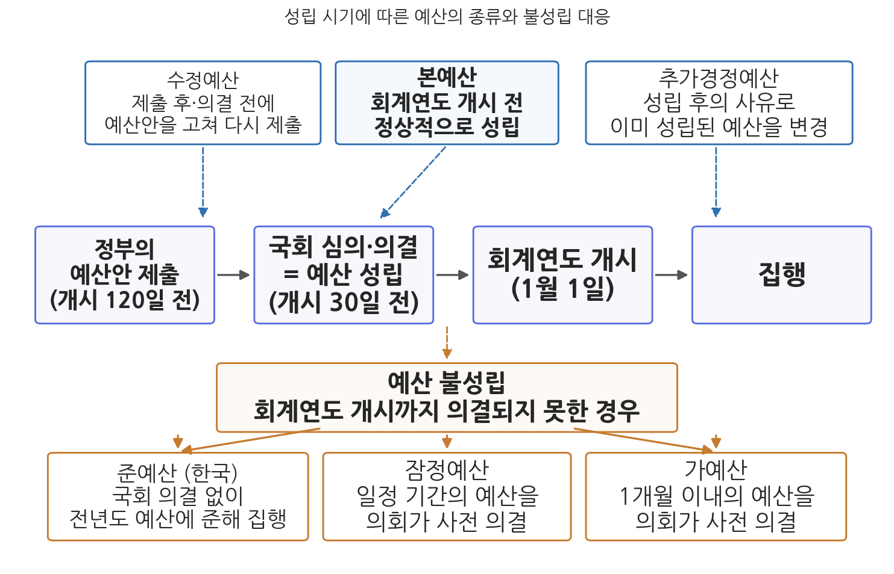
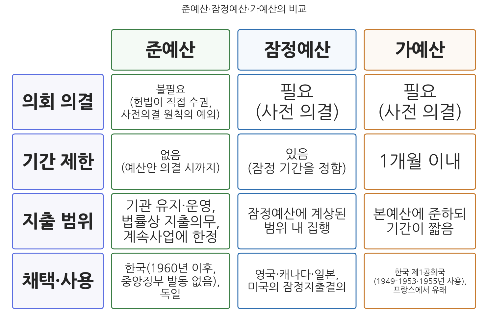

# 6주차 1차시. 예산의 종류: 본예산에서 준예산까지

> 새로운 회계연도가 개시될 때까지 예산안이 의결되지 못한 때에는 정부는 국회에서 예산안이 의결될 때까지 다음의 목적을 위한 경비는 전년도 예산에 준하여 집행할 수 있다.
> (대한민국헌법 제54조 제3항)

## 이 장에서 배우는 것

2026년 4월 11일, 국회는 총 26.2조 원 규모의 추가경정예산(추경)을 확정했다. 2026년 본예산 727.9조 원이 국회를 통과한 지 넉 달 만이다. 중동전쟁발 고유가에 대응해 국민 70%에게 최대 60만 원의 지원금을 지급하고 피해 업종을 지원하는 내용이었다. 한 해 전인 2025년에는 추경이 두 번 있었다. 5월에 산불 등 재해와 통상 환경 변화에 대응하는 13.8조 원, 7월에 새 정부 출범 직후 민생회복 소비쿠폰을 담은 31.8조 원이다. 국회가 연말에 확정한 예산이 "그해의 예산"의 전부가 아닌 것이다. 반대편 극단의 장면도 있다. 2025년 10월 1일 미국 연방정부는 예산이 성립되지 못해 문을 닫았고, 이 셧다운(shutdown)은 43일간 이어져 역대 최장 기록을 세웠다. 예산은 성립된 뒤에 바뀌기도 하고, 아예 제때 성립되지 못하기도 한다. 이 두 방향의 "정상 궤도 이탈"에 제도가 어떻게 대비하고 있는가가 이 장의 주제다.

5주차에서 우리는 하나의 예산이 안으로 어떻게 편제되는지, 곧 세입·세출예산의 과목체계와 프로그램 예산구조를 보았다. 이번 주는 시선을 예산 바깥으로 돌려, 예산이라는 것이 언제 어떤 모습으로 성립하는가에 따라 여러 종류로 나뉜다는 점을 배운다. 기준은 성립의 시기다. 국회 제출 후 의결 전에 고쳐 내는 수정예산, 회계연도 개시 전에 정상적으로 확정되는 본예산, 성립된 뒤에 변경을 가하는 추경이 있고, 회계연도가 시작될 때까지 예산이 성립되지 못하는 비상 상황에 대비한 준예산·잠정예산·가예산이 있다. 구체적으로 다음을 배운다.

- 성립 시기에 따른 예산의 분류: 본예산, 수정예산, 추가경정예산
- 국가재정법 제89조가 추경 편성 사유를 세 가지로 한정한 이유와 조문의 실제 적용
- 2025-2026년 세 차례 추경의 내역과 추경 상시화의 쟁점
- 예산 불성립에 대비하는 세 제도(준예산·잠정예산·가예산)의 구조와 국가별 채택
- 한국의 준예산 제도가 한 번도 발동되지 않은 이유와 미국 셧다운의 비교

<strong>이 장의 로드맵</strong> 
이 장은 하나의 질문을 따라 전개된다. <em>"예산이 정상 궤도를 벗어나면, 곧 성립된 뒤에 사정이 바뀌거나 제때 성립되지 못하면 어떻게 되는가?"</em>  
<strong>1.1</strong> 성립 시기에 따른 예산의 분류를 그리고, 본예산과 수정예산을 본다 →
<strong>1.2</strong> 추가경정예산의 법적 요건(국가재정법 제89조)과 2025-2026년의 실제를 뜯어본다 →
<strong>1.3</strong> 예산 불성립에 대비하는 준예산·잠정예산·가예산을 비교하고, 미국 셧다운 사례를 읽는다 →
<strong>1.4</strong> 쟁점을 정리하고 2차시(조세지출·성인지 예산과 예산법률주의)로 넘어간다.

## 1.1 본예산과 수정예산

### 성립 시기에 따른 분류

예산은 성립 시기에 따라 본예산, 수정예산, 추가경정예산으로 나뉜다. 기준이 되는 정상 절차부터 확인하자. 헌법 제54조에 따라 정부는 회계연도마다 예산안을 편성해 국회에 제출하고, 국회는 이를 심의·확정한다. 헌법은 회계연도 개시 90일 전까지 제출하도록 정하고 있으나, 국가재정법 제33조는 이를 강화해 120일 전까지 제출하도록 했다. 국회는 회계연도 개시 30일 전, 곧 12월 2일까지 예산안을 의결해야 한다. 2026년 1월 출범한 기획예산처가 예산안편성지침 통보(국가재정법 제29조)와 예산안 편성(제32조)을 관장하고, 국무회의 심의와 대통령 승인을 거쳐 정부가 국회에 제출하는 절차는 1주차에서 본 그대로다.

<strong>법조문 읽기 · 대한민국헌법 제54조</strong> 
"① 국회는 국가의 예산안을 심의·확정한다. 
② 정부는 회계연도마다 예산안을 편성하여 회계연도 개시 90일 전까지 국회에 제출하고, 국회는 회계연도 개시 30일 전까지 이를 의결하여야 한다. 
③ 새로운 회계연도가 개시될 때까지 예산안이 의결되지 못한 때에는 정부는 국회에서 예산안이 의결될 때까지 다음의 목적을 위한 경비는 전년도 예산에 준하여 집행할 수 있다. 
1. 헌법이나 법률에 의하여 설치된 기관 또는 시설의 유지·운영 
2. 법률상 지출의무의 이행 
3. 이미 예산으로 승인된 사업의 계속"

이 한 조문에 이 장의 지도가 다 들어 있다. 제1항과 제2항은 예산 성립의 정상 절차다. 정부가 편성하고 국회가 확정하되, 회계연도가 시작되기 전에 끝내야 한다는 시간 규율이 핵심이다. 이 절차를 제때 통과한 예산이 본예산이다. 그리고 제3항은 그 시간 규율이 깨졌을 때, 곧 새 회계연도가 시작됐는데도 예산이 의결되지 못했을 때의 비상 장치다. 이것이 1.3절에서 볼 준예산이다. 헌법 제정자들은 예산이 제때 성립되지 못하는 상황을 미리 내다보고 정부 기능이 멈추지 않을 최소한의 길을 헌법에 새겨 두었다.

<strong>정의 · 본예산, 수정예산, 추가경정예산</strong> 
<strong>본예산</strong>(당초예산)은 정기국회에서 다음 회계연도 예산에 대해 의결·확정한 예산으로, 새로운 회계연도를 위해 최초로 성립된 예산이다. <strong>수정예산</strong>은 정부가 예산안을 국회에 제출한 후 의결·확정되기 전에 부득이한 사유로 그 내용의 일부를 수정해 다시 제출하는 예산안이다(국가재정법 제35조). <strong>추가경정예산</strong>은 예산이 성립된 후에 생긴 사유로 이미 성립된 예산에 변경을 가할 필요가 있을 때 편성하는 예산이다(국가재정법 제89조). 기준선은 예산의 성립 시점이다. 성립 전에 고치면 수정예산, 성립 후에 고치면 추가경정예산이다.

그림 6-1을 읽는 법은 이렇다. 가운데 가로줄이 예산의 시간 흐름이다. 정부가 예산안을 국회에 제출하고, 국회가 의결해 예산이 성립하며, 새 회계연도가 시작되어 집행에 들어간다. 위쪽의 상자들은 이 흐름의 어느 지점에서 개입하는가에 따라 수정예산(제출 후·의결 전), 본예산(정상 성립), 추가경정예산(성립 후 변경)이 갈린다는 것을 보여 준다. 아래쪽 상자는 의결 시점이 회계연도 개시를 넘겨 버린 불성립 상황에서 작동하는 세 제도다. 이 그림에서 알 수 있는 것은 두 가지다. 첫째, 예산의 종류란 별개의 예산이 여럿 있다는 뜻이 아니라 하나의 예산 과정이 어느 지점에서 궤도를 이탈했는가에 대한 분류라는 점이다. 둘째, 제도는 이탈의 모든 지점에 대비책을 두고 있다는 점이다.

### 수정예산: 의결되기 전에 고쳐 내는 예산

수정예산은 정부가 예산안을 국회에 제출한 후 예산이 최종 의결되기 전에, 국내외의 사회경제적 여건 변화로 예산안 내용의 일부를 변경할 필요가 있을 때 편성한다. 국가재정법 제35조에 따라 국무회의의 심의를 거쳐 대통령의 승인을 얻어 국회에 제출한다. 이런 제도가 인정되는 이유는 시차에 있다. 예산안 편성 작업은 회계연도가 시작되기 한참 전인 전년도 봄부터 진행되고 국회 제출도 개시 120일 전에 이루어지므로, 편성의 기초가 된 경제 전망과 국회 의결 사이에는 상당한 시간 간격이 존재한다. 그 사이에 경제 위기 같은 큰 변화가 닥치면 이미 제출한 예산안이 낡은 전제 위에 서 있게 되는 것이다.

실제로 수정예산안이 제출된 것은 1970년도, 1981년도, 2009년도 예산안 등 손에 꼽을 정도로 드물다. 가장 최근인 2009년도 수정예산안은 2008년 가을 글로벌 금융위기가 터지자 정부가 이미 국회에 제출해 놓은 2009년도 예산안의 지출 규모를 늘려 다시 제출한 것이다. 편성 시점의 전망(안정적 성장)과 의결 시점의 현실(세계적 위기) 사이의 간극을 메운 전형적인 사례다. 수정예산이 드문 이유는 간단하다. 웬만한 여건 변화는 국회 심의 과정의 증액·감액으로 반영할 수 있고, 예산 성립 후에 터진 변화는 다음에 볼 추경으로 대응할 수 있기 때문이다.

## 1.2 추가경정예산: 요건과 실제

### 예산 단일성 원칙의 예외

추가경정예산(추경)은 예산이 성립된 후에 생긴 사유로 인해 이미 성립된 예산에 변경을 가할 필요가 있을 때 정부가 편성해 국회에 제출하는 예산이다. 2주차 2차시에서 본 예산의 원칙을 떠올려 보자. 예산 단일성의 원칙에 따르면 한 회계연도의 예산은 하나로 통일되어야 하고, 따라서 예산은 본예산에 의해서만 집행되는 것이 원칙이다. 추경은 이 원칙의 예외다. 예외인 만큼 문턱이 있다. 예기치 못한 지출 수요가 생기면 정부는 우선 예비비로 충당하거나 이용·전용 같은 신축성 확보수단(10주차에서 배운다)을 활용하고, 그것으로 감당할 수 없을 때 비로소 추경을 편성하는 것이 제도의 설계다. 그리고 추경안이 국회에서 확정되기 전에는 이를 미리 배정하거나 집행할 수 없다(국가재정법 제89조 제2항). 사전의결 원칙은 추경에도 그대로 적용되는 것이다.

문턱은 편성 사유 자체에도 있다. 2006년 제정되어 2007년 시행된 국가재정법은 추경을 편성할 수 있는 경우를 세 가지로 한정했다.

<strong>법조문 읽기 · 국가재정법 제89조(추가경정예산안의 편성)</strong> 
"① 정부는 다음 각 호의 어느 하나에 해당하게 되어 이미 확정된 예산에 변경을 가할 필요가 있는 경우에는 추가경정예산안을 편성할 수 있다. 
1. 전쟁이나 대규모 재해(「재난 및 안전관리 기본법」 제3조에서 정의한 자연재난과 사회재난의 발생에 따른 피해를 말한다)가 발생한 경우 
2. 경기침체, 대량실업, 남북관계의 변화, 경제협력과 같은 대내·외 여건에 중대한 변화가 발생하였거나 발생할 우려가 있는 경우 
3. 법령에 따라 국가가 지급하여야 하는 지출이 발생하거나 증가하는 경우 
② 정부는 국회에서 추가경정예산안이 확정되기 전에 이를 미리 배정하거나 집행할 수 없다."

무슨 뜻인가. 제1항의 문장 구조가 중요하다. "다음 각 호의 어느 하나에 해당하게 되어"라는 요건이 앞에 붙어 있으므로, 세 가지 사유에 해당하지 않으면 정부는 추경안을 편성할 수 없다. 국가재정법 이전에는 이런 사유 제한이 없어 추경이 사실상 정부의 재량에 맡겨져 있었는데, 국가재정법이 재정건전성 규율의 하나로 문턱을 세운 것이다. 각 호를 뜯어보면 제1호는 재난(전쟁·대규모 재해), 제2호는 거시경제와 대외 여건의 중대한 변화, 제3호는 법정 지출의 증가다. 특히 제2호는 "발생할 우려가 있는 경우"까지 포함하므로 실제 위기가 닥치기 전의 선제 대응도 허용한다. 뒤집어 말하면 이 요건은 넓게 열려 있는 문이기도 하다. 경기침체의 "우려"는 해석의 여지가 크기 때문에, 요건 조항이 추경을 실제로 얼마나 억제하는가에 대해서는 회의적인 평가가 많다.

### 추경의 재원과 본예산과의 관계

추경을 편성하려면 돈이 있어야 한다. 추경의 재원은 전년도에 쓰고 남은 세계잉여금, 당해 연도의 세수 증가분, 공기업 주식 매각 수입, 한국은행 잉여금 등으로 마련하며, 이것으로 부족하면 국채를 발행한다. 재원의 성격이 추경의 성격을 좌우한다. 세수가 잘 걷혀 남는 돈으로 하는 추경과 빚을 내서 하는 추경은 재정건전성에 미치는 효과가 전혀 다르기 때문이다. 최근의 추경은 대체로 국채 발행을 수반했고, 이는 4주차에서 본 국가채무(D1) 증가로 직결되었다. 2025회계연도 결산 기준 국가채무가 1,304.5조 원으로 전년보다 129.4조 원 늘어난 데에는 두 차례 추경의 몫이 컸다.

성립 절차의 측면에서 추경은 본예산과 별개로 편성되어 별개로 의결되지만, 일단 성립되면 본예산과 하나로 통합되어 운영된다. 그래서 추경이 있었던 해의 재정 통계는 "본예산 기준"인지 "추경 기준"인지에 따라 달라지며, 연도 간 비교를 할 때는 어느 기준인지 반드시 확인해야 한다. 4주차에서 총지출 규모를 다룰 때 "본예산 기준"이라는 단서를 계속 붙였던 이유가 이것이다.

### 한국의 실제: 거의 해마다 편성되는 추경

제도는 추경을 예외로 설계했지만, 실제의 추경은 예외라기보다 준례에 가깝다. 2020년에는 코로나19 대응을 위해 한 해에 네 차례 추경이 편성되었고, 2025년에는 두 차례, 2026년에도 4월에 한 차례 편성되었다. 최근 세 건의 내역을 사례로 읽어 보자.

<strong>사례 읽기 · 2025-2026년의 세 차례 추가경정예산</strong> 
2025년 제1회 추경은 2025년 5월 1일 국회에서 13.8조 원으로 확정되었다(정부안 12.2조 원에서 1.6조 원 순증). 대형 산불 등 재해·재난 대응, 통상 환경 변화와 AI 경쟁력 대응, 민생 지원이 내용이었다. 제2회 추경은 이재명 정부 출범 한 달 만인 2025년 7월 4일 31.8조 원으로 확정되었고(정부안 30.5조 원에서 1.3조 원 순증), 전 국민 민생회복 소비쿠폰 지급이 핵심이었다. 2026년 제1회 추경은 3월 31일 정부안(25.2조 원) 제출 후 4월 11일 26.2조 원으로 확정되었다. 중동전쟁발 고유가 대응, 취약계층 민생 안정, 피해 업종·기업 지원, 공급망 안정이 목적이며 국민 70%에게 최대 60만 원의 고유가 지원금을 지급하는 내용이 담겼다. 2025년의 두 추경은 당시의 기획재정부가, 2026년 추경은 개편으로 예산을 관장하게 된 기획예산처가 편성·발표했다. (출처: 대한민국 정책브리핑 및 기획예산처 보도자료, 2025-2026)

이 사례가 보여 주는 것은 두 가지다. 첫째, 제89조의 요건이 실제로 어떻게 적용되는지다. 산불 피해 대응은 제1호(대규모 재해)에, 고유가·통상 충격과 경기 대응은 제2호(대내·외 여건의 중대한 변화)에 해당한다. 조문의 추상적 사유가 현실의 추경에서 어떤 얼굴로 나타나는지 확인할 수 있다. 둘째, 추경의 정치경제다. 2025년 제2회 추경처럼 새 정부 출범 직후의 추경은 새 정부의 정책 기조(확장재정)를 본예산 주기가 돌아오기 전에 앞당겨 실현하는 수단이 된다. 추경이 경제 충격에 대한 대응인 동시에 정치 일정의 산물이기도 하다는 점은, 11주차에서 볼 예산행태론의 좋은 예습 거리다.

<strong>유의 · 추경의 상시화는 왜 문제인가</strong> 
추경은 예산 단일성 원칙의 예외인데, 예외가 준례가 되면 두 가지 비용이 생긴다. 첫째, <strong>국회 통제의 약화</strong>다. 본예산은 90일 안팎의 심의를 거치지만 추경은 통상 몇 주 만에 처리되므로, 재정의 큰 몫이 짧은 심의로 결정된다. 둘째, <strong>예산 팽창</strong>이다. 추경은 총지출을 늘리는 방향으로 작동하는 것이 보통이고, 국채 발행이 재원이 되면 국가채무가 늘어난다. 그래서 교과서적 처방은 "추경은 자제하는 것이 바람직하다"이지만, 현실은 거의 해마다 추경이다. 제도의 문턱(제89조)과 현실의 빈도 사이의 이 간극을 어떻게 볼 것인가가 토론 문제 6-3의 주제다.

## 1.3 예산 불성립과 준예산·잠정예산·가예산

### 예산이 제때 성립되지 못하면

이제 반대 방향의 이탈을 보자. 국회가 회계연도 개시 전까지 예산안을 의결하지 못하면 어떻게 되는가. 1월 1일부터 정부는 지출 근거를 잃는다. 공무원 급여도, 복지 급여도, 진행 중인 공사의 대금도 법적으로는 지급할 수 없게 된다. 이 상황에 대비하는 제도가 나라마다 다르며, 크게 준예산·잠정예산·가예산의 세 유형으로 나뉜다. 한국은 앞서 본 헌법 제54조 제3항의 준예산 제도를 두고 있다. 새로운 회계연도가 개시될 때까지 예산안이 의결되지 못한 때에는, 정부는 국회에서 예산안이 의결될 때까지 헌법이나 법률에 의해 설치된 기관·시설의 유지와 운영, 법률상 지출의무의 이행, 이미 예산으로 승인된 사업의 계속이라는 세 가지 목적의 경비에 한해 전년도 예산에 준하여 집행할 수 있다.

준예산의 제도적 특징은 세 가지다. 첫째, 국회의 의결이 필요 없다. 헌법이 직접 집행을 수권하기 때문이다. 이 점에서 준예산은 2주차 2차시에서 본 사전의결 원칙의 예외다. 둘째, 기간의 제한이 없다. 국회에서 예산안이 의결될 때까지 계속된다. 셋째, 지출 범위가 세 가지 목적으로 한정된다. 신규 사업은 시작할 수 없고, 기존 기관의 유지와 의무지출, 계속사업만 가능하다. 그리고 준예산으로 집행된 예산은 당해 연도의 예산이 확정되면 그 확정된 예산에 의해 집행된 것으로 본다(국가재정법 제55조 제2항). 사후에 본예산 속으로 흡수시켜 회계의 단일성을 회복하는 장치다.

<strong>법조문 읽기 · 국가재정법 제55조(예산불확정시의 예산집행)</strong> 
"① 정부는 국회에서 부득이한 사유로 회계연도 개시 전까지 예산안이 의결되지 못한 때에는 「헌법」 제54조제3항의 규정에 따라 예산을 집행하여야 한다. 
② 제1항의 규정에 따라 집행된 예산은 해당 연도의 예산이 확정된 때에는 그 확정된 예산에 따라 집행된 것으로 본다."

무슨 뜻인가. 제1항은 헌법의 준예산 조항을 법률 차원에서 받아 집행 의무를 명확히 한 것이고, 제2항은 준예산 기간의 지출을 사후 성립된 본예산의 지출로 간주하는 정산 규정이다. 준예산이 별도의 예산이 아니라 본예산이 성립할 때까지의 임시 가교라는 성격이 여기서 드러난다.

한 가지 시점을 정확히 해 두자. 본예산은 회계연도 개시 30일 전(12월 2일)까지 국회에서 의결되는 것이 원칙이지만, 이 법정기한을 넘겼다고 곧바로 준예산이 되는 것은 아니다. 준예산은 회계연도 개시일(1월 1일) 전까지 의결되지 못했을 때 비로소 작동한다. 실제로 12월 2일의 법정기한은 자주 지켜지지 않았다. 2026년도 예산안이 2025년 12월 2일 여야 합의로 처리된 것이 2021년 이후 5년 만의 법정기한 내 처리였을 정도다. 그러나 법정기한을 넘긴 해에도 연말까지는 예산이 처리되었기에, 1960년 준예산 제도 도입 이래 중앙정부 차원에서 준예산이 실제로 집행된 적은 한 번도 없다.

### 가예산과 잠정예산: 다른 나라의 대비책

한국이 처음부터 준예산이었던 것은 아니다. 제헌헌법부터 제2차 개정 헌법까지는 가예산 제도를 두었다. 예산이 의결되지 못한 때에는 국회가 1개월 이내의 가예산을 의결하고 그 기간 내에 예산을 의결하도록 한 것이다. 가예산은 이용 기간이 1개월로 짧다는 점, 사전에 국회의 의결을 얻어야 한다는 점이 특징이며, 프랑스 제3·4공화국의 잠정 12분의 1 예산제도(매월 본예산안의 12분의 1 범위에서 지출을 승인하는 방식)에서 유래했다. 우리나라는 1949년부터 1953년까지와 1955년에 실제로 가예산을 편성했다. 정부 수립 초기의 정치 혼란 속에서 예산이 제때 성립되지 못하는 일이 잦았던 것이다. 1960년 제3차 개헌에서 준예산 제도로 전환한 뒤 현재에 이른다.

잠정예산은 본예산이 성립될 때까지 일정 기간의 잠정적인 예산을 편성해 의회에 제출하고 의회의 사전 의결을 얻어 사용하는 제도로, 영국·캐나다·일본 등 의원내각제 국가에서 많이 이용된다. 영국은 회계연도가 4월에 시작되는데 본예산 심의가 회계연도 개시 후까지 이어지는 경우가 많아 잠정예산 제출이 관행처럼 되어 있다. 의회의 예산 심의가 정부안을 크게 바꾸지 않는 의원내각제의 특성 때문에, 잠정예산으로 미리 집행해도 큰 문제가 생기지 않는 것이다. 미국의 잠정지출결의(continuing resolution)도 기능상 잠정예산에 해당한다. 미국 의회가 세출법을 제때 통과시키지 못하면 일정 기간 전년 수준의 지출을 허용하는 결의로 다리를 놓는데, 이 다리마저 끊기면 뒤에서 볼 셧다운이 온다.

그림 6-2를 읽는 법은 이렇다. 세 열이 각각 준예산, 잠정예산, 가예산이고, 세 행이 국회(의회) 의결의 필요 여부, 기간의 제한, 지출 범위의 제한이라는 비교 기준이다. 이 그림에서 알 수 있는 것은 세 제도가 "의회의 통제"와 "정부의 안정적 집행" 사이에서 서로 다른 지점을 선택했다는 점이다. 가예산과 잠정예산은 의회 의결을 요구해 통제를 지키는 대신 그만큼 의회의 협조가 필요하고, 준예산은 의결 없이 자동 작동해 정부 기능의 중단을 확실히 막는 대신 의회 통제가 약해진다. 한국이 준예산을 택한 것은 가예산 시기의 경험, 곧 의회가 가예산조차 제때 의결하지 못할 수 있다는 경험의 산물로 이해할 수 있다.

<strong>왜 한국에서는 셧다운이 일어나지 않는가?</strong> 
미국식 셧다운의 제도적 전제는 두 가지다. 첫째, 예산이 법률(세출법)이어서 의회 통과와 대통령 서명 없이는 한 푼도 지출할 수 없다. 둘째, 예산 불성립 시 자동으로 작동하는 지출 근거가 없다. 한국은 두 전제가 모두 성립하지 않는다. 예산이 법률이 아닐 뿐 아니라(2차시에서 다룬다), 불성립 시 헌법 제54조 제3항이 <strong>자동으로</strong> 최소한의 지출을 수권하기 때문이다. 요컨대 준예산은 셧다운 방지 장치다. 다만 공짜는 아니다. 예산이 늦어져도 정부가 멈추지 않는다는 사실은 국회가 예산 처리를 서두를 유인을 약화시키는 면이 있고, 반대로 미국에서는 셧다운의 고통이 타협을 강제하는 (매우 비싼) 압력으로 작동한다. 제도 설계에는 언제나 맞교환이 있다.

### 사례 읽기: 셧다운과 지방자치단체의 준예산

<strong>사례 읽기 · 미국 연방정부 셧다운 (2018-2019, 2025)</strong> 
미국에서는 세출법과 잠정지출결의가 모두 성립되지 못하면 연방정부가 부분적으로 폐쇄된다. 2018년 12월 22일부터 2019년 1월 25일까지 35일간 이어진 셧다운은 국경장벽 예산을 둘러싼 대통령과 하원의 대치가 원인이었고, 약 80만 명의 연방공무원이 무급휴직되거나 무급으로 근무했다. 이 기록은 2025년에 깨졌다. 2025년 10월 1일 시작된 셧다운은 건강보험 보조금 연장을 둘러싼 여야 대립으로 43일간 이어져 역대 최장 기록을 세웠고, 약 90만 명의 연방공무원이 무급휴직 상태에 놓였다. 상원(68 대 32)과 하원(222 대 209)이 지출 법안을 통과시키고 대통령이 서명한 2025년 11월 12일에야 연방정부는 다시 문을 열었다. (출처: 미국 의회 의결 기록과 언론 보도, 2019·2025)

이 사례가 보여 주는 것은 예산 불성립의 비용이 제도 설계에 따라 얼마나 달라지는가다. 미국은 예산이 법률이고 자동 지출 장치가 없기 때문에, 정치적 대치가 풀리지 않으면 그 비용이 공무원의 급여와 공공서비스의 중단으로 직접 전가된다. 셧다운 기간에 항공관제와 식품 지원 같은 필수 기능까지 흔들린 것은 이 때문이다. 한국의 준예산은 바로 이 시나리오를 봉쇄하는 장치이지만, 한국에서도 준예산의 발동 가능성이 정치적 위협 수단으로 등장하는 일은 드물지 않다. 예산 협상이 연말까지 교착될 때마다 "준예산 사태"라는 말이 언론에 오르내린다.

<strong>사례 읽기 · 성남시의 준예산 사태 (2013)</strong> 
우리나라에서 준예산이 실제로 집행된 드문 사례는 중앙정부가 아니라 지방자치단체에서 나왔다. 성남시의회는 시 산하 도시개발공사 설립을 둘러싼 갈등으로 2012년 12월 정례회와 12월 31일 임시회에서 2013년도 본예산안을 의결하지 못했고, 성남시는 2013년 1월 1일부터 지방자치법상의 준예산 체제에 들어갔다. 준예산 기간에는 법령·조례상 기관·시설의 유지 운영비, 의무지출 경비, 계속사업비만 집행할 수 있어 공공근로사업과 저소득층 지원사업 등 신규 사업 예산이 멈춰 섰다. 준예산 체제는 2013년 1월 7일 시의회가 예산안을 의결하면서 7일 만에 끝났다. (출처: 성남시·언론 보도, 2013)

이 사례가 보여 주는 것은 준예산이 "정부가 멈추지 않는 장치"이지 "정부가 정상 운영되는 장치"가 아니라는 점이다. 단 7일의 준예산으로도 신규 사업과 재량 사업은 전면 중단되었다. 준예산의 지출 범위 한정은 의회 의결 없는 지출을 최소화하기 위한 통제 장치인데, 그 통제가 실제로 작동하면 시민이 체감하는 서비스 공백으로 나타나는 것이다. 헌법과 법률의 조문으로만 보던 제도가 발동되면 어떤 모습인지를 이 작은 사례가 생생하게 보여 준다.

## 1.4 쟁점과 함의

성립 시기에 따른 예산의 종류는 단순한 분류 지식이 아니라, 예산 과정의 두 가지 긴장을 드러내는 창이다. 첫째 긴장은 안정성과 대응성 사이에 있다. 예산 단일성과 사전의결 원칙은 재정에 대한 의회 통제라는 안정성의 장치이지만, 위기는 예산 주기를 기다려 주지 않는다. 수정예산과 추경은 대응성을 위해 안정성의 원칙에 낸 숨구멍이다. 문제는 숨구멍의 크기다. 추경이 거의 해마다 편성되는 한국의 현실은 예외가 원칙을 잠식하고 있다는 신호로 읽을 수도 있고, 불확실성이 커진 시대에 재정의 대응성이 제도적으로 작동하고 있다는 증거로 읽을 수도 있다. 둘째 긴장은 의회 통제와 정부 기능의 연속성 사이에 있다. 준예산·잠정예산·가예산의 국가별 선택은 이 긴장의 서로 다른 해법이며, 셧다운이라는 미국의 진풍경과 준예산이라는 한국의 안전판은 각 해법의 비용과 편익을 보여 준다.

이 장에서 본 예산의 종류들은 모두 "세입·세출예산"이라는 예산의 본체를 전제로 한 분류였다. 그런데 정부가 정책 목적을 달성하는 수단에는 예산서에 지출로 잡히지 않는 것도 있다. 세금을 깎아 주는 방식의 지원, 곧 조세지출이다. 또 예산의 본체에 붙어 예산이 특정 가치(성평등, 온실가스 감축)에 미치는 영향을 분석하는 서류들도 있다. 그리고 이 모든 것의 바탕에는 "예산은 도대체 법적으로 무엇인가"라는 근본 질문이 있다. 2차시에서 이 세 가지를 다루면 재정의 구조를 다루는 2부가 마무리된다.

## 요약

예산은 성립 시기에 따라 본예산, 수정예산, 추가경정예산으로 나뉜다. 본예산은 정기국회에서 다음 회계연도에 대해 의결·확정한 최초의 예산이고, 수정예산은 국회 제출 후 의결 전에 예산안을 고쳐 다시 제출하는 것으로 1970년도·1981년도·2009년도 예산안 등 드물게만 제출되었다. 추가경정예산은 예산 성립 후의 사유로 예산을 변경하는 제도로 예산 단일성 원칙의 예외이며, 국가재정법 제89조는 편성 사유를 전쟁·대규모 재해, 대내외 여건의 중대한 변화, 법정 지출의 증가라는 세 가지로 한정하고 확정 전 배정·집행을 금지한다. 그러나 실제로는 2020년 네 차례, 2025년 두 차례(13.8조 원·31.8조 원), 2026년 한 차례(26.2조 원) 등 추경이 거의 해마다 편성되어 국회 통제 약화와 예산 팽창의 우려가 제기된다. 예산이 회계연도 개시 전까지 성립되지 못하는 경우에 대비한 제도로는 준예산·잠정예산·가예산이 있다. 한국의 준예산(헌법 제54조 제3항)은 국회 의결 없이 기관 유지·운영, 법률상 지출의무 이행, 승인된 사업의 계속에 한해 전년도 예산에 준한 집행을 허용하며, 1960년 도입 이후 중앙정부에서 발동된 적은 없으나 2013년 성남시에서 지방 차원의 준예산이 7일간 집행된 사례가 있다. 가예산은 국회가 1개월 이내의 예산을 사전 의결하는 제도로 제1공화국에서 사용되었고, 잠정예산은 영국 등 의원내각제 국가에서 관행화된 사전 의결형 임시예산이다. 예산이 법률이고 자동 지출 장치가 없는 미국은 세출법 불성립 시 셧다운을 겪으며, 2025년의 셧다운은 43일로 역대 최장이었다.

## 토론·복습 문제

**6-1. (서술형 연습)** 준예산, 잠정예산, 가예산을 국회(의회) 의결의 필요 여부, 기간 제한, 지출 범위의 세 기준으로 비교하여 설명하고, 한국이 가예산 제도에서 준예산 제도로 전환한 배경을 서술하시오.

**6-2. (조문 적용형)** 다음 각 상황이 국가재정법 제89조 제1항의 어느 호에 해당하는지(또는 어느 호에도 해당하지 않는지) 판단하고 근거를 제시하시오. (가) 대규모 산불로 특별재난지역이 선포되어 복구 재원이 필요한 경우, (나) 유가 급등으로 경기 하강의 우려가 커져 민생 지원이 필요한 경우, (다) 집권당이 총선 공약 이행을 위해 신규 사업 재원이 필요한 경우.

**6-3. (찬반 토론)** "추경의 상시화는 국회의 재정 통제를 약화시키므로 국가재정법 제89조의 편성 요건을 더 엄격하게 개정해야 한다"는 주장에 대해, 2025-2026년의 추경 사례를 논거로 활용하여 찬성과 반대 입장을 각각 구성하고 자신의 입장을 정하시오.

**6-4.** 미국의 2025년 셧다운(43일)과 한국의 준예산 제도를 비교하여, 예산 불성립 시 자동 지출 장치의 존재가 (가) 정부 기능의 연속성과 (나) 의회의 예산 심의 유인에 각각 어떤 영향을 미치는지 분석하시오.
