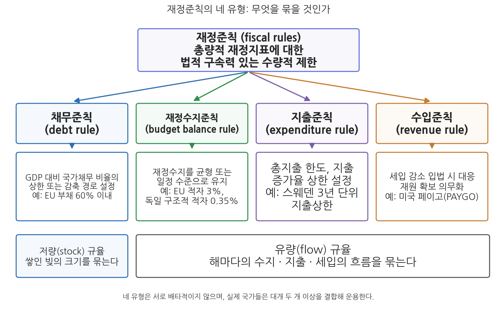

# 9주차 1차시. 재정준칙과 재정관리

> 이 법은 국가의 예산·기금·결산·성과관리 및 국가채무 등 재정에 관한 사항을 정함으로써 효율적이고 성과 지향적이며 투명한 재정운용과 건전재정의 기틀을 확립하는 것을 목적으로 한다.
> (국가재정법 제1조)

## 이 장에서 배우는 것

숫자 두 개로 시작하자. 2025년 8월 말 정부(당시 기획재정부)가 2026년도 예산안과 함께 발표한 2025-2029년 국가재정운용계획은 관리재정수지 적자를 GDP 대비 4% 수준에서 관리하겠다고 밝혔다. 역대 정부가 예산안마다 되풀이해 온 "GDP 대비 3% 이내 관리"라는 목표를 공식적으로 완화한 것이다. 같은 계획에서 국가채무(D1)는 2029년 1,788조 9,000억 원, GDP 대비 58.0%까지 늘어나는 것으로 전망되었다. 2025회계연도 결산 기준 국가채무가 1,304조 5,000억 원(GDP 대비 49.0%)이었으니, 4년 만에 500조 원 가까이 불어난다는 계산이다. 다른 한쪽의 장면도 있다. 관리재정수지 적자를 GDP 대비 3% 이내로 묶는 재정준칙을 국가재정법에 명문화하려던 시도는 2022년부터 국회 문턱을 넘지 못했고, 2026년 8월 현재까지도 한국에는 법률로 구속력을 가진 재정준칙이 없다.

7주차에서 우리는 확장적 재정정책의 논리를 보았다. 불황에는 정부가 지출을 늘려 총수요를 떠받쳐야 하고, 실제로 각국 정부는 팬데믹과 저성장 앞에서 재정의 문을 활짝 열었다. 그렇다면 이런 질문이 남는다. 확장의 시대에 재정의 규율은 어떻게 확보하는가. 해마다 적자를 내고 채무를 쌓아 가는 정부를 무엇이 멈춰 세우는가. 이 질문에 대한 현대 재정제도의 대표적 대답이 이 장의 주인공인 재정준칙(fiscal rules)이다. 2주차 2차시에서 본 쉬크의 공공지출관리 3대 규범 중 첫째가 총량적 재정규율이었음을 떠올리면, 재정준칙은 그 규범을 수량과 법의 언어로 옮긴 장치라고 할 수 있다. 구체적으로 다음을 배운다.

- 재정준칙의 개념과 네 유형(채무준칙·수지준칙·지출준칙·수입준칙)의 논리와 장단점
- 준칙 설계의 근본 딜레마: 경직성과 신뢰성의 상충, 그리고 예외조항의 설계
- EU·독일·스위스 등 주요국의 준칙 운용과 2024-2025년의 개편 동향
- 한국의 재정준칙 법제화 무산 경과, 이재명 정부의 목표 완화, 그리고 국가재정법의 재정건전성 장치

<strong>이 장의 로드맵</strong> 
이 장은 하나의 질문을 따라 전개된다. <em>"확장의 시대에 재정의 규율은 어떻게 확보하는가?"</em>  
<strong>1.1</strong> 재정준칙의 개념과 네 유형을 정리한다 →
<strong>1.2</strong> 준칙 설계의 딜레마(경직성 대 신뢰성, 예외조항)를 뜯어본다 →
<strong>1.3</strong> EU · 독일 · 스위스 등 주요국의 운용과 최근 개편을 읽는다 →
<strong>1.4</strong> 한국의 법제화 무산 경과와 현주소를 확인하고, 재정과정(10주차)을 예고한다.

## 1.1 재정준칙의 의의와 유형

### 확장의 시대, 규율의 문제

재정준칙에 대한 관심은 재정이 나빠질 때마다 커졌다. 서구에서는 1970년대 석유파동 이후 만성화된 재정적자를 극복하기 위한 해법으로 등장했고, 한국에서는 IMF 외환위기 이후 재정적자가 확대되면서 재정건전성 확보가 중요한 정책 의제로 떠올랐다. 2008년 글로벌 금융위기와 2020년 코로나19 팬데믹은 각국의 국가채무를 한 단계씩 끌어올렸고, 그때마다 준칙 도입국은 늘었다. IMF 집계에 따르면 재정준칙을 운용하는 나라는 1990년대 초 10개국 미만에서 2021년 기준 100개국 이상으로 확대되었다. 최근에는 위기 대응만이 아니라 고령화 등 미래의 잠재적 재정부담을 고려한 장기적 지속가능성 확보의 수단으로 활용되고 있다. 눈앞의 경기 때문이 아니라, 앞으로 수십 년에 걸쳐 늘어날 지출을 감당할 수 있는 궤도에 재정을 미리 올려놓기 위한 장치라는 뜻이다.

<strong>정의 · 재정준칙</strong> 
<strong>재정준칙</strong>(fiscal rules)은 재정수입, 재정지출, 재정수지, 국가채무 등 총량적 재정지표에 대하여 법적 구속력이 있는 수량적 제한을 부과함으로써 재정 규율을 확보하려는 재정건전화 제도다. 개별 사업의 타당성을 따지는 미시적 통제가 아니라 재정 <strong>총량</strong>에 대해, 재량적 판단이 아니라 <strong>사전에 정해진 수치 기준</strong>으로, 일회적 선언이 아니라 <strong>지속적 구속력</strong>을 갖고 작동한다는 세 가지가 핵심 표지다. 목표로 삼는 변수에 따라 채무준칙, 재정수지준칙, 지출준칙, 수입준칙으로 구분한다.

### 네 가지 유형: 무엇을 묶을 것인가

재정준칙은 어느 총량 변수를 묶느냐에 따라 네 유형으로 나뉜다. 그림 9-1이 전체 구조를 보여 준다.

그림 9-1을 읽는 법은 이렇다. 맨 위의 상자가 재정준칙의 공통 정의이고, 아래 네 상자가 목표변수에 따른 네 유형이다. 왼쪽의 채무준칙은 쌓여 있는 빚의 크기, 곧 저량(stock)을 묶고, 나머지 셋은 한 해 한 해의 흐름, 곧 유량(flow)을 묶는다는 점이 다르다. 이 그림에서 알 수 있는 것은 두 가지다. 첫째, 네 유형은 서로 배타적이지 않으며 실제 국가들은 대개 두 개 이상을 결합해 쓴다. 둘째, 어느 변수를 묶느냐에 따라 준칙의 성격과 약점이 달라진다.

채무준칙(debt rule)은 GDP 대비 국가채무 비율을 일정 수준 이하로 유지하거나 단계적으로 감축하도록 하는 준칙이다. EU의 "정부부채 GDP 대비 60% 이내"가 대표적이다. 재정 지속가능성이라는 최종 목표에 가장 직접 닿아 있다는 것이 장점이지만, 약점도 뚜렷하다. 채무비율은 과거 적자의 누적과 성장률·금리의 영향을 받는 결과 변수여서, 정부가 당장의 예산 편성으로 통제하기 어렵고 정책 효과가 나타나기까지 시차가 길다. 채무가 한도에 다가섰을 때 불황이 겹치면 무리한 긴축을 강요하는 경기순응적 성격도 문제가 된다.

재정수지준칙(budget balance rule)은 매 회계연도 또는 일정 기간의 재정수지를 균형이나 일정 수준으로 유지하도록 하는 준칙이다. "적자 GDP 대비 3% 이내" 같은 형태로, 직관적이고 감시하기 쉬워 가장 널리 쓰인다. 다만 수지는 경기에 따라 저절로 출렁이므로, 명목 수지를 묶으면 불황에 세수가 줄었다는 이유로 지출을 깎아야 하는 문제가 생긴다. 이를 피하기 위해 독일처럼 경기 변동의 효과를 걷어낸 구조적 재정수지(structural balance)를 기준으로 삼는 방식이 확산되었다.

지출준칙(expenditure rule)은 총지출 한도나 지출 증가율의 상한을 설정하는 준칙이다. 지출은 정부가 직접 통제할 수 있는 변수이므로 운용이 쉽고 책임 소재가 분명하며, 세수가 좋은 호황기에 지출을 함께 늘리는 것을 막아 경기순응성이 작다는 장점이 있다. 스웨덴의 3년 단위 중앙정부 지출상한이 대표적이다. 다만 지출만 묶으면 감세를 통한 재정 악화를 막지 못한다는 빈틈이 있다.

수입준칙(revenue rule)은 세입 측면을 규율하는 준칙으로, 세입을 줄이는 신규 입법을 할 때 반드시 그에 대응하는 다른 의무지출 감소나 세입 증가 등 재원조달 방안을 함께 입법하도록 의무화하는 방식이 대표적이다. 미국의 페이고(PAYGO, pay-as-you-go) 원칙이 여기에 해당한다. 네 유형 중 단독으로 쓰이는 경우는 드물고, 대개 지출준칙이나 수지준칙을 보완하는 역할을 한다.

### 강한 준칙과 약한 준칙

같은 수치라도 그것을 담는 그릇에 따라 구속력이 달라진다. 재정준칙은 재정 목표에 구속력이 없는 약한 준칙(soft rule)과, 목표 달성에 필요한 제도와 권한이 부여된 강한 준칙(hard rule)으로 구분할 수 있다. 정부가 국회에 제출하는 계획 문서에 적힌 목표는 약한 준칙이다. 어기더라도 아무 일도 일어나지 않기 때문이다. 반면 헌법이나 법률에 수치와 시정 의무가 명시되고 위반 시 교정 절차가 발동되는 준칙은 강하다. 전통적으로 재정건전성 효과는 강한 준칙이 약한 준칙보다 크다고 평가되어 왔다. 뒤에서 보겠지만 한국의 "관리재정수지 3% 이내"는 국가재정운용계획이라는 계획 문서상의 목표, 곧 약한 준칙으로만 존재해 왔고, 이를 법률로 격상하려던 시도가 번번이 무산된 것이 한국 재정준칙 논의의 핵심 줄거리다.

## 1.2 준칙 설계의 쟁점: 경직성과 신뢰성 사이

### 왜 정부는 스스로 손을 묶는가

준칙 설계를 따지기 전에 더 근본적인 질문이 있다. 민주적으로 선출된 정부가 왜 미래의 자신을 미리 묶어 두어야 하는가. 재정학은 그 이유를 민주주의 재정이 구조적으로 안고 있는 적자 편향(deficit bias)에서 찾는다.

<strong>왜 민주주의 재정은 적자로 기우는가?</strong> 
첫째, <strong>편익과 부담의 비대칭</strong>이다. 지출의 편익은 특정 집단에 집중되어 눈에 잘 띄지만, 그 부담은 전체 납세자와 미래세대에 얇게 퍼진다. 지출 확대를 요구하는 목소리는 조직되지만 그것을 막을 유인은 분산된다. 둘째, <strong>정치적 경기순환</strong>이다. 선거를 앞둔 정부는 감세와 지출 확대의 유혹을 받고, 그 청구서는 선거 뒤에 도착한다. 셋째, <strong>시간 비일관성</strong>(time inconsistency)이다. 정부가 "장기적으로 건전재정을 지키겠다"고 약속해도, 매 시점마다 "이번만은 확장이 최선"이라는 판단이 반복되면 약속은 지켜지지 않는다(Kydland &amp; Prescott, 1977). 재정준칙은 이 세 압력에 맞서 미래의 재량을 미리 묶어 두는 자기구속 장치(commitment device)다. 스스로를 돛대에 묶어 세이렌의 유혹을 이겨 낸 오디세우스처럼, 묶여 있다는 사실 자체가 시장과 국민에게 보내는 신뢰의 신호가 된다.

### 딜레마: 단순할수록 믿을 수 있고, 단순할수록 부러지기 쉽다

준칙 설계의 근본 딜레마는 경직성과 신뢰성이 같은 뿌리에서 나온다는 데 있다. 준칙이 단순하고 예외 없이 구속적일수록 지켜질 것이라는 신뢰는 커진다. 그러나 바로 그 단순함 때문에, 예상하지 못한 위기가 왔을 때 준칙은 필요한 재정 대응을 가로막는 족쇄가 된다. 반대로 준칙에 유연성을 넉넉히 심어 두면 위기 대응은 쉬워지지만, 그 유연성이 평시의 방만함을 정당화하는 뒷문으로 쓰이는 순간 준칙의 신뢰는 무너진다. 너무 뻣뻣하면 부러지고, 너무 무르면 규율이 아니다.

현대적 준칙 설계는 이 딜레마를 예외조항(escape clause)의 정교화로 다룬다. 잘 설계된 예외조항은 세 요소를 갖춘다. 첫째, 발동 요건을 사전에 구체적으로 명시한다. 전쟁, 대규모 재해, 심각한 경기침체처럼 객관적으로 확인 가능한 사유로 한정하고, "필요한 경우"류의 포괄 조항을 피한다. 둘째, 예외의 한시성을 못박는다. 언제까지 준칙 적용을 정지하는지 기간을 정한다. 셋째, 복귀 경로를 미리 정한다. 위기가 지나면 몇 년에 걸쳐 어떤 속도로 준칙 수준에 되돌아올지를 규정해, 예외가 새로운 정상이 되는 것을 막는다. 위기 시 준칙을 지키는 것이 아니라, 위기 후 돌아올 길을 지키는 것이 현대 준칙의 요체다.

경기순응성 문제도 설계로 다룬다. 명목 수지를 묶는 준칙은 불황에 긴축을, 호황에 방만을 부추긴다. 그래서 독일과 스위스는 경기 변동분을 조정한 구조적 수지나 경기조정 수입을 기준으로 삼아, 불황에는 자동적으로 적자를 허용하고 호황에는 흑자를 요구하는 방식을 택했다. 준칙이 경기안정화 기능(2주차 1차시)과 충돌하지 않게 하려는 장치다.

### 긴축의 그늘: 준칙 회의론

준칙에 대한 회의론도 만만치 않다. 최근에는 채무준칙이 완전한 경기회복을 지연시키고 공공서비스 수준을 떨어뜨리는 긴축정책을 채택하도록 정부를 유도할 우려가 있다는 비판이 힘을 얻었다. 유로존 재정위기 당시 구제금융의 조건으로 강도 높은 긴축을 요구받았던 그리스에서는 실업률이 2013년 27%를 넘어서고 청년실업률이 50%를 웃돌았으며, 빈곤층 확대와 자살률 상승 같은 사회적 비용이 뒤따랐다. 이탈리아 등 다른 남유럽 국가에서도 긴축이 경기 침체를 깊게 해 오히려 채무비율 개선을 늦췄다는 평가가 나왔다. 이런 경험은 준칙의 수치를 지키는 것이 재정의 목적일 수 없다는 반성으로 이어졌고, 확장적 재정정책을 활용하는 국가가 늘어나는 배경이 되었다. 7주차에서 본 확장재정의 부활과 이 장의 준칙 논의는 이렇게 같은 역사의 두 얼굴이다.

<strong>유의 · 준칙 도입이 곧 건전재정은 아니다</strong> 
준칙을 법에 적어 넣는 것과 재정이 건전해지는 것은 다른 문제다. 첫째, 준칙은 자주 <strong>우회</strong>된다. 본예산은 준칙을 지키면서 추가경정예산으로 지출을 늘리거나, 지출을 기금·특별회계·공공기관으로 옮겨 준칙의 포괄범위 밖으로 빼내는 창의적 회계(creative accounting)가 여러 나라에서 관찰되었다. 둘째, 준칙은 자주 <strong>개정</strong>된다. 목표를 지키기 어려워지면 목표 자체를 바꾸는 것이다. 준칙의 효과는 수치의 엄격함이 아니라, 이를 지키려는 정치적 의지와 감시 체계(독립 재정기구, 의회, 시장)의 실효성에 달려 있다. 준칙은 규율의 <em>도구</em>이지 규율 그 자체가 아니다.

## 1.3 주요국의 재정준칙 운용

주요국의 준칙 구성을 유형별로 정리하면 표 9-1과 같다. 나라마다 묶는 변수와 강도가 다르고, 최근 몇 년 사이 큰 개편이 이어졌다는 점에 주목하자.

**표 9-1. 주요국의 재정준칙 운용 (2026년 기준)**

| 국가 | 채무준칙 | 재정수지준칙 | 지출준칙·수입준칙 | 비고 |
|------|------|------|------|------|
| EU(유로존) | 정부부채 GDP 대비 60% 이내 | 재정적자 GDP 대비 3% 이내 | 2024년 개혁으로 국가별 순지출 경로 도입 | 안정성장협약(SGP), 2024년 4월 새 경제거버넌스 시행 |
| 독일 | (구조적 적자 억제로 간접 관리) | 구조적 적자 GDP 대비 0.35% 이내(연방) | 없음 | 부채브레이크를 기본법(헌법)에 명시, 2025년 3월 국방비 예외 신설 |
| 스위스 | 없음 | 경기조정 후 균형재정 원칙 | 지출을 경기조정 수입에 연동하는 지출 한도 | 헌법에 규정, 2001년 국민투표로 도입 |
| 스웨덴 | 없음 | 경기순환 전체로 흑자 목표 | 중앙정부 3년 단위 지출상한 | 지방정부에도 균형재정 의무 |
| 미국 | 연방 부채한도(debt ceiling) | 없음 | 페이고(PAYGO): 신규 지출·감세는 동일 규모 재원 확보 필요 | 부채한도는 정치적 협상 대상, 페이고는 예외 법안 다수 |
| 영국 | 부채비율의 중기적 안정·감소 목표 | 재정수지 목표(정부별로 재설정) | 지출성장률 상한(선택적) | 법적 제재보다 정치적 책무성 중심, 준칙의 잦은 교체 |

### EU: 30년 준칙 실험의 대개혁

준칙의 역사에서 가장 중요한 실험장은 EU다. 1997년 안정성장협약(Stability and Growth Pact, SGP)은 재정적자 GDP 대비 3%, 정부부채 GDP 대비 60%라는 두 기준을 회원국에 부과했다. 화폐는 하나(유로)인데 재정은 각국에 남아 있는 구조에서, 한 나라의 방만이 통화동맹 전체의 위험이 되는 것을 막기 위한 장치였다. 그러나 이 준칙은 순탄하게 작동하지 않았다. 2003년에는 독일과 프랑스가 스스로 3% 기준을 어기고도 제재를 피했고, 유로존 재정위기 이후에는 위에서 본 긴축의 사회적 비용 논쟁에 휘말렸으며, 코로나19 팬데믹이 닥치자 2020년 3월 준칙 적용 자체가 일반 예외조항 발동으로 정지되었다.

<strong>사례 읽기 · EU 경제거버넌스 개혁 (2024)</strong> 
EU는 팬데믹으로 정지시켰던 재정준칙을 원상 복귀시키는 대신 뜯어고치는 길을 택했다. 2024년 4월 30일 발효된 새 경제거버넌스 체계의 핵심은 세 가지다. 첫째, 적자 3%·부채 60%라는 기준치는 유지하되, 모든 나라에 같은 속도의 감축을 요구하던 획일적 방식을 버리고 <strong>국가별 중기 재정구조계획</strong>(4-5년, 개혁·투자를 약속하면 7년까지 연장)에 따라 나라마다 다른 조정 경로를 적용한다. 둘째, 운용 지표를 재정수지에서 <strong>순지출</strong>(net expenditure) 경로로 바꿨다. 경기에 따라 저절로 출렁이는 수지 대신 정부가 직접 통제할 수 있는 지출을 기준으로 삼아, 자동안정화장치의 작동을 막지 않으면서 감시는 단순하게 만들려는 것이다. 셋째, 경로 이탈을 기록하는 통제계정을 두고, 집행위원회가 권고한 경로를 이사회가 승인하는 절차를 정식화했다. 수지준칙 중심 체계가 지출준칙 중심 체계로 이동한 것으로, 1.1절에서 본 유형론이 실제 개혁의 언어로 쓰인 사례다. (출처: EU 이사회 보도자료, 2024년 4월)

이 사례가 보여 주는 것은 준칙 개혁의 방향이다. 단일 수치의 기계적 적용에서 국가별 채무 지속가능성 분석에 기초한 중기 경로 관리로, 통제하기 어려운 수지에서 통제 가능한 지출로 무게가 옮겨 갔다. 1.2절의 언어로 말하면, 경직성을 줄여 신뢰성을 지키려는 시도다.

### 독일: 헌법에 새긴 준칙, 그리고 2025년의 완화

독일은 강한 준칙의 대명사다. 2009년 기본법(헌법) 개정으로 도입된 부채브레이크(Schuldenbremse)는 연방정부의 구조적 재정적자를 GDP 대비 0.35% 이내로 제한한다. 헌법에 수치를 적어 넣었기 때문에 어떤 정부도 일반 법률로는 이를 우회할 수 없고, 실제로 독일은 2010년대에 균형재정(이른바 "검은 영(0)", schwarze Null)을 달성했다. 그러나 강한 준칙의 경직성은 대가를 요구했다. 낡아 가는 인프라와 부족한 국방 투자가 준칙 때문에 방치되고 있다는 비판이 누적된 것이다.

<strong>사례 읽기 · 독일 부채브레이크의 역사적 완화 (2025)</strong> 
2025년 3월, 독일 연방의회는 재적 733명 중 513명의 찬성으로 기본법을 개정해 부채브레이크를 대폭 완화했다. 개정의 골자는 세 가지다. 첫째, GDP 대비 1%를 초과하는 <strong>국방비 지출은 부채브레이크 산정에서 제외</strong>하여 차입 제한 없이 조달할 수 있게 했다. 러시아-우크라이나 전쟁 이후의 안보 환경 변화가 배경이다. 둘째, 12년에 걸쳐 집행할 <strong>5,000억 유로 규모의 인프라 특별기금</strong>을 헌법상 예외로 신설했다(이 중 1,000억 유로는 기후 관련 투자에 배정). 셋째, 그동안 신규 차입이 금지되었던 주정부에 GDP 대비 0.35%까지의 구조적 차입을 허용했다. 헌법 준칙의 원조 국가가 안보와 투자를 위해 스스로 준칙을 열었다는 점에서, 이 개정은 재정준칙의 시대가 새로운 국면에 들어섰음을 보여 주는 사건으로 평가된다. (출처: 독일 연방의회 의결, 2025년 3월)

이 사례가 보여 주는 것은 1.2절의 딜레마가 이론이 아니라는 점이다. 헌법 수준의 강한 준칙조차 안보 위기와 투자 수요라는 현실 앞에서 개정되었다. 동시에 독일의 완화는 무너짐이 아니라 설계된 예외의 확장이라는 점도 눈여겨봐야 한다. 예외의 대상(국방·인프라)과 규모(기금 5,000억 유로)와 기간(12년)을 헌법에 명시하는 방식으로, 유연성을 열되 신뢰성의 틀은 지키려 한 것이다.

### 스위스와 스웨덴: 국민투표로, 흑자 목표로

스위스는 2001년 국민투표에서 85%에 가까운 찬성으로 부채브레이크를 헌법에 담아 2003년부터 시행했다. 내용은 지출준칙에 가깝다. 연방정부의 지출은 경기순환을 조정한 수입의 범위에 묶이므로, 호황에는 흑자가 쌓이고 불황에는 적자가 허용되어 경기순응성을 피한다. 위기 시에는 의회 특별정족수의 동의로 예외 지출이 가능하되 초과분은 이후 상환 계정으로 관리된다. 스웨덴은 1990년대 초 금융위기로 재정이 무너진 경험 이후 3년 단위 중앙정부 지출상한과 경기순환 전체에 걸친 흑자 목표를 결합한 체계를 구축했고, 지방정부에도 균형재정 의무를 적용한다. 두 나라는 강한 구속(헌법, 지출상한)과 경기 배려(경기조정, 순환 전체 기준)를 결합한 균형 잡힌 설계로 자주 인용된다.

### 미국과 영국: 준칙이 있으되 준칙답지 않은

미국의 연방 부채한도는 채무준칙의 외형을 하고 있지만 성격이 다르다. GDP 대비 비율이 아니라 명목 금액의 한도여서 경제 규모가 커지면 주기적으로 올려야 하고, 그때마다 의회의 인상 협상이 정치적 벼랑 끝 대치로 치달아 오히려 국가 신용을 위협하곤 했다. 재정을 규율하는 장치라기보다 정치적 협상 카드에 가깝다는 평가가 나오는 이유다. 신규 지출이나 감세에 동일 규모의 재원 확보를 요구하는 페이고 원칙은 수입준칙의 원형이지만, 예외를 인정한 법안이 다수 통과되면서 구속력이 약해졌다. 영국은 부채비율의 중기적 안정과 재정수지 목표를 결합한 준칙을 운용하지만, 정부가 바뀔 때마다 준칙 자체를 다시 정의해 온 탓에 법적 제재보다 정치적 책무성에 기대는 체계라는 한계를 안고 있다. 준칙이 자주 바뀌면 어느 준칙도 믿기 어려워진다는 점에서, 두 나라는 1.2절 유의 박스의 경고를 보여 주는 사례다.

## 1.4 한국의 재정준칙 논의와 현주소

### 국가재정법의 재정건전성 장치: 준칙 없는 규율

한국은 법률상 재정준칙이 없는 나라지만, 재정건전성을 위한 법적 장치가 없는 나라는 아니다. 2006년 제정되어 2007년 시행된 국가재정법은 "재정건전화"라는 독립된 장을 두고 여러 장치를 담았다. 재정 부담을 수반하는 법령의 제정·개정 시 재정소요 추계(제87조), 국세 감면의 제한(제88조), 추가경정예산(추경) 편성 요건의 제한(제89조), 세계잉여금의 일정 비율을 공적자금 상환과 국채·차입금 상환에 사용할 의무(제90조), 국가채무관리계획의 수립(제91조), 국가 보증채무 부담에 대한 사전 국회 동의(제92조)가 그것이다. 이 가운데 제87조를 직접 읽어 보자.

<strong>법조문 읽기 · 국가재정법 제87조(재정부담을 수반하는 법령의 제정 및 개정)</strong> 
"① 정부는 재정지출 또는 조세감면을 수반하는 법률안을 제출하고자 하는 때에는 법률이 시행되는 연도부터 5회계연도의 재정수입·지출의 증감액에 관한 추계자료와 이에 상응하는 재원조달방안을 그 법률안에 첨부하여야 한다."

무슨 뜻인가. 돈이 드는 법을 만들려면 앞으로 5년간 얼마가 들고 그 돈을 어디서 마련할지를 법안에 함께 붙이라는 요구다. 지출 결정과 재원 결정을 분리하지 못하게 한다는 점에서 미국 페이고 원칙과 발상이 닿아 있는, 한국판 수입준칙의 맹아라고 할 수 있다. 다만 추계자료 첨부라는 절차적 의무일 뿐 재원조달방안의 실질을 심사해 법안을 막는 장치는 아니어서, 구속력은 페이고에 크게 못 미친다. 이외에도 국가재정운용계획(제7조, 기획예산처장관 수립), 총액배분 자율편성제도, 재정사업 성과관리, 예비타당성조사(예타), 총사업비관리제도 등이 넓은 의미의 재정관리제도로서 재정건전화 기능을 수행한다. 이들 제도의 소관은 2026년 정부조직 개편 이후 모두 기획예산처다. 국가재정운용계획과 총액배분 자율편성은 10주차에서, 예타는 14주차에서 자세히 다룬다.

### 법제화 10년의 표류: 세 번의 시도, 세 번의 무산

수량적 준칙을 법률로 못박으려는 시도는 정권을 넘어 반복되었고, 반복해서 무산되었다. 첫 시도는 2016년이다. 박근혜 정부는 국가채무를 GDP 대비 45% 이내로, 관리재정수지 적자를 3% 이내로 관리하는 내용의 재정건전화법 제정안을 국회에 제출했으나, 법안은 제대로 논의되지 못한 채 국회 임기 만료로 폐기되었다. 둘째 시도는 2020년이다. 코로나19 대응으로 채무가 급증하자 문재인 정부는 이른바 한국형 재정준칙을 발표했다. 국가채무비율을 60%로 나눈 값과 통합재정수지 적자비율을 3%로 나눈 값을 곱해 1.0 이하로 유지한다는 산식으로, 두 기준을 상호보완적으로 묶되 하나가 나빠져도 다른 하나가 좋으면 허용되는 유연한 설계였다. 그러나 수치를 법이 아닌 시행령에 위임한 점, 적용 시점을 2025년으로 미룬 점 때문에 야당과 재정학계 양쪽에서 "준칙이라 부르기 어렵다"는 비판을 받았고, 개정안은 21대 국회 종료와 함께 폐기되었다. 셋째 시도는 2022년이다. 윤석열 정부는 관리재정수지 적자를 GDP 대비 3% 이내로, 국가채무비율이 60%를 초과하면 2% 이내로 죄는 준칙을 국가재정법에 직접 명시하는 개정안을 추진했다. 그러나 이 개정안 역시 국회를 통과하지 못한 채 논의가 지연되다 좌초했고, 별도의 재정건전화법 제정도 이루어지지 않았다. 2026년 8월 현재 한국은 법적 재정준칙이 없는 상태로 남아 있으며, IMF와 세계은행 등 국제기구는 한국에 신뢰할 만한 재정 앵커(fiscal anchor)의 도입 필요성을 지속적으로 권고해 왔다.

<strong>왜 한국의 재정준칙 법제화는 번번이 무산되는가?</strong> 
세 번의 무산에는 공통의 구조가 있다. 첫째, <strong>시점의 역설</strong>이다. 준칙 논의는 재정이 나빠질 때(위기 직후) 불붙는데, 바로 그 시점은 긴축이 가장 어려운 때다. 위기 대응 지출이 한창인데 지출을 묶는 법을 통과시키기는 정치적으로 어렵다. 둘째, <strong>여야 공수의 교대</strong>다. 준칙은 미래 정부의 손을 묶는 법이므로, 집권 가능성이 있는 쪽은 언제나 신중해진다. 야당일 때 준칙을 요구하던 정당이 여당이 되면 유연성을 강조하는 장면이 반복되었다. 셋째, <strong>설계 논쟁의 미결</strong>이다. 통합재정수지와 관리재정수지 중 무엇을 묶을지(4주차 1차시의 두 수지 개념을 떠올려 보자), 수치를 법률에 둘지 시행령에 둘지, 예외조항을 얼마나 열어 둘지를 놓고 합의가 이루어진 적이 없다. 요컨대 준칙의 필요성에는 넓은 공감대가 있으나, "누가, 언제, 얼마나 묶일 것인가"라는 배분의 문제로 들어가면 합의가 깨지는 것이다.

### 확장재정으로의 전환: 3%에서 4%대로

2025년 출범한 이재명 정부는 재정 기조를 확장으로 명확히 전환했다. 준칙 법제화 논의는 뒤로 밀렸고, 그 자리에는 계획상 목표의 완화가 들어섰다.

<strong>사례 읽기 · 2025-2029년 국가재정운용계획과 관리 목표의 완화 (2025-2026)</strong> 
정부(당시 기획재정부)는 2025년 8월 말 "회복과 성장을 위한 2026년 예산안 및 2025-2029년 국가재정운용계획"을 발표했다. 이 계획은 그간 역대 정부가 유지해 온 "관리재정수지 적자 GDP 대비 3% 이내 관리" 목표를 4% 수준으로 완화했다. 계획상 총지출은 연평균 5.5% 증가해 2029년 834조 7,000억 원에 이르고, 국가채무는 2029년 1,788조 9,000억 원(GDP 대비 58.0%)으로 전망되었다. 2026년도 본예산은 2025년 12월 2일 국회에서 총지출 727조 9,000억 원으로 확정되었는데, 전년 본예산 대비 증가율 8.1%로 역대 최대 규모의 확장이다. 확정 예산 기준 관리재정수지 적자는 GDP 대비 3.9%(정부안 4.0%에서 국회 감액으로 소폭 개선), 국가채무는 1,415조 2,000억 원(GDP 대비 51.6%)으로 전망되었다. 실적치도 같은 방향이다. 2025회계연도 결산에서 관리재정수지 적자는 104조 2,000억 원(GDP 대비 3.9%), 국가채무(D1)는 1,304조 5,000억 원(GDP 대비 49.0%)으로 전년(46.0%)보다 3.0%포인트 올랐다. 한편 기획예산처는 2026년 3월 확정한 2027년도 예산안편성지침에서 처음으로 지출구조조정 기준을 공개하고 재량지출 15%, 의무지출 10% 감축 목표를 제시했다. 확장 기조 속에서도 지출 재편의 고삐는 죄겠다는 신호다. (출처: 정부 2025-2029년 국가재정운용계획, 2025년 8월 / 2026년 예산 국회 확정 보도자료, 2025년 12월 / 재정경제부 2025회계연도 국가결산, 2026년 4월 / 기획예산처 2027년도 예산안편성지침, 2026년 3월)

이 사례가 보여 주는 것은 한국 재정준칙 논의의 현주소다. 첫째, 한국의 재정 목표는 여전히 약한 준칙(계획 문서상의 목표)으로만 존재하며, 그 목표조차 정부의 기조에 따라 3%에서 4%대로 조정될 수 있음이 확인되었다. 법적 구속력이 없는 목표의 가변성을 보여 준 것이다. 둘째, 그렇다고 재정관리가 사라진 것은 아니다. 지출구조조정 기준 공개처럼 준칙 아닌 수단의 규율은 오히려 강화되는 양상이다. 셋째, 채무 전망(2029년 58.0%)은 과거 준칙안들이 상한으로 삼았던 60%에 바짝 다가서 있다. 준칙 논쟁은 끝난 것이 아니라, 더 무거운 조건에서 되돌아올 가능성이 크다.

### 쟁점: 묶을 것인가, 열 것인가

한국의 준칙 논쟁은 결국 두 진영의 대립으로 요약된다. 법제화를 지지하는 쪽은 세계에서 가장 빠른 고령화를 근거로 든다. 연금·의료 등 의무지출이 구조적으로 늘어나는 나라에서 지금 규율을 세우지 않으면 채무는 가속적으로 불어나고, 원화가 국제 기축통화가 아닌 한국은 채무 누적에 따른 신인도 하락에 더 취약하다는 것이다. 국가채무비율이 10년 만에 20%포인트 가까이 오른 속도 자체가 앵커의 필요성을 입증한다고 본다. 법제화에 신중한 쪽은 한국의 채무비율이 여전히 주요 선진국 평균보다 낮고, 저성장 국면에서 성장동력·복지에 대한 투자를 준칙이 가로막으면 성장률 하락을 통해 오히려 재정을 악화시킬 수 있다고 반박한다. 그리스의 긴축 경험, 그리고 헌법 준칙마저 완화한 2025년 독일의 선택은 이 진영의 유력한 논거다. 흥미로운 것은 양쪽 모두 주요국의 최근 개편을 자기편 논거로 읽는다는 점이다. 한쪽은 "EU도 독일도 준칙을 버린 것이 아니라 정교하게 고쳐 유지했다"는 점을, 다른 쪽은 "준칙의 원조들조차 경직적 수치를 포기했다"는 점을 강조한다. 이 논쟁의 답은 교재가 정해 줄 수 없다. 다만 어느 쪽이든, 규율의 실질은 수치가 아니라 그것을 지키게 만드는 제도와 정치에 있다는 이 장의 결론은 공유될 수 있을 것이다.

재정의 규율이 총량의 문제라면, 그 총량이 실제로 만들어지는 곳은 매년 반복되는 예산의 과정이다. 국가재정운용계획은 어떻게 수립되고, 기획예산처는 어떤 절차로 한 해 예산을 편성하며, 국회는 이를 어떻게 심의하는가. 10주차에서 재정과정론으로 들어간다.

## 요약

재정준칙은 재정수입·지출·수지·국가채무 등 총량적 재정지표에 법적 구속력이 있는 수량적 제한을 부과하는 재정건전화 제도로, 1970년대 서구의 재정악화 이후 확산되어 2021년 기준 100개국 이상이 운용하고 있다. 목표변수에 따라 채무준칙(저량 규율, 지속가능성에 직결되나 통제 시차가 김), 재정수지준칙(직관적이나 경기순응적이어서 구조적 수지 기준으로 진화), 지출준칙(통제 가능성이 높고 경기순응성이 작음), 수입준칙(감세 입법에 재원 대책을 요구)으로 나뉘며, 구속력에 따라 강한 준칙과 약한 준칙으로 구분된다. 준칙은 민주주의 재정의 적자 편향(편익·부담의 비대칭, 정치적 경기순환, 시간 비일관성)에 맞서는 자기구속 장치이지만, 단순할수록 신뢰가 커지는 동시에 경직되어 부러지기 쉽다는 딜레마를 안으며, 그 해법으로 발동 요건·한시성·복귀 경로를 갖춘 예외조항 설계가 핵심 과제가 되었다. 주요국의 운용은 이 딜레마의 실험장이다. EU는 2024년 적자 3%·부채 60% 기준은 유지하되 국가별 중기 계획과 순지출 경로 중심으로 준칙을 재설계했고, 헌법에 부채브레이크를 새긴 독일은 2025년 국방비 예외와 5,000억 유로 인프라 기금을 헌법 개정으로 열었으며, 스위스·스웨덴은 경기조정형 설계로, 미국·영국은 정치적 협상과 잦은 개정으로 각기 다른 모습을 보인다. 한국은 국가재정법 제87-92조의 재정건전화 장치와 국가재정운용계획 등 재정관리제도를 갖추었으나 수량적 준칙의 법제화는 2016년(재정건전화법안), 2020년(한국형 재정준칙), 2022년(관리재정수지 3% 준칙) 세 차례 모두 무산되었고, 2025년 출범한 이재명 정부는 확장재정으로 전환하면서 2025-2029년 국가재정운용계획에서 관리재정수지 적자 관리 목표를 3% 이내에서 4% 수준으로 완화했다. 2026년 본예산 총지출은 727조 9,000억 원(전년 대비 8.1% 증가), 국가채무는 2025년 결산 1,304조 5,000억 원(GDP 대비 49.0%)에서 2029년 1,788조 9,000억 원(58.0%)으로 전망되어, 과거 준칙안들의 상한이던 60%에 접근하고 있다.

## 토론·복습 문제

**9-1. (서술형 연습)** 재정준칙의 네 유형(채무준칙·재정수지준칙·지출준칙·수입준칙)을 각각 정의하고 장단점을 비교하시오. 이어서 2020년의 한국형 재정준칙(채무 60%와 통합재정수지 3%의 결합 산식)과 2022년 정부안(관리재정수지 3%, 채무 60% 초과 시 2%)이 각각 어느 유형들의 결합인지 분석하고, 두 설계의 차이가 갖는 의미를 설명하시오.

**9-2. (계산·해석형)** 2025회계연도 결산에서 관리재정수지 적자는 104조 2,000억 원으로 GDP 대비 3.9%였다. (1) 이 두 수치로부터 해당 연도의 경상GDP 규모를 역산하시오. (2) 만약 "관리재정수지 적자 GDP 대비 3% 이내" 준칙이 시행 중이었다면 허용되는 적자의 최대 규모는 약 얼마였을지 계산하고, 실제 적자와의 차이를 구하시오. (3) 2029년 국가채무 전망치 1,788조 9,000억 원이 GDP 대비 58.0%라면 계획이 전제한 2029년 경상GDP는 약 얼마인지 계산하시오.

**9-3. (찬반 토론)** "한국은 재정준칙을 국가재정법에 법제화해야 한다"는 주장에 대해 찬성과 반대의 논거를 각각 세 가지 이상 제시하고 자신의 입장을 정하시오. 찬성 논거에는 고령화와 비기축통화국 지위를, 반대 논거에는 그리스의 긴축 경험과 2025년 독일의 부채브레이크 완화를 반드시 포함해 논하시오.

**9-4.** 1.2절에서 본 예외조항 설계의 세 요소(발동 요건의 사전 명시, 한시성, 복귀 경로)를 기준으로, 2024년 EU 개혁과 2025년 독일 기본법 개정이 각 요소를 어떻게 구현했는지 평가하시오. 이어서 한국이 재정준칙을 도입한다면 예외조항에 어떤 발동 요건을 명시해야 할지, 국가재정법 제89조의 추경 편성 요건(6주차)을 참고하여 제안해 보시오.
