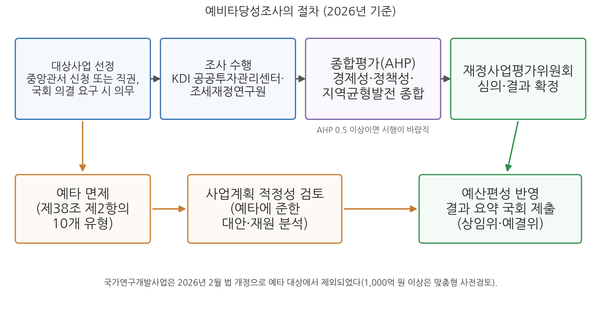
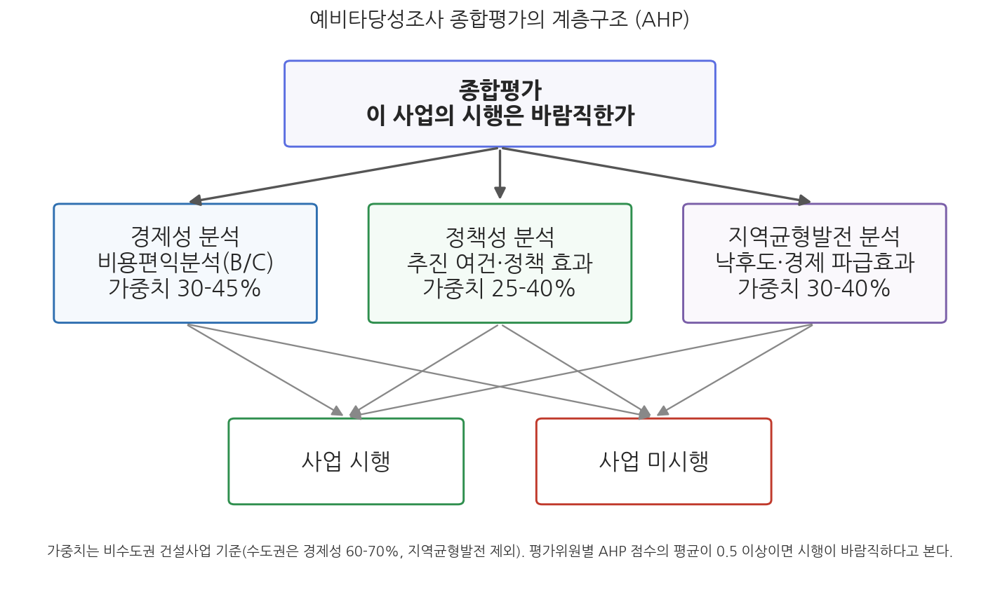

# 14주차 1차시. 예비타당성조사제도

> 기획예산처장관은 총사업비가 500억원 이상이고 국가의 재정지원 규모가 300억원 이상인 신규 사업으로서 다음 각 호의 어느 하나에 해당하는 대규모사업에 대한 예산을 편성하기 위하여 미리 예비타당성조사를 실시하고, 그 결과를 요약하여 국회 소관 상임위원회와 예산결산특별위원회에 제출하여야 한다.
> (국가재정법 제38조 제1항)

## 이 장에서 배우는 것

2026년 1월 29일, 국회 본회의는 국가연구개발사업을 예비타당성조사(예타) 대상에서 제외하는 국가재정법 개정안을 통과시켰다. 500억 원 이상의 대규모 연구개발(R&D) 사업이 예비타당성조사를 받기 시작한 2008년 이후 18년 만에, R&D 분야에서 이 제도가 사라진 것이다. 같은 해 정부 R&D 예산은 35조 5,000억 원으로 전년 대비 19.9% 늘어난 역대 최대 규모였다. 한쪽에서는 사상 최대의 연구개발 투자를 편성하면서, 다른 쪽에서는 그 투자의 관문 역할을 하던 사전 심사를 걷어낸 셈이다. 관문이 사라지면 돈이 빨리 흐르지만, 나쁜 사업을 거르는 힘도 함께 사라진다. 1999년 도입 이후 사반세기 동안 "대형 국책사업의 문지기"로 불려 온 예비타당성조사제도는 지금 도입 이래 가장 큰 변화의 한가운데에 있다.

이 장은 그 문지기의 구조를 배우는 시간이다. 13주차 2차시에서 우리는 비용편익분석이라는 계산의 원리를 익혔고, 그 도구가 한국에서는 예비타당성조사라는 제도로 국가재정법에 붙박여 있다는 것을 예고했다. 이번 차시는 그 예고를 거두어들인다. 어떤 사업이 조사를 받아야 하고 무엇이 면제되는지, 조사는 누가 어떤 분석으로 수행하는지, 그리고 경제성·정책성·지역균형발전이라는 서로 다른 잣대가 계층화분석법(AHP)이라는 하나의 숫자로 어떻게 종합되는지를 본다. 계산은 13주차와 마찬가지로 산수 수준이다. 구체적으로 다음을 배운다.

- 예비타당성조사의 의의: 왜 주무부처의 타당성조사만으로는 부족한가
- 1999년 도입 이후의 연혁: 경제성 평가에서 3대 분석 체계로, 그리고 2026년의 재편까지
- 대상사업의 법정 기준(총사업비 500억·국고 300억)과 면제제도, 그리고 면제 확대 논쟁
- 2026년의 세 가지 변화를 구분하기: 법정 기준 유지, R&D 예타 폐지(법 개정), SOC 기준 상향(개편방안)
- AHP의 원리와 예비타당성조사 종합평가: 쌍대비교에서 0.5의 문턱까지

<strong>이 장의 로드맵</strong> 
이 장은 하나의 질문을 따라 전개된다. <em>"국가는 수천억 원짜리 사업의 시행 여부를 어떤 절차와 계산으로 결정하는가?"</em>  
<strong>1.1</strong> 예비타당성조사의 의의와 1999년 이후의 연혁을 정리한다 →
<strong>1.2</strong> 대상사업의 법정 기준과 면제제도를 국가재정법 제38조로 읽고, 2026년의 제도 변화와 면제 확대 논쟁을 따져 본다 →
<strong>1.3</strong> 조사의 절차와 3대 분석(경제성·정책성·지역균형발전)의 내용을 본다 →
<strong>1.4</strong> AHP 종합평가의 원리를 산수 예시로 익히고, 제도의 쟁점을 확인한다.

## 1.1 예비타당성조사의 의의와 연혁

### 왜 "예비" 타당성조사인가

예비타당성조사(예타)는 대규모 신규 재정사업에 대해 예산을 편성하기 전에, 사업 주무부처가 아닌 제3의 기관이 국민경제적 관점에서 사업의 추진 여부를 미리 검증하는 제도다. 여기서 핵심은 "예비"라는 말과 "제3의 기관"이라는 말에 있다. 예타가 도입되기 전에도 대형 사업에는 타당성조사가 있었다. 그러나 그 조사는 사업을 추진하려는 주무부처가 발주하고 수행했으며, 사업 추진을 기정사실로 놓고 기술적 검토와 예비 설계에 초점을 맞추는 경우가 많았다. 11주차에서 본 예산행태론의 언어로 말하면, 소비자이자 획득 지향의 행위자인 부처가 자기 사업의 심사관까지 겸했던 것이다. 13주차 2차시에서 본 편익 부풀리기와 비용 빠뜨리기의 유혹이 제도적으로 걸러지지 않는 구조였다. 예타는 이 구조를 바꾸어, 본격적인 타당성조사와 설계에 돈이 들어가기 전에 중앙예산기관 주관으로 사업의 근본적인 추진 가치를 따져 보게 한 것이다.

<strong>정의 · 예비타당성조사</strong> 
<strong>예비타당성조사</strong>(preliminary feasibility study)는 국가재정법 제38조와 같은 법 시행령 제13조에 따라, 대규모 신규 사업에 대한 예산편성과 기금운용계획 수립을 위하여 기획예산처장관 주관으로 실시하는 사전적 타당성 검증 조사를 뜻한다. 주무부처가 수행하는 (본)타당성조사가 기술적 검토와 설계에 초점을 둔다면, 예타는 그 이전 단계에서 경제성과 정책적 필요성을 개략적으로, 그러나 국민경제 전체의 관점에서 검증한다. 대형 신규 사업의 무분별한 착수와 예산 낭비를 방지하고 재정운용의 효율성을 높이는 것이 제도의 목적이다.

<strong>왜 심사를 부처가 아니라 예산당국이 주관하는가?</strong> 
예타의 설계 원리는 심사자와 수혜자의 분리다. 첫째, <strong>유인의 문제다.</strong> 사업이 성사되면 예산과 조직이 커지는 부처에 심사를 맡기면, 수요 예측은 낙관으로, 비용 추정은 과소로 기우는 편향을 막기 어렵다. 둘째, <strong>정보의 문제다.</strong> 개별 부처는 자기 사업의 편익은 잘 알지만, 그 돈을 다른 부처의 사업에 썼을 때의 가치(기회비용)는 계산할 유인이 없다. 나라 전체의 우선순위를 셈할 수 있는 것은 중앙예산기관이다. 셋째, <strong>시점의 문제다.</strong> 설계비가 이미 투입된 사업은 "여기까지 왔는데"라는 매몰비용의 논리로 중단하기 어렵다. 그래서 심사는 예산이 편성되기 전, 가장 이른 단계에 이루어져야 한다. 예비타당성조사라는 이름의 "예비"가 바로 이 셋째 원리를 담고 있다.

### 1999년의 도입과 KDI 공공투자관리센터

예타는 1999년 김대중 정부의 기획예산처가 도입했다. 시점이 우연이 아니다. 1997년 외환위기 직후 강도 높은 재정개혁이 추진되던 시기였고, 1990년대에 타당성조사를 통과하고 착수된 대형 국책사업들이 수요 부풀리기와 총사업비 증액으로 재정 낭비의 상징이 되어 있었다. 정부는 부처의 타당성조사와 별도로 예산당국이 주관하는 사전 검증 절차를 만들고, 조사의 수행을 국책연구기관인 한국개발연구원(KDI)에 맡겼다. KDI는 2000년 공공투자관리센터를 설립해 예타를 전담시켰고, 이 센터는 2005년 국토연구원의 민간투자지원센터를 통합해 현재의 공공투자관리센터(PIMAC)로 확대되었다. 예타 수행의 방법론인 일반지침과 부문별 표준지침을 축적해 온 것도 이 센터다. 요컨대 예타는 "예산당국이 주관하고 국책연구기관이 수행하는" 이원 구조로 출발했고, 이 골격은 지금까지 유지되고 있다.

도입 이후 사반세기 동안 제도는 여러 차례 모습을 바꾸었다. 표 14-1이 그 연혁이다.

**표 14-1. 예비타당성조사제도의 연혁**

| 시기 | 변화 | 내용 |
|------|------|------|
| 1999 | 제도 도입 | 김대중 정부 기획예산처가 도입, KDI가 조사 수행(2000년 공공투자관리센터 설립) |
| 2003 | 종합평가 도입 | 경제성 평가만으로 판정하던 방식에 정책성 평가를 반영한 종합평가 도입 |
| 2006-2007 | 3대 분석 체계·법제화 | 지역균형발전 항목이 제1계층으로 분리되어 경제성·정책성·지역균형발전의 3대 분석 체계 확립. 국가재정법 제정(2007년 시행)으로 법률상 제도가 됨 |
| 2008 | 대상 확대 | 정보화 사업에 이어 대규모 R&D 사업도 예타 대상에 포함 |
| 2013 | 가중치 조정 | 지역균형발전 가중치를 15-25%에서 20-30%로 상향 |
| 2014 | 면제요건 법률 명시 | 예타 면제 대상 10개 유형을 국가재정법 제38조 제2항에 명시 |
| 2018-2019 | 수행체계 개편 | R&D 예타를 과학기술정보통신부에 위탁(한국과학기술기획평가원 수행). 종합평가를 수도권·비수도권으로 이원화(비수도권 지역균형발전 가중치 30-40%), 한국조세재정연구원을 수행기관으로 추가 지정 |
| 2020-2022 | 운영 보완 | 면제사업에 대한 사업계획 적정성 검토 확대(2020), 신속성·유연성·투명성 제고를 위한 제도 개선(2022) |
| 2026 | 대규모 재편 | R&D 예타 폐지(2월, 법 개정), SOC 기준 상향 등 제도 개편방안 확정(3월, 기획예산처) |

표 14-1에서 읽어야 할 흐름은 두 가지다. 첫째, 판정의 잣대가 넓어져 왔다. 시행 초기에는 경제성 평가만으로 사업의 진행 여부를 결정했으나, 2003년 정책성 평가를 반영한 종합평가가 도입되었고, 지역균형발전이 국가 정책방향으로 제시되면서 정책성 평가의 하위 항목이던 지역균형발전이 제1계층으로 분리되어 2006년부터 3대 분석 체계가 만들어졌다. 둘째, 경제성과 균형발전 사이의 줄다리기가 가중치 조정의 역사로 나타난다. 지역균형발전 가중치는 2007년 15-25%에서 2013년 20-30%로, 2019년 개편에서는 비수도권 사업에 대해 30-40%로 계속 높아졌다. 수도권과 비교해 경제성이 부족해 사업 추진이 어려웠던 비수도권 사업의 통과율을 높이는 방향이었다. 그런데도 정치적으로 추진이 필요한 사업의 통과가 담보되지 않자, 조사 자체를 받지 않는 면제의 요구가 커졌고 2014년 면제요건이 법률에 명시되기에 이른다. 잣대를 조정하는 힘과 잣대를 피하려는 힘이 제도의 연혁을 함께 끌고 온 것이다(정성봉, 2024).

## 1.2 대상사업과 면제제도

### 법조문 읽기: 국가재정법 제38조

어떤 사업이 예타를 받아야 하는가. 답은 국가재정법 제38조에 있다. 13주차 2차시 끝에서 잠깐 본 조문을, 이번에는 2026년 2월 개정이 반영된 현행 조문으로 꼼꼼히 읽는다.

<strong>법조문 읽기 · 국가재정법 제38조(예비타당성조사)</strong> 
"① 기획예산처장관은 총사업비가 500억원 이상이고 국가의 재정지원 규모가 300억원 이상인 신규 사업으로서 다음 각 호의 어느 하나에 해당하는 대규모사업에 대한 예산을 편성하기 위하여 미리 예비타당성조사를 실시하고, 그 결과를 요약하여 국회 소관 상임위원회와 예산결산특별위원회에 제출하여야 한다. 다만, 제4호의 사업은 제28조에 따라 제출된 중기사업계획서에 의한 재정지출이 500억원 이상 수반되는 신규 사업으로 한다. 
1. 건설공사가 포함된 사업. 다만, 「과학기술기본법」 제12조의3제1항에 따른 구축형 연구개발사업 중 해당 연구개발의 수행에 필수적인 시설물의 건설공사가 포함된 사업은 제외한다. 
2. 「지능정보화 기본법」 제14조제1항에 따른 지능정보화 사업 
3. 삭제 
4. 그 밖에 「과학기술기본법」 제11조에 따른 국가연구개발사업이 아닌 사업으로서 사회복지, 보건, 교육, 노동, 문화 및 관광, 환경 보호, 농림해양수산, 산업ㆍ중소기업 분야의 사업 
② 제1항에도 불구하고 다음 각 호의 어느 하나에 해당하는 사업은 대통령령으로 정하는 절차에 따라 예비타당성조사 대상에서 제외한다. ..." (개정 2026. 2. 10.)

무슨 뜻인가. 첫째, 두 개의 문턱이 있다. 총사업비 500억 원 이상이면서 국가의 재정지원이 300억 원 이상인 신규 사업이 대상이다. 총사업비에는 국비뿐 아니라 지방비와 민간 부담분까지 포함되므로, 국고 지원이 300억 원을 넘는 대형 사업이 실질적 관문이다. 조사는 국가가 직접 시행하는 사업만이 아니라 국가 대행사업, 지방자치단체 보조사업, 민간투자사업 등 정부 재원이 들어가는 사업에 두루 적용되며, 대상 단위는 원칙적으로 세부사업이다. 둘째, 절차의 주어가 기획예산처장관이다. 기획예산처장관은 중앙관서의 장의 신청에 따라 또는 직권으로 조사 대상을 선정할 수 있고, 국회가 의결로 요구하는 사업은 조사를 실시해야 하며, 결과 요약을 국회 상임위원회와 예산결산특별위원회에 제출해야 한다. 재정 낭비를 막는 행정부 내부 통제 장치인 동시에, 국회의 재정통제와 연결된 장치이기도 한 것이다. 셋째, 제3호가 "삭제"로 남아 있는 것이 2026년 개정의 흔적이다. 원래 그 자리에 있던 국가연구개발사업이 대상에서 빠졌고, 제1호와 제4호에도 연구개발 관련 사업을 덜어내는 단서가 붙었다.

### 2026년의 세 가지 변화를 구분하기

2026년의 제도 변화를 정확히 이해하려면 성격이 다른 세 가지를 구분해야 한다. 언론 보도에서 자주 뒤섞이는 대목이므로 하나씩 짚는다.

첫째, 대상사업의 법정 기준은 그대로다. 총사업비 500억 원·국고 300억 원 기준은 2026년 8월 현재도 국가재정법 제38조 제1항에 유지되고 있다. 이 기준을 총사업비 1,000억 원·국고 500억 원으로 올리는 방안은 2025년 8월 정부(당시 기획재정부)가 발표해 법 개정으로 추진되었고 의원 발의안도 나왔으나, 2026년 8월 현재 기준 금액을 상향하는 개정은 이루어지지 않았다. 500억 원 기준은 1999년 도입 때 정해진 뒤 사반세기 넘게 그대로여서, 그동안의 경제 규모와 물가 상승을 반영하면 사실상 대상이 계속 넓어져 온 셈이라는 것이 상향론의 논거다.

둘째, R&D 예타 폐지는 법 개정으로 확정되었다. 국가연구개발사업을 예타 대상에서 제외하는 국가재정법 개정안이 2026년 1월 29일 국회를 통과해 2월 10일 공포·시행되었다(법률 제21341호). 다만 심사가 완전히 사라진 것은 아니다. 함께 개정된 과학기술기본법에 따라 1,000억 원 이상 대규모 R&D 사업에는 맞춤형 사전검토 제도가 도입되었다. 기술 변화가 빠른 분야에서 수년씩 걸리는 예타가 투자의 골든타임을 놓치게 한다는 과학기술계의 오랜 요구가 반영된 결과이지만, 재정 규율의 관점에서는 R&D 예산(2026년 35조 5,000억 원)이 사전 검증의 강도가 약한 영역으로 옮겨 갔다는 우려도 함께 제기된다.

셋째, SOC 기준 상향은 법 개정이 아니라 정부의 운용 개편방안이다. 기획예산처는 2026년 3월 10일 재정사업평가위원회에서 '예비타당성조사 제도 개편방안'을 확정했다. 사회간접자본(SOC) 사업의 예타 기준을 1,000억 원으로 올려 그 미만의 SOC 사업은 예타 대신 주무부처의 자체 타당성검토로 넘기고, 인구감소지역 사업은 경제성 평가 가중치를 5%포인트 내리는 대신 지역균형 평가 가중치를 5%포인트 올리며, 모든 건설사업의 평가에 균형성장효과 항목을 신설하고, 정보화 사업은 통과·탈락형에서 진단형 평가로 바꾸어 조사 기간을 9개월에서 6개월로 줄이는 내용이다. 지침 개정을 거쳐 2026년 6월부터 시행한다는 계획으로 발표되었다.

<strong>유의 · "예타 기준이 1,000억 원으로 올랐다"는 서술은 부정확하다</strong> 
법률의 기준과 운용의 개편을 구분해야 한다. 국가재정법 제38조의 법정 기준은 <strong>총사업비 500억 원·국고 300억 원으로 유지</strong>되고 있고(2026년 8월 기준), 1,000억 원 상향은 기획예산처가 발표한 <strong>개편방안</strong>으로서 지침 차원에서 추진되는 것이다. 반면 <strong>R&D 예타 폐지는 국가재정법 개정(2026년 2월 10일 시행)으로 확정된 법률 차원의 변화</strong>다. 시험 답안에서든 보고서에서든, 세 변화의 법적 지위(법정 기준 유지 / 법 개정 완료 / 개편방안 발표)를 구분해 쓰는 것이 정확한 서술이다.

### 면제제도: 문지기의 뒷문

제38조 제2항은 예타를 실시하지 않는 사업, 곧 면제 대상을 정한다. 공공청사·교정시설·초중등 교육시설의 신증축, 국가유산 복원, 국가안보·보안이 필요한 국방 사업, 남북교류협력이나 국가 간 협약에 따라 추진하는 사업, 기존 시설의 단순 개량·유지보수, 재난 복구와 안전 확보 등 시급한 추진이 필요한 사업, 법령에 따라 추진해야 하는 사업, 출연·보조기관 인건비 지원처럼 조사의 실익이 없는 사업 등 10개 유형이다. 이 면제요건들은 원래 시행령에 있다가 2014년 개정으로 법률에 명시되었다. 유형 대부분은 조사의 실익이 없거나 시급성이 명백한 경우여서 논란이 적다. 논쟁의 초점은 마지막 유형, 곧 "지역 균형발전, 긴급한 경제·사회적 상황 대응 등을 위하여 국가 정책적으로 추진이 필요한 사업"이다. 요건이 포괄적이어서 정부가 정책적 의지로 대형 사업을 관문 없이 통과시키는 통로가 될 수 있기 때문이다. 면제된 사업이라고 아무 검증 없이 예산이 편성되는 것은 아니다. 국가 정책적 필요로 면제된 사업에 대해서는 예타에 준하여 중장기 재정소요, 재원조달 방안, 효율적 대안 등을 분석하는 사업계획 적정성 검토를 실시하고 그 결과를 예산편성에 반영하는데, 이 검토는 면제사업이 급증한 뒤인 2020년부터 확대 시행되었다. 다만 적정성 검토는 사업의 시행 여부가 아니라 "어떻게 할 것인가"를 다듬는 절차이므로, 예타의 문지기 기능을 대신하지는 못한다.

<strong>사례 읽기 · 2019 국가균형발전 프로젝트의 예타 면제 (2019)</strong> 
2019년 1월 29일 정부는 '국가균형발전 프로젝트'를 발표하면서, 전국 시도별로 안배된 23개 사업, 총사업비 24조 1,000억 원 규모에 대해 국가재정법 제38조 제2항의 국가 정책적 추진 요건을 적용해 예비타당성조사를 일괄 면제했다. 남부내륙철도(김천-거제), 새만금 국제공항 등 대형 SOC가 다수 포함되었고, 지역 전략산업 R&D 투자(3조 6,000억 원), 도로·철도 등 인프라 확충, 지역 교통·물류망 구축 등이 담겼다. 수도권과 비수도권의 격차 심화, 비수도권 사업의 경제성 확보 곤란이 선정 배경으로 제시되었다. 단일 발표로는 제도 도입 이후 최대 규모의 면제였고, 이후 면제 남용 논쟁의 대표 사례가 되었다. 시민단체 집계로는 2005-2018년 사이 면제 사업이 221개, 115조 4,000억 원에 이른다. (출처: 대한민국 정책브리핑, 2019-01-29; 경제정의실천시민연합 집계, 2019)

이 사례가 보여 주는 것은 면제 논쟁의 양면성이다. 면제를 옹호하는 쪽은 예타의 경제성 잣대 자체가 인구와 수요가 많은 수도권에 구조적으로 유리하므로, 균형발전이라는 헌법적 가치를 위해서는 정치적 결단으로 잣대를 우회할 수 있어야 한다고 본다. 비판하는 쪽은 면제가 관행이 되면 "심사를 통과하는" 경쟁이 "면제를 받아내는" 경쟁으로 바뀌어 제도 전체가 무력화되고, 그 부담은 결국 재정건전성과 미래 세대에 전가된다고 본다. 특히 선거를 앞둔 시기의 면제 발표는 지역 표심을 겨냥한 나눠먹기라는 비판을 피하기 어렵다. 2026년 3월의 개편방안이 면제요건의 엄격 적용을 명시한 것은 이 논쟁에 대한 제도 운영자의 응답이지만, 같은 개편방안이 SOC 기준 상향으로 예타 대상 자체를 줄이는 내용을 담고 있어, 문지기의 문을 좁히는 힘과 넓히는 힘은 여전히 공존하고 있다.

## 1.3 조사의 구조와 분석방법

### 절차와 수행체계

예타의 절차는 그림 14-1과 같다.

그림 14-1을 읽는 법은 이렇다. 위 줄이 예타의 본 트랙이다. 기획예산처장관이 중앙관서의 신청 또는 직권으로(국회 의결 요구 시에는 의무적으로) 대상사업을 선정하면, 전문기관이 조사를 수행해 경제성·정책성·지역균형발전을 분석하고 AHP로 종합하며, 그 결과를 재정사업평가위원회의 심의를 거쳐 확정한다. 확정된 결과는 예산편성에 반영되고 요약되어 국회에 제출된다. 아래 줄이 면제 트랙이다. 제38조 제2항의 유형에 해당해 면제된 사업은 조사 대신 사업계획 적정성 검토를 거쳐 예산편성으로 간다. 이 그림에서 알 수 있는 것은 예타가 단일 기관의 판단이 아니라 "예산당국의 선정, 전문기관의 분석, 위원회의 심의"로 역할이 나뉜 다단계 절차라는 점, 그리고 면제가 절차의 생략이 아니라 다른(그러나 더 약한) 절차로의 우회라는 점이다.

조사의 수행체계는 이원화되어 있다. 도로·철도 같은 SOC 건설사업의 예타는 주로 KDI 공공투자관리센터가 수행하고, 복지·고용 등 기타 재정사업의 예타는 2019년 4월 수행기관으로 추가 지정된 한국조세재정연구원이 맡는다. 조세재정연구원은 2019년 12월 이 업무를 전담하는 정부투자분석센터를 개소했다. 대규모 R&D 사업의 예타는 2018년부터 과학기술정보통신부에 위탁되어 한국과학기술기획평가원(KISTEP) 등이 수행해 왔으나, 2026년 R&D 예타 폐지로 이 트랙은 역사 속으로 들어갔다. 조사가 개시되면 수행기관은 먼저 사업의 추진 배경과 목적, 지역 현황, 유사 사례 등 기초자료를 검토해 조사의 쟁점과 대안을 도출하고, 그 위에서 3대 분석을 수행한다.

### 3대 분석: 경제성, 정책성, 지역균형발전

**표 14-2. 예비타당성조사의 3대 분석**

| 구분 | 묻는 질문 | 주요 방법·항목 |
|------|------|------|
| 경제성 분석 | 국민경제 전체로 보아 남는 장사인가 | 비용편익분석(B/C), 수요 추정, 비용편익분석이 부적합한 사업은 비용효과분석 |
| 정책성 분석 | 정책적으로 추진할 여건과 가치가 있는가 | 사업추진 여건, 정책 효과, 사업 특수평가 항목(재원조달 위험성 등, 정량·정성 분석) |
| 지역균형발전 분석 | 지역 간 형평에 기여하는가 | 지역낙후도 개선, 지역경제 파급효과, 고용유발 효과 |

첫째, 경제성 분석은 13주차 2차시에서 배운 비용편익분석을 기본 방법론으로 한다. 사업 시행에 따른 수요를 추정해 편익을 계산하고, 총사업비와 운영에 필요한 모든 경비를 합해 비용을 산정하며, 사회적 할인율(현행 4.5%)로 현재가치화해 B/C를 구한다. 13주차의 고속도로 예제가 바로 이 분석의 축소판이다. 다만 기타 재정사업처럼 편익의 화폐화가 적합하지 않은 사업은 비용효과분석을 쓸 수 있다. 둘째, 정책성 분석은 해당 사업과 관련된 사업추진 여건과 정책 효과, 그리고 재원조달 위험성이나 문화유산 가치 같은 사업 특수평가 항목을 정량적 또는 정성적으로 분석한다. B/C라는 하나의 숫자에 담기지 않는 정책적 고려를 판정에 넣는 통로다. 셋째, 지역균형발전 분석은 지역 간 불균형 심화를 방지하고 형평성을 높이기 위해 지역낙후도 개선, 지역경제 파급효과, 고용유발 효과 등 지역개발에 미치는 요인을 분석한다. 균형발전이라는 가치를 아예 독립된 평가 계층으로 만든 것은 한국 예타의 특징적 설계이며, 그 가중치의 변천은 1.1절에서 본 대로 제도 정치의 축소판이다. 한편 2026년 6월 국가재정법 개정으로 법률상 "지역균형발전" 용어가 "균형성장"으로 바뀌었고, 같은 해 개편방안은 모든 건설사업 평가에 균형성장효과 항목을 신설하기로 했다. 명칭과 세부 항목은 지침 개정에 따라 조정되겠지만, 이 교재에서는 확립된 관행에 따라 지역균형발전 분석으로 부른다.

세 분석의 결과는 성격이 다른 세 개의 답이다. 경제성 분석은 "B/C가 0.95다"라고 답하고, 정책성 분석은 "정책 효과는 크지만 재원조달에 위험이 있다"고 답하며, 지역균형발전 분석은 "낙후 지역의 고용을 늘린다"고 답한다. 이 이질적인 답들을 하나의 시행 여부 판단으로 종합하는 도구가 다음 절의 AHP다.

## 1.4 AHP를 이용한 종합평가

### AHP의 원리: 쌍대비교로 가중치를 만든다

계층화분석법(Analytic Hierarchy Process, AHP)은 새티(Saaty)가 개발한 다기준 의사결정 기법으로, 평가 문제를 계층구조로 정리한 뒤 평가자들이 요소를 둘씩 짝지어 비교(쌍대비교)한 결과로부터 가중치와 대안의 우선순위를 계량화하는 방법이다. 속성이 무형이어서 절대적인 점수를 매기기 어려운 문제일수록, 정확한 점수보다 상대적인 비교가 믿을 만하다는 것이 이 기법의 출발점이다(Brunelli, 2015). "경제성은 몇 점인가"에는 답하기 어려워도 "경제성과 균형발전 중 무엇이 얼마나 더 중요한가"에는 답할 수 있다는 것이다.

AHP는 세 단계로 진행된다. 첫째, 계층구조의 작성이다. 최상위에 결정의 목표를, 그 아래에 평가기준을, 최하위에 대안을 놓는다. 각 수준의 평가 요소는 명확히 정의해 응답자 간 개념 인식의 편차를 줄이고, 같은 수준의 요소들은 서로 독립적이어야 한다. 둘째, 쌍대비교다. 같은 계층의 요소들을 둘씩 비교해 상대적 중요도를 새티의 9점 척도로 답한다. 1은 두 요소가 동등하게 중요, 3은 한쪽이 약간 더 중요, 5는 더욱 중요, 7은 대단히 중요, 9는 절대적으로 중요를 뜻하며, 2·4·6·8은 그 중간값이다(Saaty & Vargas, 1991). 셋째, 가중치의 도출과 일관성 검증이다. 쌍대비교 결과로부터 각 요소의 가중치를 계산하고, 응답이 논리적으로 앞뒤가 맞는지를 일관성 지표로 검증한다.

산수 예시로 감을 잡아 보자. 평가기준이 경제성과 균형발전 둘뿐이고, 한 평가자가 "경제성이 균형발전보다 3배 중요하다"고 답했다고 하자. 두 기준의 중요도 비가 3 대 1이므로, 가중치는 합이 1이 되도록 나눈 3/(3+1) = 0.75와 1/(3+1) = 0.25가 된다. 기준이 셋 이상이면 계산이 조금 복잡해질 뿐 원리는 같다. 일관성 검증의 논리도 산수로 이해할 수 있다. 어떤 평가자가 "A는 B보다 3배 중요하고, B는 C보다 2배 중요하다"고 답했다면, 논리적으로 A는 C보다 6배쯤 중요하다고 답해야 앞뒤가 맞는다. 그런데 같은 평가자가 "A와 C는 동등하다"고 답했다면 응답에 모순이 있는 것이다. AHP는 이런 모순의 정도를 일관성 비율(consistency ratio)로 계산해, 모순이 큰 응답은 재검토하거나 제외한다(Saaty, 1994). 여러 평가자의 판단을 종합할 때는 개인별 가중치를 평균하는 방법(AIP) 등이 쓰인다.

### 예비타당성조사의 AHP: 대안은 시행과 미시행

예타의 AHP는 전형적인 AHP와 한 가지가 다르다. 보통의 AHP가 여러 대안 중 최선을 고르는 데 쓰인다면, 예타의 AHP는 하나의 사업에 대해 "시행"과 "미시행"이라는 두 대안을 놓고 집단적 판단을 내리는 데 쓰인다. 그림 14-2가 이 구조다.

그림 14-2를 읽는 법은 이렇다. 최상위가 종합평가의 질문(이 사업의 시행은 바람직한가)이고, 가운데 층이 3대 분석 항목이며, 맨 아래가 시행과 미시행의 두 대안이다. 각 평가위원은 항목별 가중치(사업 유형별로 정해진 범위 안에서)와 항목별로 시행 대안이 미시행 대안보다 얼마나 우월한지를 판단하고, 이를 종합해 위원별 AHP 점수를 얻는다. 위원들 점수의 평균이 최종 AHP 점수이며, 통상 0.5 이상이면 사업 시행이 바람직한 것으로 해석한다. 이 그림에서 알 수 있는 것은 B/C가 1에 못 미치는 사업도 정책성과 지역균형발전에서 시행의 우위가 크면 종합 판정을 통과할 수 있다는 점, 곧 AHP가 세 잣대 사이의 공식적 교환 장치라는 점이다.

숫자로 확인해 보자. 비수도권의 어느 건설사업에 대해 한 평가위원이 표 14-3과 같이 판단했다고 하자. 가중치는 비수도권 건설사업의 허용 범위(경제성 30-45%, 정책성 25-40%, 지역균형발전 30-40%) 안에서 정한 값이다.

**표 14-3. 예타 AHP 종합점수 계산의 예 (가상의 평가위원 1인)**

| 평가 항목 | 가중치 | "시행" 선호도 | 가중치 × 선호도 |
|------|------|------|------|
| 경제성 분석 (B/C 0.95) | 0.45 | 0.40 | 0.180 |
| 정책성 분석 | 0.25 | 0.60 | 0.150 |
| 지역균형발전 분석 | 0.30 | 0.70 | 0.210 |
| 합계 (AHP 점수) | 1.00 | | 0.540 |

계산은 곱해서 더하는 것이 전부다. 이 위원은 경제성 항목에서는 B/C가 1에 미달하므로 시행의 선호도를 0.40으로 낮게(미시행 0.60), 정책성과 지역균형발전에서는 시행을 우위에 두었다. 가중합은 0.45 × 0.40 + 0.25 × 0.60 + 0.30 × 0.70 = 0.54다. 시행과 미시행의 선호도는 합이 1이 되도록 매기므로, 0.54라는 점수는 이 위원이 종합적으로 시행 쪽에 54 대 46으로 기울었다는 뜻이다. 실제 예타에서는 이런 계산을 위원마다 수행해 평균을 내며, 그 평균이 0.5 이상이면 시행이 바람직하다고 판정한다. 경제성에서 진 사업이 균형발전에서 이겨 종합 판정을 통과하는 구조가 숫자로 보이는 지점이다.

### 쟁점: 0.5의 문턱과 문턱을 넘는 기술

AHP 종합평가는 이질적 가치를 투명한 절차로 종합한다는 장점이 있지만, 세 가지 쟁점이 따라붙는다. 첫째, 판단의 변동성이다. 평가자 사이에, 그리고 같은 평가자 안에서도 판단의 변동성이 존재하고 사업을 보는 관점과 이해 수준이 서로 다른 상태에서, 단순 평균점수로 수천억 원의 재정 투입을 결정하는 것은 필요하지 않은 사업을 필요하다고 판정하는 오류(통계학의 용어로 제1종 오류)의 위험을 안는다. 그래서 0.5 언저리의 점수는 확신 있는 판정이 아니라는 점을 명시하고 신중한 검토를 요구하는 장치가 마련되어 있지만, 평가 과정에서 충분히 활용되지 못한다는 지적이 있다. 둘째, 문턱 효과다. 0.5라는 경계선이 있는 한, 사업 설계는 문턱을 넘는 방향으로 최적화될 유인을 갖는다. 실제 사례를 보자.

<strong>사례 읽기 · 7호선 연장(도봉산-옥정)의 단선 축소와 복선화 요구 (2016-현재)</strong> 
서울 지하철 7호선을 의정부 장암에서 양주 옥정까지 약 15.1km 연장하는 도봉산-옥정 광역철도는 당초 복선으로 구상되었으나, 경제성 확보를 위해 장암-옥정 구간을 단선으로 축소한 계획으로 2016년 예비타당성조사를 통과했고 2020년 착공했다(총사업비 약 7,100억 원). 그러나 공사가 진행되면서 단선 운영에 따른 수송능력 제약과 운행 안전 우려, 인접 구간(옥정-포천)은 복선으로 추진되는 데 따른 병목 문제가 제기되었고, 지역 주민과 의정부시 등 연선 지방자치단체는 복선화를 지속적으로 요구하고 있다. 검토 결과 복선 터널로 바꾸면 공사비가 약 9,600억 원으로 2,500억 원 가까이 늘어나는 것으로 추산되었다. 예타를 통과하기 위해 축소했던 규모를 되돌리는 데 별도의 대규모 재정이 필요해진 것이다. (출처: 경기일보·인천일보 등 보도, 2025)

이 사례가 보여 주는 것은 문지기 제도의 역설이다. 심사가 엄격할수록 사업자는 심사를 통과할 수 있는 형태로 사업을 다듬는데, 그 다듬기가 사업의 실질을 훼손하면 통과 후에 문제가 되돌아온다. 규모를 쪼개거나 줄여 문턱을 넘고 나서 증액과 재확장을 요구하는 전략은, 총사업비 관리와 타당성재조사라는 후속 장치가 왜 필요한지를 보여 준다. 셋째, 우회로의 존재다. 1.2절의 면제 논쟁에서 보았듯, 문 앞의 심사가 엄격해질수록 뒷문(면제)과 옆문(기준 미달로의 분할, 규모 축소)의 유혹이 커진다. 문지기의 힘은 문 자체의 엄격함이 아니라, 모든 문을 일관되게 관리하는 데서 나온다. 다음 차시에서는 관문을 통과해 집행된 사업들이 사후에 어떻게 평가되는지, 곧 재정평가의 세계로 넘어간다.

## 요약

예비타당성조사는 총사업비 500억 원 이상·국고 지원 300억 원 이상의 대규모 신규 사업에 대해 예산편성 전에 기획예산처장관 주관으로 실시하는 사전 타당성 검증으로, 주무부처 타당성조사의 낙관 편향을 제3자 심사로 거르기 위해 1997년 외환위기 직후인 1999년 김대중 정부의 기획예산처가 도입했고, KDI 공공투자관리센터(2000년 설립, 2005년 PIMAC으로 확대)가 조사를 전담해 왔다. 판정 잣대는 경제성 단일 평가에서 2003년 종합평가를 거쳐 2006년 경제성·정책성·지역균형발전의 3대 분석 체계로 넓어졌으며, 지역균형발전 가중치는 지속적으로 상향되었다(2019년 개편 이후 비수도권 30-40%). 2026년의 변화는 세 갈래를 구분해야 한다. 법정 기준(500억·300억)은 유지되고 있고, R&D 예타는 국가재정법 개정(법률 제21341호, 2026년 2월 10일 시행)으로 폐지되어 1,000억 원 이상 R&D는 과학기술기본법상 맞춤형 사전검토로 이관되었으며, SOC 기준의 1,000억 원 상향은 기획예산처가 2026년 3월 확정한 개편방안으로서 지침 차원에서 추진되고 있다. 면제제도는 제38조 제2항의 10개 유형(2014년 법률 명시)으로 운영되고 면제사업에는 사업계획 적정성 검토가 따르지만, 2019년 국가균형발전 프로젝트의 23개 사업 24조 1,000억 원 일괄 면제가 보여 주듯 국가 정책적 추진 요건의 포괄성은 제도 무력화 논쟁을 낳아 왔다. 조사는 기획예산처의 대상 선정, 전문기관(KDI 공공투자관리센터·한국조세재정연구원)의 3대 분석, 재정사업평가위원회 심의의 다단계로 진행되며, 이질적인 분석 결과는 AHP로 종합된다. 예타의 AHP는 시행과 미시행을 대안으로 하는 집단 판단으로, 항목별 가중치와 선호도의 가중합으로 위원별 점수를 내고 평균이 0.5 이상이면 시행이 바람직하다고 해석하는데, 판단의 변동성에 따른 오판 위험, 문턱을 넘기 위한 사업 규모 축소(7호선 연장 단선 사례), 면제·분할이라는 우회로가 제도의 쟁점으로 남아 있다.

## 토론·복습 문제

**14-1. (계산형 연습)** 비수도권의 어느 건설사업에 대해 한 평가위원이 경제성 0.40, 정책성 0.35, 지역균형발전 0.25의 가중치를 적용하고, 항목별 "시행" 선호도를 각각 0.45, 0.55, 0.65로 판단했다. 이 위원의 AHP 점수를 계산하고 시행 바람직 여부를 판정하시오. 또한 같은 선호도에서 가중치만 경제성 0.60, 정책성 0.40(지역균형발전 제외)인 수도권 기준으로 바뀌면 점수가 어떻게 달라지는지 계산하고, 가중치 체계가 판정에 미치는 영향을 설명하시오.

**14-2. (서술형 연습)** 2026년 예비타당성조사제도에 일어난 변화를 (1) 대상사업의 법정 기준, (2) R&D 사업, (3) SOC 사업의 세 측면으로 나누어 서술하되, 각 변화의 법적 지위(법률 개정인지, 정부 개편방안인지, 현행 유지인지)를 명확히 구분하시오. 이어서 R&D 예타 폐지에 대한 찬성 논거와 우려 논거를 각각 두 가지 이상 제시하시오.

**14-3. (찬반 토론)** "지역균형발전을 위한 예비타당성조사 면제는 확대되어야 한다"는 주장에 대해 찬성과 반대 논거를 각각 제시하고 자신의 입장을 정하시오. 찬성 측은 경제성 잣대의 구조적 수도권 편향과 균형발전의 가치를, 반대 측은 2019년 국가균형발전 프로젝트 사례와 제도 무력화·재정건전성 우려를 논거로 활용하고, 면제 대신 가중치 조정으로 같은 목적을 달성할 수 있는지도 검토하시오.

**14-4. (응용형)** 예비타당성조사를 우회하거나 무력화하는 경로로 (1) 면제요건의 활용, (2) 총사업비를 기준 미달로 낮추는 사업 분할·규모 축소, (3) 통과 후 증액·재확장의 세 가지를 들 수 있다. 7호선 연장(도봉산-옥정) 사례가 어느 경로에 해당하는지 설명하고, 각 경로를 막기 위한 제도적 장치(사업계획 적정성 검토, 총사업비 관리, 타당성재조사 등)가 어떤 논리로 설계되어야 하는지 논하시오.
